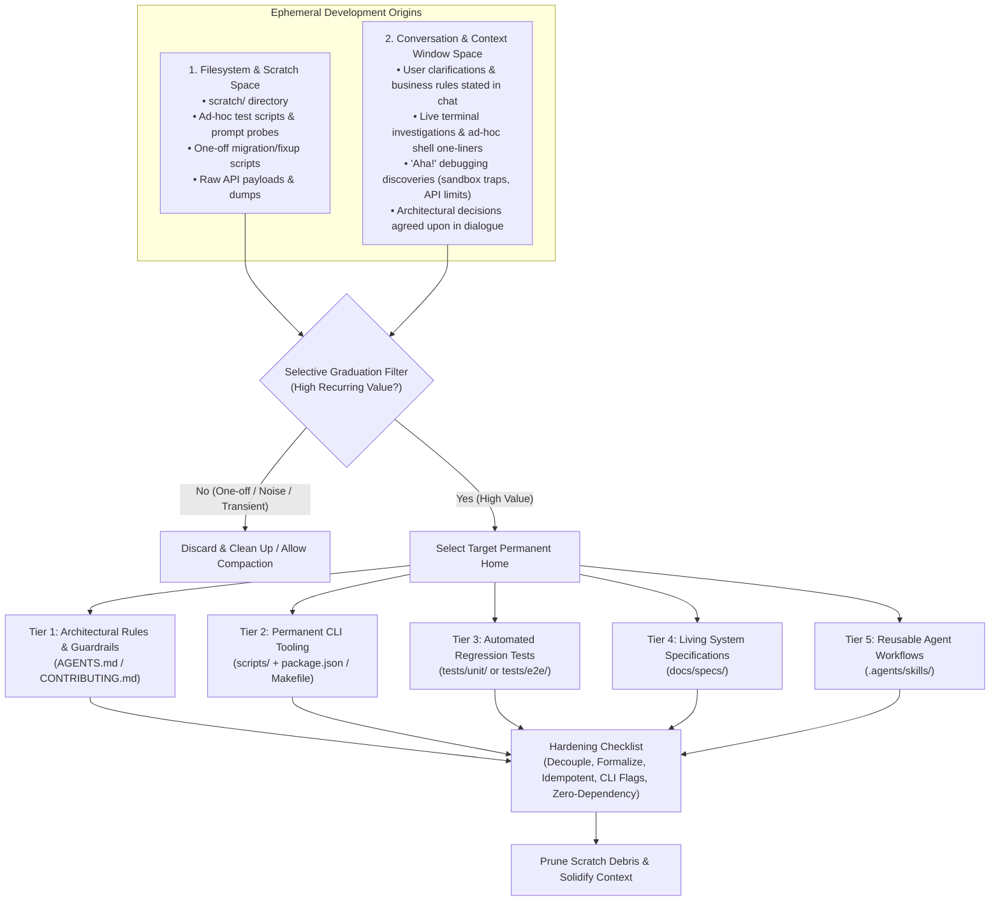

# Selective Artifact Graduation & Knowledge Codification

This skill provides a systematic, cross-project framework for identifying, refining, and "graduating" ephemeral development artifacts into permanent, high-value repository assets.

---

## 1. Overview & Philosophy: The Two Ephemeral Sources

During development and pair-programming, engineers and AI agents generate critical knowledge across **two distinct ephemeral spaces**:

### The Amnesia Trap (Why Context Window Graduation Matters)
- **Filesystem Loss**: Scratch files get deleted or lost in untracked git trees.
- **Context Window Loss**: Chat dialogues, terminal debugging traces, and agreed-upon assumptions vanish upon conversation compaction, context exhaustion, or when switching to a new session or agent.
- **The Core Mandate**: If an important truth, edge case, or user requirement is discovered in the context window, **it must not remain trapped in conversation memory**—it must be graduated into a tracked repository artifact before concluding the task.

---

## 2. The Selective Graduation Filter (Evaluation Rubric)

Before graduating any artifact or in-context learning, evaluate it against this rubric:

### ✅ High-Value Criteria (Qualifies for Graduation)
- **Context-Window Breakthrough**: Did the user clarify a domain rule, priority, or disambiguation logic in chat that future sessions would otherwise have to re-ask?
- **Recurring Operational Burden**: Does this tool or terminal sequence automate an audit, schema check, migration, or diagnostic that would otherwise require manual steps?
- **Hard-Won Edge Case or Gotcha**: Did a live terminal debugging session uncover a non-obvious runtime quirk (e.g. API rate limits, sliding quota windows, token refresh timing, sandbox denials, shell escaping)?
- **Defensive Guardrail**: Does codifying this rule prevent AI agents or developers from hallucinating invalid payloads, dropping user context, or executing destructive mutations?
- **Valuable Test Regression**: Does an ad-hoc test probe exercise difficult edge cases (e.g. natural language parsing, fuzzy matching, concurrency) that should be executed continuously in CI/CD?

### ❌ Low-Value Criteria (Reject to Prevent Bloat)
- **Single-Use Exploratory Probes**: Quick `console.log` snippets used once to inspect an unfamiliar payload.
- **Redundant Mocks**: Mock objects or stubs that duplicate standard test fixtures.
- **Generic Best Practices**: General programming advice already handled by linters, typecheckers, or standard conventions (e.g. "always handle null").
- **Transient Debug Dumps**: Raw JSON responses, log captures, or environment dumps.

---

## 3. The 5-Tier Graduation Taxonomy

When an item qualifies for graduation, place it into its appropriate permanent location:

| Tier | Category | Destination | Criteria & Examples |
| :--- | :--- | :--- | :--- |
| **Tier 1** | **Architectural Rules & Guardrails** | `AGENTS.md` / `RULES.md` | Non-obvious project behavioral constraints, quota backoff requirements, precedence rules, and sandbox execution quirks. |
| **Tier 2** | **Operational & Diagnostic Tooling** | `scripts/` (registered in `package.json` / `Makefile`) | Standalone tools for auditing schemas, running health checks, generating seeds, or performing safe migrations. |
| **Tier 3** | **Regression & Automated Tests** | `tests/unit/`, `tests/e2e/`, `tests/integration/` | Exploratory test scripts promoted into permanent test suites run by standard test runners (`npm test`, `pytest`, `cargo test`). |
| **Tier 4** | **Living System Specifications** | `docs/specs/` | Permanent contracts, API schemas, data models, and domain invariants clarified during user dialogue. |
| **Tier 5** | **Reusable Workflows & Skills** | `.agents/skills/<name>/SKILL.md` | Multi-step procedures or best practices for agents performing specialized workflows across sessions or projects. |

---

## 4. Hardening Checklist for Graduating Artifacts & Learnings

Never copy raw scratch code or unformatted chat thoughts directly into the repository. Follow this 5-step hardening checklist:

### 1. Extract & Formalize (Context Window & Scratch)
- **From Context Window**: Distill user dialogue or debugging discoveries into precise, declarative statements, specifications, or code comments. Remove conversational filler.
- **From Scratch Files**: Strip all absolute file paths (e.g. `/Users/...`), temporary tokens, and private test data. Ensure configuration reads from standard environment variables (`.env`, `.dev.vars`) or CLI flags.

### 2. Standardize CLI Arguments & Safe Defaults
- For graduated scripts: Add `--help` or clear usage banners.
- **Safe Defaults**: Tools should default to **read-only / audit mode** (`--dry-run` or audit by default).
- Require an explicit flag (e.g. `--fix`, `--apply`, `--write`) before executing any mutations or schema changes.
- Support environment targeting flags where applicable (e.g. `--staging`, `--prod`, `--all`).

### 3. Make It Zero-Dependency or Use Project Primitives
- Avoid adding heavy third-party dependencies for simple scripts.
- Prefer built-in language/runtime primitives (e.g. standard Node.js `crypto.subtle` / Web Crypto, standard `fetch`, Python standard library).
- If internal project modules are imported, verify they run cleanly under the project's standard execution runtime without requiring specialized loaders.

### 4. Provide Rate Limit & Quota Resilience
- Any script interacting with external APIs (databases, cloud providers, third-party services) must implement exponential backoff retry logic for transient errors and rate limits (`HTTP 429`).

### 5. Register in Project Task Runners & Prune Debris
- Expose CLI tools in `package.json` `"scripts"`, `Makefile`, or `Taskfile.yml`.
- Verify the graduated asset passes all test/typecheck suites.
- Delete temporary files from `scratch/` or conversation work directories.

---

## 5. Real-World Graduation Archetypes

### Archetype A: Scratch Exploration ➔ Permanent Regression Test
- **Scratch State:** `scratch/test_gemini_parsing.ts` was written to manually test how an LLM handles messy user descriptions.
- **Filter Evaluation:** High value. LLM parsing behavior can silently regress with prompt changes or model updates.
- **Graduation Action:** Move into `tests/e2e/gemini-prompt-parsing.test.ts`, wrap in standard test assertions (`assert.strictEqual`), and integrate into `npm run test:e2e`.

### Archetype B: Temporary Fix Script ➔ Idempotent Verification CLI
- **Scratch State:** `scratch/migrate_headers.mjs` was created to hot-fix a mismatched column header in a remote database or spreadsheet.
- **Filter Evaluation:** High value. Schema drift can reoccur across environments (staging vs. production).
- **Graduation Action:** Refactor into `scripts/verify-schema.mjs`. Add multi-environment support (`--staging`, `--prod`), audit by default, and provide a safe `--fix` flag. Register in `package.json`.

### Archetype C: In-Context Debugging Discovery ➔ Codified Rule
- **Context Window State:** During live terminal debugging, the agent discovers that a third-party API strictly enforces a 60 requests/minute sliding quota window, causing intermittent HTTP 429 errors.
- **Filter Evaluation:** High value. Prevents future developers and agents from hitting silent quota walls and writing naive retry loops.
- **Graduation Action:** Add an explicit rule to `AGENTS.md` (e.g. *Rule 9: Google Sheets Quota Absorption via exponential backoff*).

### Archetype D: In-Context User Clarification ➔ Living Spec & Data Contract
- **Context Window State:** In chat, the user clarifies: *"The settlement note is optional. The direction of debt payment vs. cash drawer advance return is inferred by who runs the command."*
- **Filter Evaluation:** Critical domain logic. If left only in chat messages, subsequent agents or sessions will misinterpret the command options.
- **Graduation Action:** Update the living specification in `docs/specs/partner-ledger.md` (Contract & Architecture sections) and add concrete unit tests enforcing symmetric sender-aware resolution.

### Archetype E: Terminal Workaround ➔ Operational Policy / Script Flag
- **Context Window State:** An agent encounters macOS sandbox denials when executing git commands due to an unreadable global config file (`~/.gitconfig`). The agent works around it in chat with `GIT_CONFIG_GLOBAL=/dev/null`.
- **Filter Evaluation:** High value. Any future sandboxed command execution will fail unless this pattern is preserved.
- **Graduation Action:** Record the sandbox execution requirement in `AGENTS.md` or developer setup documentation.
