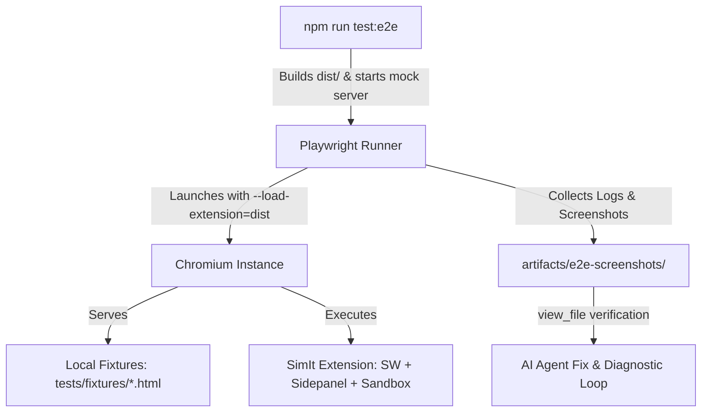

# SimIt Autonomous E2E Testing & Observation Skill

This skill guides AI agents on running automated, end-to-end browser tests for the SimIt Chrome Extension (Manifest V3) without requiring human intervention or acting as a manual relay.

---

## 1. Overview & Architecture

SimIt converts highlighted text, equations, and algorithms on host webpages into real-time interactive simulations rendered inside the Chrome Side Panel.



The E2E harness eliminates manual testing bottlenecks by:
1. Booting Chromium with the unpacked extension loaded (`--load-extension=dist`).
2. Serving local HTML test fixtures covering major simulation archetypes.
3. Simulating user text selections and triggering the background orchestrator.
4. Monitoring multi-context console telemetry (Service Worker, Side Panel, and Sandbox Iframe).
5. Capturing high-resolution screenshots into `artifacts/e2e-screenshots/`.
6. Testing parametric control interactivity (sliders, toggles, steppers).

---

## 2. Test Fixtures Suite (`tests/fixtures/`)

| Fixture File | Domain | Target Archetype | Key Elements |
|---|---|---|---|
| `harmonic_oscillator.html` | Classical Mechanics | `PARAMETER_EXPLORER` | Damped oscillator equations, mass-spring parameters ($\zeta, \omega_0$) |
| `sorting_algorithms.html` | Computer Science | `STEP_SCRUBBER` | Quicksort Lomuto partition pseudocode and discrete array states |
| `graph_traversal.html` | Graph Theory | `INTERACTIVE_GRAPH` | Directed network topology and Dijkstra edge relaxation |
| `state_machine.html` | Systems / Networking | `STATE_MACHINE_INSPECTOR` | TCP connection states (`SYN_SENT`, `ESTABLISHED`, `FIN_WAIT`) |

---

## 3. How to Run Autonomous E2E Tests

### Step 1: Run the Test Suite
Always invoke via `run_command` with `BypassSandbox: true` (required for Chromium socket and process binding):

```bash
npm run test:e2e
```

### Step 2: Inspect Output & Logs
The runner provides:
- Service Worker registration status
- Loading state transitions (`Harvesting Context...` -> `Generating...` -> `Verified`)
- Sandbox iframe initialization status
- Slider / parameter control responsiveness
- File paths of all captured screenshots

### Step 3: Visually Verify Rendered Artifacts
When a test generates or fails a screenshot, call `view_file` on the image path:

```
view_file AbsolutePath="/Users/waqqasmeraj/Developer/vmatrixdev/simit/artifacts/e2e-screenshots/harmonic_oscillator_simulation.png"
```

The AI assistant can inspect whether:
- The canvas / SVG is rendering properly
- Color schemes and contrast meet rich aesthetic standards
- Sliders and controls are rendered with appropriate labels and units
- Error banners or broken layouts are visible

---

## 4. Diagnosing & Self-Repairing Common Failures

### 4.1 Playwright Default Arguments Gotcha
Chrome extensions in Playwright will fail to load if Playwright's default flags are not overridden:
- **Problem**: Playwright adds `--disable-extensions` and `--disable-component-extensions-with-background-pages` by default.
- **Fix**: In `chromium.launchPersistentContext`, always provide:
  ```ts
  ignoreDefaultArgs: [
    '--disable-extensions',
    '--disable-component-extensions-with-background-pages'
  ]
  ```

### 4.2 Sandbox Content Security Policy (CSP) Violations
- **Symptom**: Console error `Refused to execute inline script because it violates the following Content Security Policy directive...` or `unsafe-eval`.
- **Diagnosis**: Verify `dist/manifest.json` has:
  ```json
  "content_security_policy": {
    "sandbox": "sandbox allow-scripts; script-src 'self' 'unsafe-eval' 'unsafe-inline'; default-src 'none'; style-src 'self' 'unsafe-inline'; font-src 'self' data:; img-src 'self' data: blob:;"
  }
  ```

### 4.3 Missing Vendor Libraries in Sandbox
- **Symptom**: `ReferenceError: anime is not defined` or `d3 is not defined` in the sandbox.
- **Diagnosis**: Check `src/sandbox/vendor/` and ensure the build script copies vendor libraries:
  ```bash
  mkdir -p dist/src/sandbox/vendor && cp -r src/sandbox/vendor/* dist/src/sandbox/vendor/
  ```

### 4.4 Parameter State Binding Errors
- **Symptom**: Slider changes in Side Panel do not update the simulation canvas.
- **Diagnosis**: Verify that `SimModule.update(params)` inside the simulation code handles partial parameter updates gracefully and redraws the view without throwing.

---

## 5. Adding New Test Archetypes

To test a new domain or archetype:
1. Create a fixture under `tests/fixtures/<name>.html` with an element `#target-selection`.
2. Add mock simulation code in `tests/e2e/mock-server.ts` or configure live model inference.
3. Add a test scenario method in `tests/e2e/simit.e2e.ts`.
4. Run `npm run test:e2e` and verify with `view_file`.
