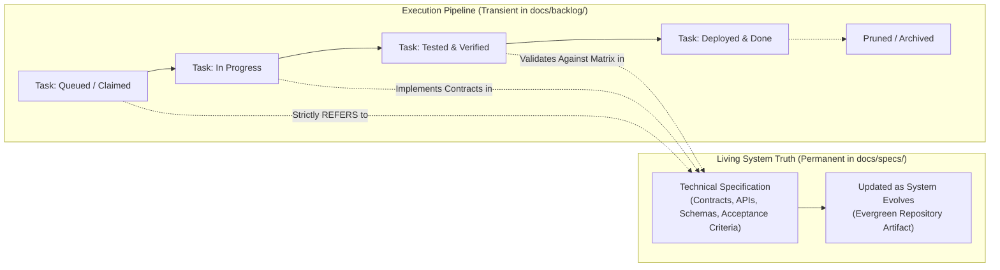
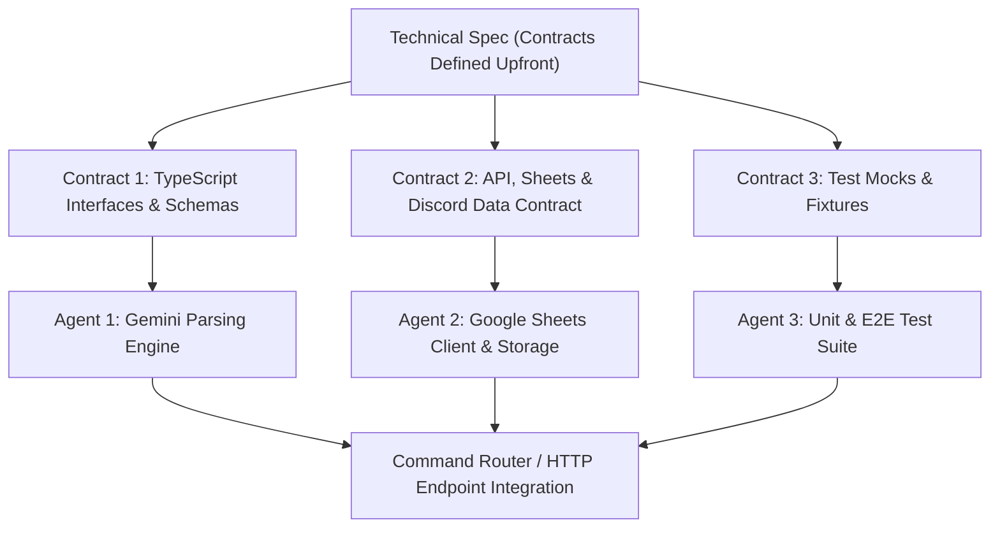

# Specification Authoring & Verifiable Engineering Workflow

This skill defines the requirements, architecture, and standards for writing technical specifications under `docs/specs/<feature-name>.md`. Every feature or backlog phase must be fully specified and approved before writing implementation code.

---

## 1. Lifecycle Architecture: Long-Lived Specs vs. Ephemeral Tasks

To keep the repository clean, maintainable, and aligned with architectural reality, agents and developers must strictly distinguish between **Living Specifications** and **Ephemeral Execution Tasks**:



### 1.1 Specifications (`docs/specs/`) — Long-Lived Architectural Truth
- **Permanent Assets**: Specs are evergreen documents that live indefinitely in the repository.
- **Scope**: Define system behavior, API contracts (OpenAPI/REST, Cloudflare Worker routes, webhooks), data models, event interfaces, and verifiable verification matrices.
- **Maintenance**: When a feature evolves, its spec is updated. The spec remains the single source of truth for current and future agents/developers.

### 1.2 Backlog Tasks (`docs/backlog/`) — Ephemeral Execution Units
- **Transient Workflow Items**: Tasks represent transactional units of work (`queued` -> `in-progress` -> `tested` -> `deployed` -> `done`).
- **Prunable**: Once completed, reviewed, and deployed to production, task checklists may eventually be archived or pruned without losing architectural knowledge.
- **The Golden Referral Rule**: **Backlog tasks must NEVER duplicate architectural details, schemas, or API contracts.** Instead, tasks must simply **REFER** to the living spec:
  - ❌ *Incorrect (Duplication):* `- [ ] Add Account column to Expenses tab with options Cash, Card, Reimbursable and fuzzy matching rules...`
  - ✅ *Correct (Referral):* `- [ ] Expand Expenses schema with Column G (account) conforming to [docs/specs/multi-account.md#22-google-sheets-storage-schemas](file:///Users/waqqasmeraj/Developer/vmatrixdev/expenselogger/docs/specs/multi-account.md#22-google-sheets-storage-schemas)`.

### 1.3 Organize Specs by Feature Domain, Never by Project Phase
- **Domain-Oriented Cohesion**: Specifications describe cohesive features and target system states (`multi-account.md`, `reimbursements.md`, `receipt-scanning.md`). They must **NEVER** be named or scoped by temporary delivery milestones (e.g. avoid `phase-1-...` or `sprint-3-...`).
- **Phasing is an Execution Concern (Owned by Backlog)**: The living spec defines what the system looks like and how its contracts interact. The **Backlog (`docs/backlog/tasks.md`)** is responsible for slicing that spec into deliverable phases, managing workstream decomposition, and coordinating sequencing across agents.
- **Verifying Implementation Status**:
  - Anyone can ascertain whether a spec is implemented by running its test suite (`npm run test:unit`, `npm run test:e2e`). A fully spec'd feature can have failing tests committed upfront; as backlog phases deliver code, the tests transition from failing to green.
  - Sprints and backlog tasks track *who* is building *which slice* right now.


---

## 2. Core Principle: Verifiable Output

A specification must never rely on subjective definitions of completion (e.g., *"feature is implemented"* or *"commands work as expected"*). Every deliverable must specify **verifiable outputs**:

1. **Automated Unit Verification**: Deterministic test suites run via `npm run test:unit` that pass with code 0 in `< 300ms` without making external network calls or spending Gemini API tokens.
2. **Automated Staging E2E Verification**: Declarative test suites run via `npm run test:e2e` that hit the live staging edge worker (`expenselogger-staging`), assert bot response formatting, and verify persisted rows in the Staging Google Sheet.
3. **Deterministic Contract Conformance**: TypeScript type checking via `npm run typecheck` passing with zero compilation or lint errors.
4. **Concrete Row & Endpoint Schemas**: Exact column indices, types, sample data rows, and HTTP status/payload schemas documented for all interfaces.

---

## 3. Multi-Agent Parallelization & Contract-First Design

To enable multiple agents (or developers) to work on complex phases concurrently without blocking, waiting, or stepping on each other's code, tasks must be decomposed into **Independent** vs. **Dependent** workstreams using **Contract-First Architecture**.



### 3.1 Classifying Workstreams

- **Independent Tasks**: Tasks with zero shared mutable files and no direct runtime dependencies. These can be executed in parallel immediately.
  - *Examples:* Creating test fixtures (`tests/fixtures/sample-accounts.ts`), authoring command registration options in `scripts/register-commands.mjs`, or creating empty sheet tab scaffolding in the staging sheet.
- **Dependent Tasks**: Tasks where one component consumes another component's output. **These MUST NOT begin implementation until the Contract is formally defined in the spec.**
  - *Examples:* Router depends on Gemini parsing output; Monthly summary depends on Sheets client response format; Webhook handler depends on external API schema.

### 3.2 Contract Types (Present & Future Interfaces)

Every spec must define concrete contracts before code is written:

1. **HTTP & API Contracts (Present & Future)**:
   - **REST / OpenAPI / Swagger**: Route paths (e.g. `/api/v1/expenses`), HTTP methods, request headers, query params, request body JSON schema, response status codes, and error payloads.
   - **Cloudflare Worker Routes**: Fetch handler signatures and environment bindings.
   - **Webhooks & Events**: Inbound signature verification headers, timestamp validation, and payload schema.
2. **TypeScript Domain Models (`src/types/`)**:
   - Authored directly in `src/types/<domain>.ts` as the single compileable source of truth.
   - Defined upfront with explicit input/output shapes, enums, and types.
   - The markdown spec references these models via clickable links without line numbers (e.g. `[`ModelName`](file:///Users/waqqasmeraj/Developer/vmatrixdev/expenselogger/src/types/<domain>.ts)`). **Never hardcode line numbers (`#L...`)** because line numbers drift over time.
3. **Data & Storage Schemas (Google Sheets / Databases)**:
   - Tab name, exact 1-indexed column letters (A, B, C...), headers, data formats, and default fallbacks.
   - Example: `Expenses` Tab: `[ A: id, B: date, C: title, D: amount, E: category, F: user, G: account, H: is_settled ]`.
4. **Discord Interaction Protocols (Executable Contracts)**:
   - Discord slash commands represent an explicit contract between user and application.
   - Authored as strongly typed contracts in [`src/discord/commands.ts`](file:///Users/waqqasmeraj/Developer/vmatrixdev/expenselogger/src/discord/commands.ts) (`ApplicationCommandDefinition`, `LOG_COMMAND`, `FUND_COMMAND`, etc.) and registered via [scripts/register-commands.mjs](file:///Users/waqqasmeraj/Developer/vmatrixdev/expenselogger/scripts/register-commands.mjs).
   - Specs reference the command definitions directly by name.
5. **AI Generation Schemas (Gemini Structured Outputs)**:
   - Authored as typed executable JSON schema objects in [`src/gemini/types.ts`](file:///Users/waqqasmeraj/Developer/vmatrixdev/expenselogger/src/gemini/types.ts) (e.g. `EXPENSE_RESPONSE_SCHEMA`) and passed to `responseSchema` in the Gemini API call.
   - Fallback behavior for missing, hallucinated, or malformed fields.

### 3.3 Contract Mocking (Unblocking Consumers)

Once the contract is defined in the spec:
- Upstream and downstream components are decoupled.
- The test harness mock (`tests/mocks/`) can implement the contract immediately.
- Downstream consumers (e.g. `handleDiscordCommand` in `src/commands/router.ts`) can be built and unit-tested against the mock *before* the upstream provider (e.g. Gemini client or Sheets API client) is even written!

---

## 4. Lean & Executable Behavioral Verification

To avoid narrative bloat and keep specs compact (< 180 lines) for both human comprehension and LLM token ingestion, specs must **NEVER** write long paragraphs describing tests.

Instead, acceptance criteria must be defined using a **Compact Behavioral Acceptance Matrix** (or concise Gherkin scenarios) that maps 1:1 to deterministic zero-token unit tests (`npm run test:unit`).

### 4.1 Compact Acceptance Matrix Format

```markdown
| ID | Scenario | Given / State | When / Input | Expected Output / Bot Card | Sheets Persistence | Unit Test Target |
| :--- | :--- | :--- | :--- | :--- | :--- | :--- |
| **S1** | Standard Expense | Valid account exists | `/s-log 120 fuel on bop card` | `⛽ Fuel • 120` • Account: `BoP Primary` | `Expenses` row with cols G=`BoP Primary`, H=`TRUE` | `tests/unit/router.test.ts` |
| **S2** | Reimbursable | Wife personal card | `/s-log 65 dinner paid by wife` | `🍽️ Dinner • 65` • `(Owed - Unsettled)` | `Expenses` col G=`Wife Personal`, H=`FALSE` | `tests/unit/reimbursements.test.ts` |
| **S3** | Overpayment Guard | Pending balance is 3,000 | `/s-settle amount:4000` | Rejected: `⚠️ Cannot settle more than owed` | Zero mutation | `tests/unit/partner-ledger.test.ts` |
```

### 4.2 Spec-as-Code: Co-Authoring Initial Failing Unit Tests in TypeScript

When authoring a specification under `docs/specs/<feature-name>.md`, the authoring agent must also scaffold the initial **failing unit test suite** in `tests/unit/<feature-name>.test.ts`:

1. **Spec & Test Co-Creation**: The spec documents the architectural intent, data models, and acceptance matrix; the test file (`tests/unit/<feature-name>.test.ts`) translates those scenarios into declarative TypeScript tests (`describe` / `it`).
2. **Upfront Failing State (Red TDD)**: Before implementation code is written, running `npm run test:unit` executes these tests in a failing state. This proves the test is actually verifying new behavior rather than giving a false positive.
3. **Coding Agent Implementation (Green)**: The subsequent coding agent uses the failing tests as an unambiguous executable checklist. The coding agent:
   - Implements the contracts to turn the tests green.
   - Expands the test suite with boundary and defensive edge cases.
   - Adapts or refactors tests if feature requirements change.
4. **Zero Cognitive Friction for LLMs**: For an LLM, Spec-as-Code and Spec-as-English have identical cognitive load, but code provides immediate typechecking, instant compiler feedback, and zero translation loss.
5. **Bidirectional Linking**: The spec must link directly to its executable suite:
   ```markdown
   **Executable Test Suite:** [tests/unit/feature.test.ts](file:///Users/waqqasmeraj/Developer/vmatrixdev/expenselogger/tests/unit/feature.test.ts)
   ```

---

## 5. Lean Specification Template

Every technical specification under `docs/specs/<feature-name>.md` should target **120-180 lines** of high-density architectural truth:

```markdown
# Technical Specification: <Feature Name>

**Status:** Draft | Under Review | Approved & Live in Production  
**Domain:** <Domain / Subsystem>  
**Living Document:** Permanent architectural specification under `docs/specs/`  
**Tracking Backlog:** [docs/backlog/tasks.md](file:///Users/waqqasmeraj/Developer/vmatrixdev/expenselogger/docs/backlog/tasks.md)  

---

## 1. Overview & Business Objectives
- Concise 1-2 paragraph functional summary.
- Expected user experience and key workflows.

---

## 2. Domain Model & Architecture (Mermaid)
\`\`\`mermaid
erDiagram
    EXPENSE ||--o{ ACCOUNT : "paid_from"
    EXPENSE ||--o| SETTLEMENT : "reconciled_by"
\`\`\`

---

## 3. Contracts & Data Models

### 3.1 TypeScript Domain Models
The strongly typed domain models are authored directly in `src/types/` as the single compileable source of truth (zero duplicate code in markdown):
- [`ModelName`](file:///Users/waqqasmeraj/Developer/vmatrixdev/expenselogger/src/types/<domain>.ts): Concise summary of domain responsibility.

### 3.2 Storage Schemas (Google Sheets / Tab Layouts)
| Col | Header | Type | Format / Example | Description |
| :--- | :--- | :--- | :--- | :--- |
| **A** | `id` | String | `E00001` | Sequential identifier |

### 3.3 AI Extraction Schema (Gemini Structured Outputs)
- JSON Schema object passed to `responseSchema`.

---

## 4. Domain Invariants & Edge Cases
- Mathematical formulas (e.g. `Net Balance = Inflows - Outflows`).
- Fallback hierarchy for missing, ambiguous, or incoherent inputs.
- Guardrails (e.g. rejection of `<= 0` amounts, overpayment prevention).

---

## 5. Behavioral Acceptance Matrix
| ID | Scenario | Given / State | When / Input | Expected Output | Storage Mutation | Test File |
| :--- | :--- | :--- | :--- | :--- | :--- | :--- |
| **S1** | ... | ... | ... | ... | ... | ... |

---

## 6. Deployment & Release Status
- **Standard Release Gate:** Follows the staging-first workflow in [docs/specs/staging-and-release-workflow.md](file:///Users/waqqasmeraj/Developer/vmatrixdev/expenselogger/docs/specs/staging-and-release-workflow.md) and [AGENTS.md #6](file:///Users/waqqasmeraj/Developer/vmatrixdev/expenselogger/AGENTS.md).
- **Status:** Draft / Verified on Staging / Deployed & Live on production worker (`small-dream-1b0d`).
```

> **Important Note:** Do **NOT** copy-paste a 25-line staging deployment checklist or rollout gate into individual feature specs. Release rules are repo invariants defined globally in `AGENTS.md` (#6) and `docs/specs/staging-and-release-workflow.md`. Granular sprint execution tasks belong exclusively in `docs/backlog/tasks.md`.

---

## 6. Spec Review Checklist

Before marking a spec as ready for implementation:
- [ ] Is the spec registered in the master index [docs/specs/index.md](file:///Users/waqqasmeraj/Developer/vmatrixdev/expenselogger/docs/specs/index.md)?
- [ ] Are all contracts (TypeScript interfaces, Sheets columns, Discord options) strongly typed and compileable?
- [ ] Is there a cohesive visual diagram (Mermaid ERD, state machine, or sequence flow)?
- [ ] Are edge cases and mathematical invariants explicitly stated?
- [ ] Is verification specified via a concise Behavioral Acceptance Matrix rather than long prose paragraphs?
- [ ] Is boilerplate rollout text omitted in favor of referencing the global release workflow?

