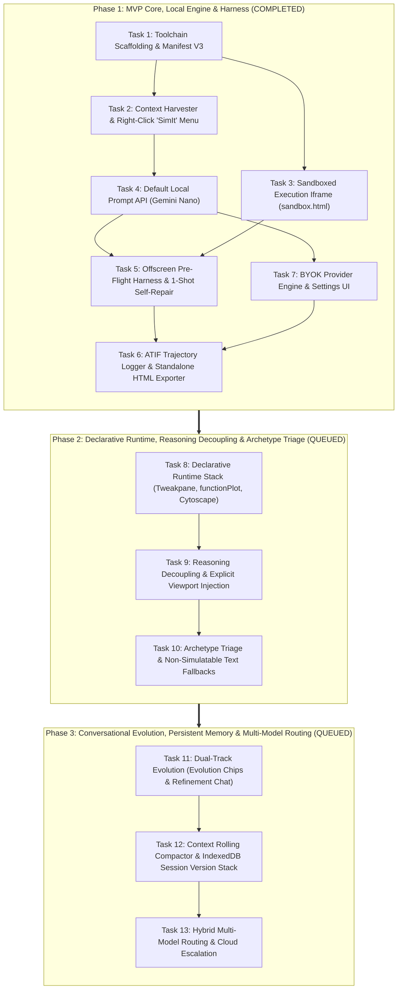

# SimIt Execution Backlog

**Lifecycle:** Ephemeral Backlog under `docs/backlog/`  
**Master Specifications:** [docs/specs/index.md](file:///Users/waqqasmeraj/Developer/vmatrixdev/simit/docs/specs/index.md)  
**Roadmap Source:** [docs/product/roadmap.md](file:///Users/waqqasmeraj/Developer/vmatrixdev/simit/docs/product/roadmap.md)  

---

## Workstream Decomposition & Dependency Graph

---

## Phase 1 Execution Checklist (Status: Completed)

### Step 1: Manifest V3 Extension Shell & Side Panel
- [x] Initialize extension project scaffolding (WXT / Vite toolchain) with TypeScript and Manifest V3.
- [x] Configure `manifest.json` with permissions (`sidePanel`, `contextMenus`, `activeTab`, `scripting`, `offscreen`, `storage`) conforming to [docs/specs/architecture.md#1-high-level-architecture-overview](file:///Users/waqqasmeraj/Developer/vmatrixdev/simit/docs/specs/architecture.md#1-high-level-architecture-overview).
- [x] Implement background Service Worker lifecycle listener establishing Side Panel routing via `chrome.sidePanel.setPanelBehavior`.
- [x] Scaffold `sidepanel.html` frame with header, status pill, simulation container, and parameter controls dock conforming to [docs/specs/architecture.md#side-panel-ui-host](file:///Users/waqqasmeraj/Developer/vmatrixdev/simit/docs/specs/architecture.md).

### Step 2: Right-Click "SimIt" Menu & Context Harvester
- [x] Register context menu item titled **"SimIt"** for selection contexts (`contexts: ["selection"]`) in background Service Worker conforming to [docs/specs/context_harvester.md#31-typescript-domain-models](file:///Users/waqqasmeraj/Developer/vmatrixdev/simit/docs/specs/context_harvester.md#31-typescript-domain-models).
- [x] Implement `content-script.ts` selection harvester with LaTeX regex parsing conforming to [docs/specs/context_harvester.md#32-math-extraction-delimiters--selectors](file:///Users/waqqasmeraj/Developer/vmatrixdev/simit/docs/specs/context_harvester.md#32-math-extraction-delimiters--selectors).
- [x] Implement KaTeX, MathJax, and MathML DOM annotation extractors conforming to [docs/specs/context_harvester.md#32-math-extraction-delimiters--selectors](file:///Users/waqqasmeraj/Developer/vmatrixdev/simit/docs/specs/context_harvester.md#32-math-extraction-delimiters--selectors).
- [x] Implement DOM hierarchy traverser for section headings (`h1`–`h4`) and figure captions conforming to [docs/specs/context_harvester.md#4-domain-invariants--edge-cases](file:///Users/waqqasmeraj/Developer/vmatrixdev/simit/docs/specs/context_harvester.md#4-domain-invariants--edge-cases).
- [x] Add 2,000-character payload sanitization and budget limiter conforming to invariant in [docs/specs/context_harvester.md#4-domain-invariants--edge-cases](file:///Users/waqqasmeraj/Developer/vmatrixdev/simit/docs/specs/context_harvester.md#4-domain-invariants--edge-cases).

### Step 3: Sandboxed Execution Iframe
- [x] Scaffold `sandbox.html` declared under `manifest.json` `sandbox.pages` conforming to [docs/specs/sandbox_ipc.md#32-manifest-v3-sandbox-declaration--pre-loaded-stack](file:///Users/waqqasmeraj/Developer/vmatrixdev/simit/docs/specs/sandbox_ipc.md#32-manifest-v3-sandbox-declaration--pre-loaded-stack).
- [x] Bundle local offline dependencies (`d3.v7.min.js`, `anime.v3.min.js`, `katex.min.js`) into extension sandbox bundle conforming to [docs/specs/agent_loop.md#4-sandboxed-runtime-api--declarative-library-stack](file:///Users/waqqasmeraj/Developer/vmatrixdev/simit/docs/specs/agent_loop.md#4-sandboxed-runtime-api--declarative-library-stack).
- [x] Implement bidirectional `postMessage` protocol handler in `sandbox.html` conforming to message schemas in [`src/types/ipc.ts`](file:///Users/waqqasmeraj/Developer/vmatrixdev/simit/src/types/ipc.ts) and [docs/specs/sandbox_ipc.md#31-typescript-domain-models](file:///Users/waqqasmeraj/Developer/vmatrixdev/simit/docs/specs/sandbox_ipc.md#31-typescript-domain-models).
- [x] Implement dynamic parameter UI renderer (sliders, toggles, steppers) inside `sidepanel.html` that sends updates into the iframe conforming to [`src/types/simulation.ts`](file:///Users/waqqasmeraj/Developer/vmatrixdev/simit/src/types/simulation.ts).

### Step 4: Default Local Simulation Engine (Gemini Nano / Local Gemma)
- [x] Implement Chrome Prompt API adapter (`ai.languageModel`) in background worker conforming to [`IModelProvider`](file:///Users/waqqasmeraj/Developer/vmatrixdev/simit/src/types/models.ts) and [docs/specs/model_providers.md#31-typescript-domain-models](file:///Users/waqqasmeraj/Developer/vmatrixdev/simit/docs/specs/model_providers.md#31-typescript-domain-models).
- [x] Implement system prompt builder assembling sandbox contracts and harvested context conforming to [docs/specs/agent_loop.md#6-concrete-system-prompt-specification](file:///Users/waqqasmeraj/Developer/vmatrixdev/simit/docs/specs/agent_loop.md#6-concrete-system-prompt-specification).
- [x] Implement output code fence sanitizer stripping markdown wrappers conforming to [docs/specs/model_providers.md#4-domain-invariants--edge-cases](file:///Users/waqqasmeraj/Developer/vmatrixdev/simit/docs/specs/model_providers.md#4-domain-invariants--edge-cases).
- [x] Add Gemini Nano availability detector with fallback routing to BYOK setup conforming to [docs/specs/model_providers.md#4-domain-invariants--edge-cases](file:///Users/waqqasmeraj/Developer/vmatrixdev/simit/docs/specs/model_providers.md#4-domain-invariants--edge-cases).

### Step 5: Pre-Flight Self-Repair & Runtime Error Recovery
- [x] Implement headless offscreen document (`offscreen.html`) with 100ms smoke test runner conforming to [docs/specs/sandbox_ipc.md#2-domain-model--ipc-topology](file:///Users/waqqasmeraj/Developer/vmatrixdev/simit/docs/specs/sandbox_ipc.md#2-domain-model--ipc-topology).
- [x] Wire 1-shot silent pre-flight repair loop in background worker conforming to sequence in [docs/specs/agent_loop.md#1-the-autonomous-agent-loop](file:///Users/waqqasmeraj/Developer/vmatrixdev/simit/docs/specs/agent_loop.md#1-the-autonomous-agent-loop).
- [x] Implement runtime console error interception (`window.onerror`, `unhandledrejection`) in `sandbox.html` conforming to [docs/specs/sandbox_ipc.md#2-domain-model--ipc-topology](file:///Users/waqqasmeraj/Developer/vmatrixdev/simit/docs/specs/sandbox_ipc.md#2-domain-model--ipc-topology).
- [x] Implement auto-appearing 🛠️ Repair Icon in Side Panel header that captures active slider state and triggers interactive repair conforming to [docs/specs/agent_loop.md#1-the-autonomous-agent-loop](file:///Users/waqqasmeraj/Developer/vmatrixdev/simit/docs/specs/agent_loop.md#1-the-autonomous-agent-loop).

### Step 6: Simulation Export & ATIF Trajectory Tracking
- [x] Implement standalone HTML exporter bundling inlined CSS, KaTeX, D3, Anime, and simulation module conforming to [docs/specs/atif_specification.md#31-standalone-self-contained-html-sim-exporthtml](file:///Users/waqqasmeraj/Developer/vmatrixdev/simit/docs/specs/atif_specification.md#31-standalone-self-contained-html-sim-exporthtml).
- [x] Implement ATIF session trajectory recorder tracking harvest, prompt, inference, pre-flight, and repair steps conforming to schema in [`src/types/atif.ts`](file:///Users/waqqasmeraj/Developer/vmatrixdev/simit/src/types/atif.ts) and [docs/specs/atif_specification.md#2-atif-trajectory-schema-for-simit](file:///Users/waqqasmeraj/Developer/vmatrixdev/simit/docs/specs/atif_specification.md#2-atif-trajectory-schema-for-simit).
- [x] Add 1-click **"Export Simulation (HTML)"** and **"Download ATIF (.atif.json)"** buttons in Side Panel header conforming to [docs/specs/atif_specification.md#4-atif-trajectory-export-in-the-ui](file:///Users/waqqasmeraj/Developer/vmatrixdev/simit/docs/specs/atif_specification.md#4-atif-trajectory-export-in-the-ui).

### Step 7: BYOK (Bring Your Own Key) Provider Settings
- [x] Build Provider Settings modal / panel in `sidepanel.html` conforming to schema in [docs/specs/model_providers.md#32-chrome-storage-schema-simit_byok_settings](file:///Users/waqqasmeraj/Developer/vmatrixdev/simit/docs/specs/model_providers.md#32-chrome-storage-schema-simit_byok_settings).
- [x] Implement Anthropic Claude client provider (`claude-3-5-sonnet`) conforming to [`IModelProvider`](file:///Users/waqqasmeraj/Developer/vmatrixdev/simit/src/types/models.ts).
- [x] Implement Google Gemini Cloud client provider (`gemini-2.5-flash`) conforming to [`IModelProvider`](file:///Users/waqqasmeraj/Developer/vmatrixdev/simit/src/types/models.ts).
- [x] Implement OpenAI-compatible client provider (Ollama / custom base URL) conforming to [`IModelProvider`](file:///Users/waqqasmeraj/Developer/vmatrixdev/simit/src/types/models.ts).
- [x] Implement secure `chrome.storage.local` persistence and connection test verification for configured API keys conforming to [docs/specs/model_providers.md#4-domain-invariants--edge-cases](file:///Users/waqqasmeraj/Developer/vmatrixdev/simit/docs/specs/model_providers.md#4-domain-invariants--edge-cases).

---

## Phase 2 Execution Checklist (Status: Completed)

### Step 8: Declarative Runtime Bundle (`Tweakpane`, `functionPlot`, `cytoscape`)
- [x] Bundle `tweakpane.min.js` (v4.x), `function-plot.js` (v1.x), and `cytoscape.min.js` (v3.x) into extension sandbox assets conforming to [docs/specs/declarative_runtime.md#31-global-sandbox-window-contract](file:///Users/waqqasmeraj/Developer/vmatrixdev/simit/docs/specs/declarative_runtime.md#31-global-sandbox-window-contract).
- [x] Implement declarative Tweakpane parameter generator in `sandbox.html` replacing custom HTML controls conforming to [docs/specs/declarative_runtime.md#1-overview--business-objectives](file:///Users/waqqasmeraj/Developer/vmatrixdev/simit/docs/specs/declarative_runtime.md#1-overview--business-objectives).
- [x] Implement zero-latency parameter update handler routing slider inputs directly to `Tweakpane.updateParams()` (0ms LLM overhead) conforming to [docs/specs/declarative_runtime.md#4-domain-invariants--edge-cases](file:///Users/waqqasmeraj/Developer/vmatrixdev/simit/docs/specs/declarative_runtime.md#4-domain-invariants--edge-cases).
- [x] Verify functionPlot and Cytoscape integration in sandbox test harness with automated unit tests conforming to [docs/specs/declarative_runtime.md#5-behavioral-acceptance-matrix](file:///Users/waqqasmeraj/Developer/vmatrixdev/simit/docs/specs/declarative_runtime.md#5-behavioral-acceptance-matrix).

### Step 9: Reasoning Decoupling & Viewport Dimension Injection
- [x] Update Prompt Composer to mandate `<simulation_thinking>...</simulation_thinking>` scratchpad and `<simulation_code>...</simulation_code>` blocks conforming to [docs/specs/agent_loop.md#2-prompting-strategy--reasoning-decoupling](file:///Users/waqqasmeraj/Developer/vmatrixdev/simit/docs/specs/agent_loop.md#2-prompting-strategy--reasoning-decoupling).
- [x] Implement Tag Parser extracting `<simulation_code>` for sandbox execution and routing thinking traces to ATIF telemetry conforming to [docs/specs/model_providers.md#4-domain-invariants--edge-cases](file:///Users/waqqasmeraj/Developer/vmatrixdev/simit/docs/specs/model_providers.md#4-domain-invariants--edge-cases).
- [x] Implement dynamic Side Panel container pixel dimension measurement (`container.clientWidth`, `container.clientHeight`) and injection into prompt payload conforming to [docs/specs/agent_loop.md#3-dynamic-viewport-measurement--injection](file:///Users/waqqasmeraj/Developer/vmatrixdev/simit/docs/specs/agent_loop.md#3-dynamic-viewport-measurement--injection).
- [x] Enable native hidden thinking parameters for Anthropic Claude (Extended Thinking) and Google Gemini (Flash Thinking) providers conforming to [docs/specs/model_providers.md#32-chrome-storage-schema-simit_byok_settings](file:///Users/waqqasmeraj/Developer/vmatrixdev/simit/docs/specs/model_providers.md#32-chrome-storage-schema-simit_byok_settings).

### Step 10: Archetype Triage & Non-Simulatable Text Fallbacks
- [x] Implement upfront archetype triage in orchestrator classifying inputs into dynamic systems vs static concepts conforming to [docs/specs/archetype_triage.md#2-taxonomy--triage-decision-tree](file:///Users/waqqasmeraj/Developer/vmatrixdev/simit/docs/specs/archetype_triage.md#2-taxonomy--triage-decision-tree).
- [x] Implement fallback prompt pipelines generating Cytoscape concept DAGs for non-simulatable text conforming to [docs/specs/archetype_triage.md#3-contracts--data-models](file:///Users/waqqasmeraj/Developer/vmatrixdev/simit/docs/specs/archetype_triage.md#3-contracts--data-models).
- [x] Implement interactive Socratic breakdown chips for static definitions conforming to [docs/specs/archetype_triage.md#3-contracts--data-models](file:///Users/waqqasmeraj/Developer/vmatrixdev/simit/docs/specs/archetype_triage.md#3-contracts--data-models).
- [x] Enforce "No Meaningless Motion" invariant asserting no arbitrary particle animations for non-simulatable text conforming to [docs/specs/archetype_triage.md#4-domain-invariants--edge-cases](file:///Users/waqqasmeraj/Developer/vmatrixdev/simit/docs/specs/archetype_triage.md#4-domain-invariants--edge-cases).

---

## Phase 3 Execution Checklist (Status: Queued)

### Step 11: Conversational Dual-Track Evolution
- [ ] Implement pre-computed evolution chips (`[+ Add Temperature Scaling]`, `[Show Phase Boundary]`, etc.) in `sidepanel.html` conforming to [docs/specs/agent_loop.md#81-dual-track-evolution](file:///Users/waqqasmeraj/Developer/vmatrixdev/simit/docs/specs/agent_loop.md#81-dual-track-evolution).
- [ ] Implement natural language refinement chat bar in `sidepanel.html` conforming to [docs/specs/architecture.md#36-progressive-complexity--conversational-iteration](file:///Users/waqqasmeraj/Developer/vmatrixdev/simit/docs/specs/architecture.md#36-progressive-complexity--conversational-iteration).
- [ ] Wire evolution chip clicks and chat submissions to background refinement pipeline conforming to [docs/specs/architecture.md#2-end-to-end-execution-flow](file:///Users/waqqasmeraj/Developer/vmatrixdev/simit/docs/specs/architecture.md#2-end-to-end-execution-flow).

### Step 12: Context Rolling Compactor & IndexedDB Session Version Stack
- [ ] Implement Context Rolling Compactor retaining static paper anchor, single latest `<simulation_code>` snapshot, and sliding 2-turn window conforming to [docs/specs/agent_loop.md#7-context-rolling-for-infinite-evolution](file:///Users/waqqasmeraj/Developer/vmatrixdev/simit/docs/specs/agent_loop.md#7-context-rolling-for-infinite-evolution).
- [ ] Implement client-side IndexedDB persistence layer (`simit_sessions`) storing version snapshots (`v1 -> v2 -> v3`) and parameter states conforming to [docs/specs/agent_loop.md#82-client-side-session-version-stack-indexeddb](file:///Users/waqqasmeraj/Developer/vmatrixdev/simit/docs/specs/agent_loop.md#82-client-side-session-version-stack-indexeddb).
- [ ] Add version scrubber (`v1`, `v2`, `v3`) in Side Panel header with 1-click state rollback conforming to [docs/specs/sandbox_ipc.md#5-behavioral-acceptance-matrix](file:///Users/waqqasmeraj/Developer/vmatrixdev/simit/docs/specs/sandbox_ipc.md#5-behavioral-acceptance-matrix).

### Step 13: Hybrid Multi-Model Routing & Cloud Escalation
- [ ] Implement autonomous model routing: use local Gemini Nano for instant domain triage and bounds extraction before elevating to frontier models conforming to [docs/specs/architecture.md#1-high-level-architecture-overview](file:///Users/waqqasmeraj/Developer/vmatrixdev/simit/docs/specs/architecture.md#1-high-level-architecture-overview).
- [ ] Add 1-click cloud escalation button in Side Panel header allowing user to re-generate complex simulations with configured frontier models conforming to [docs/specs/architecture.md#32-orchestration--model-provider-layer-backgroundjs](file:///Users/waqqasmeraj/Developer/vmatrixdev/simit/docs/specs/architecture.md#32-orchestration--model-provider-layer-backgroundjs).

