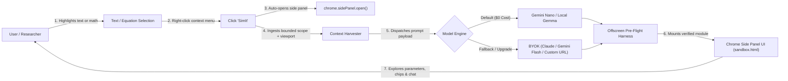
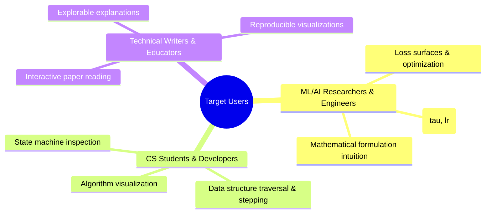

# Product Requirements Document (PRD)

## 1. Product Overview & Mental Model

**SimIt** is the **"Lovable / v0 for interactive simulations and mental models."** Built as a Chrome Extension adhering strictly to **Manifest V3**, it acts as an autonomous compiler of static text, mathematical equations, and algorithms from research papers, textbooks, and documentation into **epistemic software**—playable state machines, phase transitions, and visual mathematical systems—rather than static web apps or textual summaries.

From a UX standpoint, the interaction is streamlined, zero-prompt, and non-intrusive:
1. The user highlights any text or equation.
2. The user right-clicks and selects **"SimIt"** from the context menu.
3. Chrome's native Side Panel immediately opens and starts generating a playable, parameter-driven explorable explanation with a strict latency target of **$< 3$ seconds to first frame** to preserve reading flow.

---

## 2. User Problems & Objectives

| Problem | Description | Solution / Objective |
| :--- | :--- | :--- |
| **Manual Context Switching & Friction** | Readers frequently copy-paste code/equations into external web LLMs or scratchpads to grasp abstractions. | Keep the user in-flow: highlight text, right-click "SimIt" menu, and render an interactive simulation directly in the Side Panel in $< 3$ seconds. |
| **Limitations of Static Media** | Papers present multidimensional algorithms and formulas as static 2D figures or dry pseudo-code. | Convert static abstractions into **epistemic software** (state machines, phase transitions, parameter-driven dynamical models). |
| **Code-Only Reasoning Suppression** | Forcing LLMs to output raw code suppresses chain-of-thought tokens, degrading spatial and mathematical generation quality. | Decouple reasoning from code synthesis using explicit scratchpad tags (`<simulation_thinking>` and `<simulation_code>`) or native hidden thinking modes. |
| **Fragile DOM Generation & Hallucinations** | Asking models to invent manual HTML sliders, labels, and event listeners causes frequent runtime crashes. | Provide a battle-tested, declarative sandboxed runtime stack (`Tweakpane`, `functionPlot`, `Cytoscape`, `Anime.js`, `D3 v7`, `KaTeX`). |
| **Non-Simulatable Text Breakdown** | Generating animations for static historical or definitional text produces arbitrary, meaningless motion. | Upfront archetype triage: route non-dynamic text to concept DAGs (Cytoscape) or Socratic chip breakdowns; never show arbitrary moving balls. |
| **Conversation & Context Window Bloat** | Iterative chatting about simulations inflates token context and latency. | Rolling context window with code compaction: retain original paper anchor, pass single active working code snapshot, and slide the last 2 conversational turns. |
| **Infrastructure Overhead & Cloud Lock-in** | Traditional simulation generators require expensive cloud backends, LangGraph servers, or remote sandboxes. | $0 client-side infrastructure: the extension orchestrates everything locally with IndexedDB persistence and headless iframe smoke testing. |

---

## 3. Key Personas & Use Cases

### 3.1 Personas

### 3.2 Primary Use Cases

* **ML/AI Researchers & Engineers**: Highlighting an equation (e.g., softmax temperature $\tau$, gradient descent learning rates, attention matrices) to inspect live parameter sliders, 2D function curves, and state transitions in the Side Panel.
* **CS Students & Developers**: Scrubbing through discrete algorithms (sorting, graph traversals, cache evictions) step-by-step with state inspection and concept graphs.
* **Domain Scholars & Educators**: Transforming abstract definitions into interactive DAGs or continuous parametric systems with instant state reverting and evolution chips.

---

## 4. Functional Requirements

### A. Context Capture & Ingestion
* **Primary Trigger**:
  * Browser context menu item (`chrome.contextMenus`) titled **"SimIt"** for selection contexts (`contexts: ["selection"]`). Opens/focuses the Side Panel with zero in-page DOM injection or style interference.
* **Selective Bounded Scope (No Full Page Dumps)**:
  * Ingests strictly the highlighted snippet, preceding section heading (`h1`–`h4`), neighboring caption/LaTeX elements (`\(...\)`, `\[...\]`, `<figcaption>`), and immediate adjacent paragraphs to avoid context dilution and minimize time-to-first-token.
* **Dynamic Viewport Measurement & Injection**:
  * Avoids hardcoded static container sizes. The extension dynamically queries the real-time pixel dimensions of the active Side Panel container (derived from available browser space and user panel width, e.g., `container.clientWidth`, `container.clientHeight`) at trigger time and injects the live bounds directly into the system prompt. This guarantees fluid, high-resolution rendering without clipping or zero-dimension rendering failures.

### B. Prompting Strategy & Reasoning Decoupling
* **No "Code Only" Directives**: Avoid prompt constraints that suppress chain-of-thought tokens.
* **Explicit Tag Separation**:
  * Prompt the model to formulate mathematical models and architectural step plans inside `<simulation_thinking>...</simulation_thinking>`.
  * Output executable module code inside `<simulation_code>...</simulation_code>`. The runtime parser extracts only the verified code block while preserving reasoning in ATIF telemetry.
* **Native Hidden Thinking**:
  * For models with native thinking modes (Gemini Flash Thinking, Claude Extended Thinking), leverage native reasoning APIs so reasoning remains out-of-band while the main payload delivers clean code.

### C. Sandboxed Declarative Runtime Stack
To achieve deterministic execution and high first-run reliability, the runtime provides pre-loaded declarative libraries:
* **UI & Parameters**: `Tweakpane (v4.x)` (eliminates manual HTML sliders, labels, and event listeners; provides instant zero-latency parameter updates).
* **2D Function Curves**: `functionPlot (v1.x)` (instant Cartesian coordinates and function evaluation without custom scale math).
* **Graph & Topologies**: `cytoscape (v3.x)` (handles DAGs, trees, and network layouts declaratively).
* **Vector/Fluid Animation**: `HTML5 Canvas 2D` (safest fallback) + `anime.js (v3.x)` (timeline tweening and state scrubbing).
* **Math Typesetting**: `katex (v0.16.x)` (zero-shot rendering of LaTeX notation).
* **General Scales & Projections**: `d3 (v7.x)` (pinned explicitly to v7 to prevent deprecated v3/v4 syntax hallucinations).

### D. Fallback Modes for Non-Simulatable Text
* **Archetype Triage**: Classify input text upfront into dynamic mathematical/state systems vs static conceptual text.
* **Graceful Alternate Modalities**:
  * If text lacks dynamic equations or state transitions (e.g., historical background, static taxonomy), render an interactive concept map (Cytoscape DAG) or an interactive Socratic chip breakdown.
  * Prompt to expand selection to adjacent equations if mathematical variables are referenced but missing.
* **No Meaningless Motion**: Strictly prohibit arbitrary bouncing balls or irrelevant generic charts; simulation must preserve epistemic fidelity.

### E. Progressive Complexity & Conversational Iteration
* **Dual-Track Controls**:
  * *Pre-Computed Evolution Chips*: Quick-action buttons (e.g., `[+ Add Temperature Scaling]`, `[Show Phase Boundary]`, `[Step-by-Step Traversal]`).
  * *Refinement Chat Bar*: Lightweight natural language input for direct user modifications.
* **Parametric Tweaks (Zero Latency)**: Minor parameter adjustments route directly to `Tweakpane.updateParams()` without invoking LLM calls.
* **Structural Feature Additions with Context Rolling**:
  * Rolling window with code compaction: keep the static paper anchor, supply the single latest working code inside `<simulation_code>`, and maintain only the last 2 conversational turns.
* **Session Version Stack**:
  * Lightweight version stack (`v1 -> v2 -> v3`) stored client-side with 1-click state rollback and branch switching.

### F. Verification & Telemetry
* **Offscreen Pre-Flight Harness**: 100ms headless evaluation in an isolated sandbox iframe with automated 1-shot self-repair.
* **Interactive Runtime Recovery**: Auto-appearing Repair Icon (🛠️) on unhandled console errors during live slider manipulation.
* **Export & Benchmarking**: Standalone self-contained HTML export and ATIF trajectory logging (`.atif.json`) for cross-model benchmarking.

---

## 5. Non-Functional Requirements

### 5.1 Performance & Cost
* **$0 Infrastructure**: No cloud VMs, LangGraph backends, or remote sandboxes. All orchestration runs in the extension; persistent state lives in IndexedDB.
* **Latency Target**: $< 3$ seconds to first frame for reading flow preservation.
* **Framerate**: Steady 60 FPS for continuous time-series, parameter updates, and particle systems.

### 5.2 Reliability & Fault Tolerance
* **Isolated Sandboxing**: Manifest V3 sandboxed iframe (`sandbox.html`) prevents arbitrary script execution against host pages or extension credentials.
* **Self-Healing**: Automated 1-shot pre-flight repair + 1-click interactive runtime recovery handles $\ge 85\%$ of edge-case exceptions.