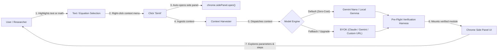
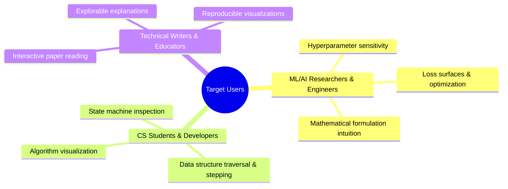

# Product Requirements Document (PRD)

## 1. Product Overview

**SimIt** (Paper/Doc Interactive Visualizer Copilot) is a Chrome Extension (built with Manifest V3) that converts complex technical text, mathematical equations, and algorithms from documents or research papers into **zero-prompt, real-time, interactive visual simulations**.

From a UX standpoint, the interaction is streamlined and non-intrusive: the user simply **highlights any text or equation, right-clicks, and clicks the "SimIt" menu option**. The native Chrome Side Panel immediately springs open and starts generating a playable, parameter-driven explorable explanation (interactive sliders, step-by-step scrubbers, and responsive state updates).

---

## 2. User Problems & Objectives

| Problem | Description | Solution / Objective |
| :--- | :--- | :--- |
| **Manual Context Switching & Friction** | Readers frequently copy-paste code/equations into external web LLMs or scratchpads to grasp abstractions. | Keep the user in-flow: simply highlight text, right-click, and select "SimIt" to launch the simulation directly in the Side Panel. |
| **Limitations of Static Media** | Papers present multidimensional algorithms and formulas as static 2D figures or dry pseudo-code. | Convert static abstractions into playable, parameter-driven dynamic visual models. |
| **High Frontier Model Costs** | Developing and testing an execution harness against commercial frontier LLM APIs incurs high per-call token costs. | Default to on-device Gemini Nano / Gemma via Chrome's built-in Prompt API for zero API costs during harness buildout. |
| **Vendor Lock-in & Flexibility** | Different users prefer different frontier models (Claude 3.5 Sonnet, Gemini 2.5 Flash, self-hosted endpoints). | Provide a Bring Your Own Key (BYOK) system supporting custom keys, base URLs, and model selection. |
| **Prompt Engineering Overhead** | Users should not need to write intricate prompts detailing UI controls or simulation steps. | Autonomous archetype deduction that infers parameters, domains, bounds, and UI controls automatically. |

---

## 3. Key Personas & Use Cases

### 3.1 Personas

### 3.2 Primary Use Cases

* **ML/AI Researchers & Engineers**:
  * Highlighting an equation (e.g., softmax temperature $\tau$, gradient descent learning rates, loss functions) and right-clicking "SimIt" to inspect live parameter sliders and state transitions in the Side Panel.
* **CS Students & Developers**:
  * Scrubbing through discrete algorithms (sorting, binary search, tree traversals, cache evictions) step-by-step with state inspection.
  * Exploring mathematical theorems and dynamical systems with continuous parameter controls.

---

## 4. Functional Requirements

### A. Context Capture & UX Trigger
* **Primary Trigger: Right-Click "SimIt" Context Menu**:
  * Registers a browser context menu item (`chrome.contextMenus`) with title **"SimIt"** for text and math selections (`contexts: ["selection"]`).
  * On click, automatically opens or focuses Chrome's native Side Panel via `chrome.sidePanel.open({ tabId })`.
  * Displays an immediate visual loading / synthesis state in the Side Panel while background processing takes place.
* **Context Harvester**:
  * Captures highlighted text snippet, preceding section heading (`h1`–`h4`), neighboring caption/LaTeX elements (`\(...\)`, `\[...\]`, `<figcaption>`), and adjacent paragraphs to resolve variable definitions.
* **OCR / Crop Support**: Area screenshot grabber for visual diagrams and unformatted formula figures.

### B. Generation Engine & Model Orchestration
* **Default Local Generator (Gemini Nano / Local Gemma)**:
  * Extension assumes by default that Gemini Nano is available via Chrome's built-in Prompt API (`ai.languageModel`).
  * Generates simulation code locally on-device with **zero API cost**.
  * Accepts baseline simulation quality during initial harness iteration: as long as parameters, canvas/DOM elements, and state transitions execute, initial aesthetic roughness is acceptable.
* **BYOK (Bring Your Own Key) Setup**:
  * If Gemini Nano is not detected or unavailable, the extension automatically prompts the user to configure BYOK settings directly within the Side Panel.
  * Allows users to input:
    * API Key
    * Custom Base URL / Endpoint (supports Anthropic, Google Gemini, OpenAI, or local/remote OpenAI-compatible proxies such as Ollama)
    * Preferred Model ID and configuration settings.
* **Dual-Tier Self-Correction**:
  * *Tier 1 (Automated Pre-Flight)*: Silently feeds unhandled syntax/runtime exceptions from the 100ms smoke test back to the model for an autonomous 1-shot repair before rendering.
  * *Tier 2 (Interactive Runtime Recovery)*: If an unhandled console error occurs while the user is actively manipulating parameter sliders or timelines, an interactive **Repair Icon (🛠️)** appears automatically in the Side Panel header, allowing 1-click self-correction with active slider state preserved.

### C. Execution Runtime & UI
* **Side Panel Host**: Renders inside Chrome’s native `sidePanel` API to preserve uninterrupted reading flow.
* **Interactive Control Harness**: Supports dynamic parameter sliders, numeric steppers, continuous timeline scrubbers (`Play`, `Pause`, `Step-Next`, `Speed`), and inspectable canvas/SVG nodes.
* **Rich Animation Primitives**: Localized animation primitives via D3 and Anime.js for smooth coordinate transformations and state scrubbing.
* **Zero External Dependencies at Runtime**: All libraries (D3.js, KaTeX, Anime.js) are bundled directly inside the sandboxed environment to comply with strict Content Security Policies (CSP).

### D. Export & ATIF Trajectory Benchmarking
* **Standalone HTML Simulation Export**: 1-click download of a fully self-contained `.html` simulation file bundling localized libraries (D3, Anime, KaTeX) and dynamic parameter controls, allowing offline inspection and decoupled harness testing in any browser.
* **ATIF (Agent Trajectory Interchange Format) Tracking**: Formats all agent synthesis steps (harvested context, prompt parameters, raw model code, pre-flight test results, repair iterations, latency metrics) into standardized ATIF JSON (`.atif.json`) to enable rigorous cross-model benchmarking and regression test suite creation from Day 1.

---

## 5. Non-Functional Requirements

### 5.1 Performance & Cost
* **Zero-Cost Baseline**: Development and default user operation run at $0.00 marginal cost using on-device models.
* **Generation Latency**: On-device generation target $< 4.0$ seconds; BYOK cloud streaming $< 3.0$ seconds.
* **Framerate**: Steady 60 FPS animation loop for continuous time-series and particle animations.

### 5.2 Reliability & Fault Tolerance
* **Graceful Degradation**: If on-device Gemini Nano fails or is unavailable, the user is immediately guided to the BYOK configuration panel without crashing.
* **Self-Healing**: Automated 1-shot repair handles $\ge 80\%$ of transient code generation syntax/runtime errors.

### 5.3 Security & Compliance
* **Manifest V3 Strict Compliance**: No remote code execution outside sandboxed boundaries.
* **Key Security**: User BYOK keys are encrypted/stored only in local extension storage and never transmitted to third-party intermediary servers.
* **Sandbox Isolation**: All untrusted LLM-generated code executes inside a restricted, isolated sandbox page (`sandbox.html`) without host DOM, cookie, or storage access.