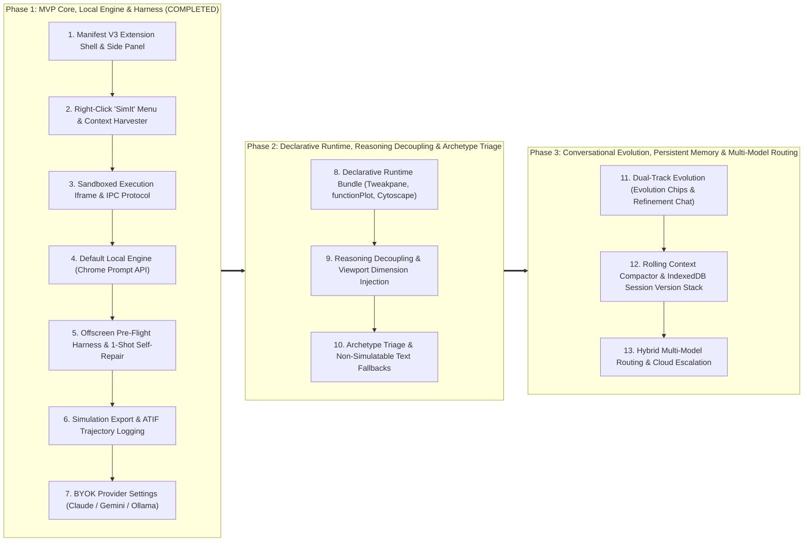

# Product & Technical Roadmap

A high-level implementation roadmap for **SimIt**, spanning from the foundational Manifest V3 extension core to declarative simulation runtimes, reasoning decoupling, archetype triage, conversational evolution, and persistent client-side session memory.

---

## 1. Phased Development Overview

---

## 2. Milestone Descriptions

### Phase 1: MVP Core, Local Engine & Harness Benchmarking (Completed)
- **M1: Extension Baseline & Side Panel Routing**: Manifest V3 extension shell with automatic native Side Panel routing on text selection and context menu trigger.
- **M2: Validated Sandbox & Pre-Flight Smoke Test**: Secure sandboxed iframe execution with offscreen 100ms headless smoke testing and 1-shot self-repair.
- **M3: Local-First Generation Engine**: Zero-cost on-device simulation generation via Chrome Prompt API (`ai.languageModel`) with fallback detection.
- **M4: Standalone Export & ATIF Telemetry**: 1-click self-contained HTML simulation exporter and standardized ATIF trajectory logging (`.atif.json`).
- **M5: BYOK Multi-Provider Engine**: Local settings management for frontier cloud providers (Anthropic Claude, Google Gemini, Ollama/OpenAI-compatible).

### Phase 2: Declarative Runtime, Reasoning Decoupling & Archetype Triage (Completed)
- **M6: Declarative Runtime Stack Integration**: Pre-loaded sandbox libraries (`Tweakpane v4`, `functionPlot v1`, `cytoscape v3`, `anime.js v3`, `d3 v7`, `katex v0.16`) eliminating manual DOM wiring.
- **M7: Reasoning Decoupling & Explicit Viewport Injection**: Structured prompt pipeline using `<simulation_thinking>` scratchpad and `<simulation_code>` blocks alongside exact container pixel bounds.
- **M8: Archetype Triage & Concept Fallbacks**: Upfront viability classification routing non-simulatable text to Cytoscape concept DAGs or Socratic breakdowns without meaningless motion.

### Phase 3: Conversational Evolution, Persistent Memory & Multi-Model Routing (Planned)
- **M9: Dual-Track Evolution & Zero-Latency Parametric Tweaks**: Pre-computed evolution chips and refinement chat bar with direct Tweakpane updates bypassing LLM calls.
- **M10: Rolling Context Window & IndexedDB Session Version Stack**: Token-efficient context compactor with static paper anchor and 2-turn window, paired with IndexedDB persistence and `v1 -> v2 -> v3` state revert.
- **M11: Hybrid Multi-Model Routing & Cloud Escalation**: Intelligent model routing delegating quick triage and bound extraction to Gemini Nano before escalating to frontier models for complex dynamics.

---

## 3. Milestone & Capability Matrix

| Milestone | Key Deliverable | Generation Source | Target Cost | Status |
| :--- | :--- | :--- | :--- | :--- |
| **M1: Extension Baseline** | Right-click "SimIt" menu + Side Panel Shell | N/A | $0.00 | **Completed** |
| **M2: Validated Sandbox** | Headless Smoke Test + postMessage IPC | N/A | $0.00 | **Completed** |
| **M3: Local-First MVP** | On-device simulation code generator via Chrome Prompt API | Gemini Nano / Gemma | $0.00 | **Completed** |
| **M4: Export & ATIF Telemetry** | Standalone HTML export + ATIF trajectory JSON export | Local / Any Provider | $0.00 | **Completed** |
| **M5: BYOK Provider Support** | Configurable API Key, Base URL, Model selector (Claude/Gemini/Ollama) | BYOK Cloud / Custom API | User-funded (BYOK) | **Completed** |
| **M6: Declarative Runtime Stack** | Tweakpane v4, functionPlot v1, Cytoscape v3 bundled in sandbox | Local / BYOK | $0.00 | **Completed** |
| **M7: Reasoning Decoupling & Viewport** | `<simulation_thinking>` + `<simulation_code>` tags, injected pixel dimensions | Local / BYOK | $0.00 | **Completed** |
| **M8: Archetype Triage & Fallbacks** | Upfront viability triage, concept DAG & Socratic chip fallbacks | Local / BYOK | $0.00 | **Completed** |
| **M9: Dual-Track Evolution** | Pre-computed evolution chips, refinement chat, direct Tweakpane updates | Local / BYOK | $0.00 | Planned |
| **M10: Context Compactor & Session Stack** | Sliding 2-turn window + code compaction, IndexedDB persistence & revert | Local / BYOK | $0.00 | Planned |
| **M11: Multi-Model Orchestration** | Autonomous escalation from Gemini Nano triage to frontier models | Hybrid Routing | Configurable | Planned |