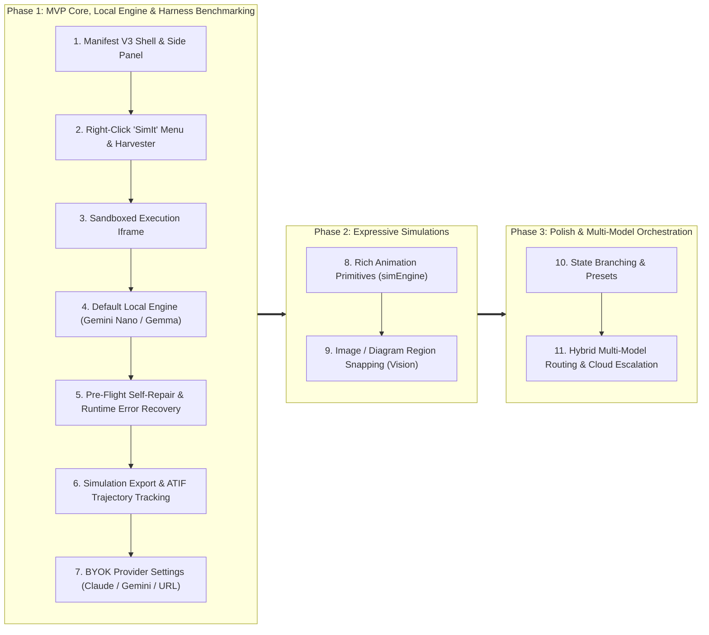

# Product & Technical Roadmap

A phased implementation roadmap for **SimIt**, spanning from foundational Manifest V3 extension infrastructure to local-first zero-cost simulation synthesis, ATIF trajectory benchmarking, BYOK provider integration, and expressive animation primitives.

---

## 1. Phased Development Overview

---

## 2. Phase Breakdown

### Phase 1: MVP Core, Local Engine & Harness Benchmarking

*Goal: Deliver an end-to-end working loop where highlighting text, right-clicking "SimIt" opens the Side Panel, generates a simulation at zero API cost using on-device Gemini Nano/Gemma, validates it in the sandbox, tracks ATIF trajectories, and allows exporting simulations offline from day one.*

* **Step 1: Manifest V3 Extension Shell & Side Panel**
  * Set up modern extension toolchain (using Plasmo or WXT).
  * Configure `manifest.json` with permissions: `sidePanel`, `contextMenus`, `activeTab`, `scripting`, `offscreen`, and `sandbox`.
  * Establish baseline service worker lifecycle and inter-process communication channels.

* **Step 2: Right-Click "SimIt" Menu & Context Harvester**
  * Register browser context menu item (`chrome.contextMenus.create`) titled **"SimIt"** for selection contexts (`contexts: ["selection"]`).
  * Wire `chrome.contextMenus.onClicked` to programmatically open the Side Panel (`chrome.sidePanel.open({ tabId })`) and dispatch harvesting.
  * Extract nearby document context: section headers (`h1`–`h4`), captions (`<figcaption>`), and LaTeX / MathML nodes.
  * Package payload for transmission to background service worker with immediate loading state in the Side Panel.

* **Step 3: Sandboxed Execution Iframe**
  * Establish bidirectional, secure `postMessage` protocol between extension side panel and `sandbox.html`.
  * Bundle local dependencies (KaTeX, Plotly/D3) inside the sandbox with strict CSP (`no-unsafe-eval`, `no-remote-scripts`).

* **Step 4: Default Local Simulation Engine (Gemini Nano / Local Gemma)**
  * **Default On-Device Generator**: Assume Gemini Nano is installed by default via Chrome's built-in Prompt API (`ai.languageModel`).
  * **Zero Cost During Harness Buildout**: Use Gemini Nano and/or local Gemma as the primary code generator for initial simulation synthesis, avoiding expensive frontier model API calls while building and iterating on the harness.
  * **Acceptance of Baseline Fidelity**: Prioritize rapid iteration and functional loop validation; basic or crude simulations are acceptable as long as executable parameters and visuals are produced.
  * **Availability Detection & Setup Guard**: If Gemini Nano is not detected or unavailable on the user's browser, automatically route the user to the BYOK setup screen in the Side Panel.

* **Step 5: Pre-Flight Self-Repair & Runtime Error Recovery**
  * Create headless offscreen document for pre-flight code validation.
  * Execute generated code silently for 100ms; capture syntax errors or unhandled exceptions and run a silent 1-shot repair.
  * Implement runtime console error interception (`window.onerror`) inside `sandbox.html` to automatically display a floating **Repair Icon (🛠️)** in the Side Panel header when live interactions fail, enabling 1-click healing with preserved slider state.

* **Step 6: Simulation Export & ATIF Trajectory Tracking**
  * **Immediate Export Support (From Day 1)**:
    * Export standalone, self-contained `.html` simulation file bundling libraries and code for offline execution and independent testing outside the extension.
    * Export raw simulation ES module code (`simulation.js`) and parameter JSON.
  * **ATIF (Agent Trajectory Interchange Format) Logging**:
    * Log full lifecycle trajectories: prompt inputs, harvested context, raw model code, pre-flight test results, latency, and any repair passes.
    * Provide 1-click **"Download ATIF (.atif.json)"** and **"Copy ATIF"** for rigorous cross-model benchmarking (Gemini Nano vs Claude 3.5 Sonnet vs Gemini Flash vs Gemma) and automated regression test creation.

* **Step 7: BYOK (Bring Your Own Key) & Provider Settings**
  * Build an options/settings UI allowing users to configure external model providers.
  * **Configurable Fields**:
    * Provider selection (Anthropic Claude, Google Gemini 2.5 Flash / Pro, OpenAI, or Custom OpenAI-compatible endpoints).
    * API Key (stored securely in `chrome.storage.local` / session storage).
    * Custom Base URL / Endpoint (for self-hosted endpoints, proxies, or local Ollama instances).
    * Model ID and temperature / token limits.
  * Enables seamless upgrade to frontier models once the harness is verified, without developer cost overhead.

---

### Phase 2: Expressive Simulations & Visual Metaphors

*Goal: Expand visual vocabulary with rich animation primitives and multimodal vision extraction.*

* **Step 8: Rich Animation Primitives (`simEngine`)**
  * Expose declarative D3 spatial layouts and Anime.js timeline interpolators (Manim-style primitives).
  * Build universal UI playback controls: `Play`, `Pause`, `Step-Forward`, `Step-Backward`, speed multiplier, and scrubbable timeline.
  * Provide dynamic binding between LLM-generated parameter sliders and reactive animation frames.

* **Step 9: Image / Diagram Region Snapping (Vision)**
  * Implement an area crop/screenshot tool to select static diagrams and figures in research papers.
  * Leverage multimodal vision models (via BYOK or local vision) to deconstruct static figures into interactive dynamic simulations.

---

### Phase 3: Advanced Interactivity & Multi-Model Polish

*Goal: Enable persistence, preset sharing, and intelligent multi-model orchestration.*

* **Step 10: State Branching & Presets**
  * Allow users to save parameter configurations, create simulation branches, and share preset state URLs.
  * Export simulations as animated GIF/SVG recordings.

* **Step 11: Hybrid Multi-Model Orchestration & Routing**
  * Implement intelligent model routing: use local Gemini Nano for instant domain classification, parameter bounds extraction, and fast drafting.
  * Automatically offer seamless 1-click elevation to BYOK frontier models (Claude 3.5 Sonnet / Gemini Flash) for intricate multi-step dynamics.

---

## 3. Milestone & Capability Matrix

| Milestone | Key Deliverable | Generation Source | Target Cost | Status |
| :--- | :--- | :--- | :--- | :--- |
| **M1: Extension Baseline** | Right-click "SimIt" menu + Side Panel Shell | N/A | $0.00 | Planned |
| **M2: Validated Sandbox** | Headless Smoke Test + postMessage IPC | N/A | $0.00 | Planned |
| **M3: Local-First MVP** | On-device simulation code generator via Chrome Prompt API | **Gemini Nano / Local Gemma** | **$0.00 (Zero API Cost)** | Planned |
| **M4: Export & ATIF Telemetry** | Standalone HTML export + ATIF trajectory JSON export | Local / Any Provider | $0.00 | Planned |
| **M5: BYOK Provider Support** | Configurable API Key, Base URL, Model selector (Claude/Gemini/Ollama) | **BYOK Cloud / Custom API** | User-funded (BYOK) | Planned |
| **M6: simEngine Suite** | High-framerate physics, D3/Anime.js primitives & scrubbers | Nano / BYOK Provider | Configurable | Planned |
| **M7: Multimodal Snapping** | Region screenshot crop to interactive visualizer | Multimodal Vision (BYOK) | Configurable | Planned |