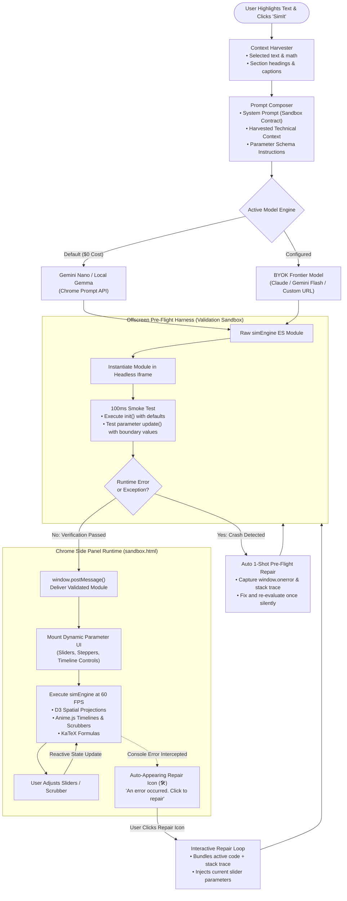
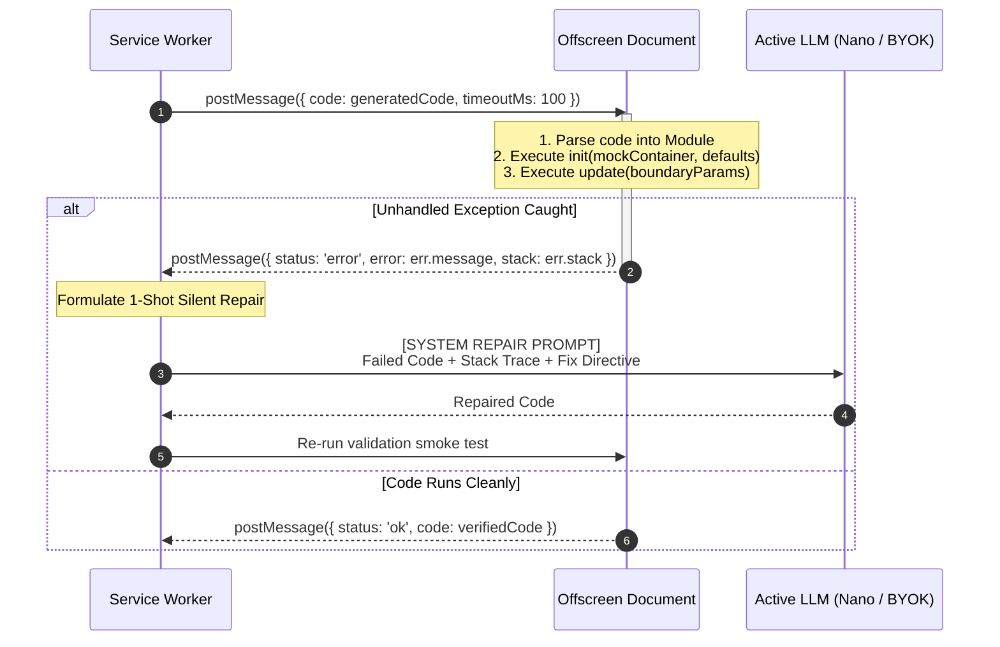
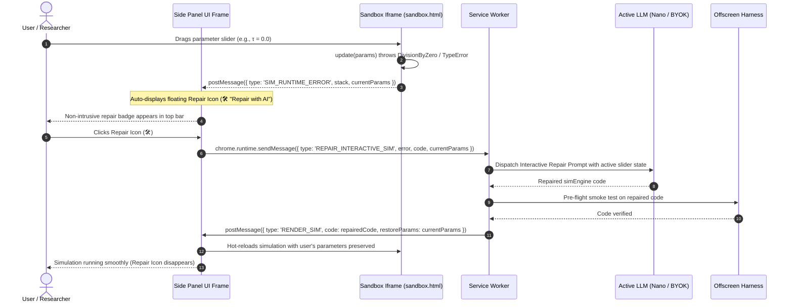

# Agent Loop & System Prompt Specification

This document specifies the autonomous **Agent Loop** and the **System Prompt Contract** for **SimIt**. It details how technical context is ingested, how the model is informed of sandboxed libraries and capabilities, and how the extension manages both **pre-flight automated self-repair** and **interactive runtime error recovery via an auto-appearing repair icon**.

---

## 1. The Autonomous Agent Loop

The agent loop orchestrates code generation, offscreen smoke testing, automated error diagnosis, and reactive rendering in the sandboxed iframe, with continuous error monitoring during user interactions.



---

## 2. System Prompt Architecture

### 2.1 Core Objectives of the System Prompt
The system prompt must achieve three goals:
1. **Define the persona and mission**: Generate a playable, visual, interactive simulation (`simEngine` ES module) rather than text explanations.
2. **Explicitly define sandbox capabilities**: Instruct the model exactly which libraries, globals, DOM elements, and helper methods are available inside the isolated execution environment.
3. **Enforce a strict output schema**: Constrain the output to executable JavaScript adhering to an expected lifecycle contract (`init`, `update`, `step`, `destroy`).

---

## 3. Sandboxed Runtime API & Environment Contract

The table below lists how capabilities and constraints are declared to the LLM in the system prompt:

| Component | Global Reference | Available Capabilities | Limitations & Rules |
| :--- | :--- | :--- | :--- |
| **D3.js** | `window.d3` (v7) | Coordinate scales (`scaleLinear`, `scaleOrdinal`), SVG line/area generators, force layouts, color interpolation (`interpolateViridis`). | Use D3 for spatial and data transforms; avoid external GeoJSON fetches. |
| **Anime.js** | `window.anime` (v3) | Keyframe timelines, tweening, spring physics, play/pause, seek, scrubber interpolation. | Manage animation instances through `simEngine` timeline hooks to enable scrubbability. |
| **KaTeX** | `window.katex` (v0.16) | Fast formula rendering via `katex.render(latexString, targetElement)`. | Use for annotating formulas, variables, and axes with LaTeX typography. |
| **Canvas / SVG** | `#sim-root` container | Standard HTML5 Canvas 2D context or dynamic SVG elements. | Responsive width (300px–500px matching Side Panel); auto-resizes to container. |
| **Network & IO** | *None (Strict CSP)* | Local memory and math functions only (`Math.*`). | **Zero network**: No `fetch`, `XMLHttpRequest`, `WebSocket`, `localStorage`, or external scripts. |

---

## 4. The `simEngine` Lifecycle Contract

The LLM is instructed to output an ES module matching the following interface:

```typescript
interface SimModule {
  title: string;
  description: string;
  
  // Declares dynamic controls to be generated in the Side Panel UI
  parameters: Array<{
    id: string;
    label: string;
    type: 'slider' | 'toggle' | 'stepper' | 'select';
    min?: number;
    max?: number;
    step?: number;
    default: number | boolean | string;
    unit?: string;
    options?: string[]; // For select type
  }>;

  // Lifecycle Methods
  init(container: HTMLElement, params: Record<string, any>): void;
  update(params: Record<string, any>): void;
  step?(stepIndex: number): void; // For discrete algorithms
  destroy?(): void; // Cleanup timers, requestAnimationFrame, or listeners
}
```

---

## 5. Concrete System Prompt Specification

Below is the concrete system prompt injected into the model (Gemini Nano or BYOK provider):

```markdown
You are SimIt, an expert graphics and simulation engineer. Your task is to transform technical concepts, scientific formulas, and algorithms into self-contained, interactive visual simulations.

### EXECUTION ENVIRONMENT & AVAILABLE TOOLS
Your code runs inside an isolated browser iframe sandbox with NO network access.
The following localized libraries are pre-loaded in the global scope:
1. `d3` (v7): Available globally as `d3`. Use for geometric projections, axes, scales, and layouts.
2. `anime` (v3): Available globally as `anime`. Use for timelines, tweens, and smooth animation loops.
3. `katex`: Available globally as `katex`. Use `katex.render(formula, domElement)` for rendering LaTeX equations.
4. Container: You are given an empty DOM element `<div id="sim-root"></div>` with dynamic width (300px to 450px).

### RESTRICTIONS & CSP RULES
- Do NOT use `fetch`, `XMLHttpRequest`, `WebSocket`, or load external CDN scripts.
- Do NOT use `eval()` or access `window.parent` / `document.cookie`.
- Ensure all computations are safe: guard against division by zero, `NaN`, and infinite loops.
- All styles must be applied directly via JavaScript or inline CSS within the container.

### OUTPUT FORMAT
Output ONLY valid JavaScript (ES module format) with NO markdown backticks or text preamble.
Your module must export default an object with the following structure:

export default {
  title: "Short Descriptive Title",
  description: "1-sentence summary of the interactive concept.",
  parameters: [
    { id: "tau", label: "Temperature (τ)", type: "slider", min: 0.1, max: 5.0, step: 0.1, default: 1.0 },
    { id: "showVectors", label: "Show Projections", type: "toggle", default: true }
  ],
  init(container, params) {
    // 1. Create Canvas or SVG inside container
    // 2. Initial render using params
  },
  update(params) {
    // Reactively update visual elements based on changed slider/toggle values
  },
  destroy() {
    // Cancel requestAnimationFrame or anime timelines
  }
};
```

---

## 6. Pre-Flight Verification & Automatic 1-Shot Self-Correction

Before presenting code to the user, the **Offscreen Pre-Flight Harness** validates execution silently:



### Self-Correction Repair Prompt Format
When an exception occurs during the 100ms test, the following repair prompt is dispatched:

```markdown
Your previously generated simulation code failed during sandboxed pre-flight verification.

### FAILED CODE:
```javascript
<PREVIOUS_GENERATED_CODE>
```

### RUNTIME ERROR & STACK TRACE:
<ERROR_MESSAGE>
<STACK_TRACE>

### REPAIR DIRECTIVES:
1. Fix the root cause identified in the stack trace.
2. Check for missing variable definitions, unhandled `null`/`undefined` DOM nodes, or library API mismatches (ensure valid `d3`, `anime`, or `katex` method signatures).
3. Ensure defensive mathematical checks (guard against division by zero or empty arrays).
4. Return ONLY the repaired executable ES module code with no markdown wrapping.
```

---

## 7. Interactive Runtime Error Interception & Auto-Appearing Repair Icon

Even if code passes the pre-flight smoke test, edge cases can occur during live user interaction—for instance, dragging a parameter slider to a boundary value that triggers a math divide-by-zero, or scrubbing past an array bound.

### 7.1 Runtime Error Interception in `sandbox.html`
Inside the running sandboxed iframe, global error hooks catch unhandled console errors without crashing the Side Panel:

```javascript
// sandbox.html runtime error hooks
window.addEventListener("error", (event) => {
  window.parent.postMessage({
    type: "SIM_RUNTIME_ERROR",
    message: event.message,
    filename: event.filename,
    lineno: event.lineno,
    colno: event.colno,
    stack: event.error ? event.error.stack : null,
    currentParams: window.__currentSimParams
  }, "*");
});

window.addEventListener("unhandledrejection", (event) => {
  window.parent.postMessage({
    type: "SIM_RUNTIME_ERROR",
    message: event.reason ? event.reason.message : "Unhandled Promise Rejection",
    stack: event.reason ? event.reason.stack : null,
    currentParams: window.__currentSimParams
  }, "*");
});
```

### 7.2 The Auto-Appearing Repair Icon UX Flow



### 7.3 Interactive Repair Prompt Structure
When the user clicks the auto-appearing Repair Icon, the prompt includes both the failure stack trace and the exact parameter configuration the user had selected when the error happened:

```markdown
The user was interacting with the simulation when an unhandled runtime error occurred in the browser console.

### CURRENT PARAMETER STATE:
<JSON_STRINGIFIED_CURRENT_PARAMS>

### FAILED CODE:
```javascript
<CURRENT_ACTIVE_CODE>
```

### CONSOLE ERROR & STACK TRACE:
<ERROR_MESSAGE>
<STACK_TRACE>

### REPAIR DIRECTIVE:
1. Fix the error that occurred under the specified parameter state.
2. Defensively handle extreme parameter ranges and edge cases.
3. Return ONLY the repaired executable ES module code.
```
