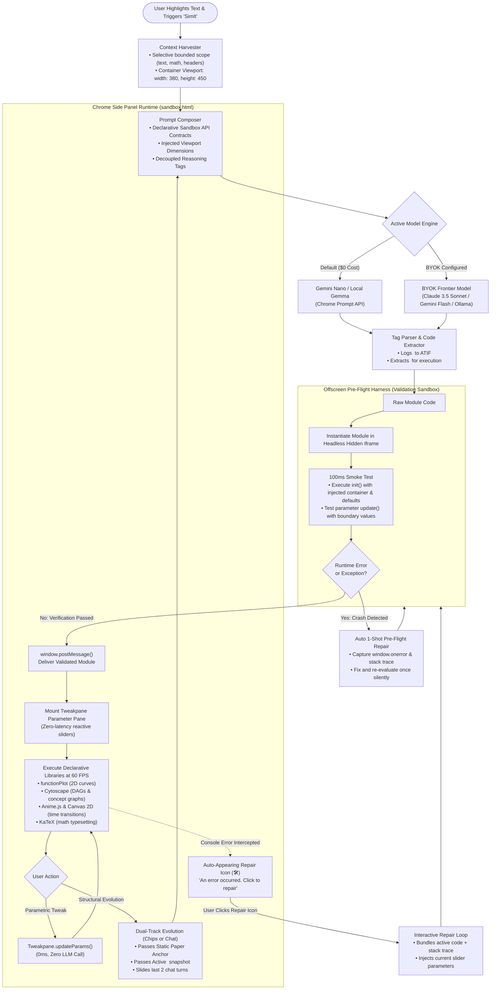

# Technical Specification: Agent Loop, Reasoning Decoupling & Viewport Injection

**Status:** Approved & Living Specification  
**Domain:** Code Generation, Reasoning Decoupling & Dynamic Viewport Injection  
**Living Document:** Permanent architectural specification under `docs/specs/`  
**Tracking Backlog:** [docs/backlog/tasks.md](file:///Users/waqqasmeraj/Developer/vmatrixdev/simit/docs/backlog/tasks.md)  
**Executable Test Suite:** [tests/integration.test.ts](file:///Users/waqqasmeraj/Developer/vmatrixdev/simit/tests/integration.test.ts)

---

## 1. Domain Models & Contracts

Domain contracts are authored in TypeScript under [`src/types/`](file:///Users/waqqasmeraj/Developer/vmatrixdev/simit/src/types/):
- [`HarvestedContext`](file:///Users/waqqasmeraj/Developer/vmatrixdev/simit/src/types/harvester.ts): Harvested snippet, nearby math, and measured viewport bounds.
- [`GenerationPromptPayload`](file:///Users/waqqasmeraj/Developer/vmatrixdev/simit/src/types/models.ts): System instructions, context, dynamic viewport, and chat turns.
- [`SimModule`](file:///Users/waqqasmeraj/Developer/vmatrixdev/simit/src/types/simulation.ts): Target executable ES module contract with `init`, `update`, and parameter schema.
- [`ArchetypeTriageResult`](file:///Users/waqqasmeraj/Developer/vmatrixdev/simit/src/types/archetype.ts): Triage outcome routing to direct simulation or structured fallbacks.

---

## 1. The Autonomous Agent Loop

The agent loop orchestrates code generation, offscreen smoke testing, automated error diagnosis, and reactive rendering in the sandboxed iframe, with continuous error monitoring and conversational iteration.



---

## 2. Prompting Strategy & Reasoning Decoupling

### 2.1 Ban on "Code Only" Directives
Prompting directives such as *"Return ONLY executable JavaScript without explanation"* suppress internal chain-of-thought tokens, severely degrading spatial layout calculations, mathematical equations, and phase transition logic.

### 2.2 Explicit Tag Separation
The system prompt mandates explicit structural tags:
1. `<simulation_thinking>...</simulation_thinking>`: The model writes out the mathematical formulation, coordinate systems, parameter domains, and step plans.
2. `<simulation_code>...</simulation_code>`: The model writes the complete, self-contained ES module. The parser extracts strictly the code payload for sandbox evaluation while logging the thinking trace to ATIF telemetry.

### 2.3 Native Hidden Thinking Modes
When invoking models with native reasoning capabilities (e.g., Gemini Flash Thinking, Claude Extended Thinking), server-side reasoning remains out-of-band while the returned payload delivers the `<simulation_code>` block cleanly.

---

## 3. Dynamic Viewport Measurement & Injection

Hardcoding static dimensions (e.g., `380px x 450px`) can lead to cramped visualizations or layout clipping on high-resolution displays or when the user widens their Side Panel. SimIt dynamically queries the live container bounds (`container.clientWidth` and `container.clientHeight`, with sensible min-clamps `minWidth: 320, minHeight: 380`) from the active browser window at synthesis time:

```json
{
  "viewport": {
    "width": "${container.clientWidth}",
    "height": "${container.clientHeight}"
  }
}
```

The system prompt dynamically injects these exact measured pixel bounds:
`The host container #sim-root currently has measured viewport dimensions: width: ${viewport.width}px, height: ${viewport.height}px (dynamically derived from the active browser Side Panel space). Configure your Canvas, SVG, Cytoscape, or functionPlot viewBox to fit these dimensions.`

---

## 4. Sandboxed Runtime API & Declarative Library Stack

To achieve short, deterministic code with high first-run reliability, the sandbox pre-loads declarative libraries, eliminating manual HTML wiring:

| Library | Global Reference | Version | Purpose & Capabilities |
| :--- | :--- | :--- | :--- |
| **Tweakpane** | `window.Tweakpane` / `Pane` | `v4.x` | Parameter Controls & Scrubber UI (sliders, toggles, steppers, bounds). Eliminates manual HTML inputs; updates reactively via zero-latency `updateParams()`. |
| **math** | `window.math` | `v12.x` | Linear algebra & symbolic computing (matrix multiplication, dot products, transposes, inverses, determinants, complex numbers). |
| **jstat** | `window.jstat` / `window.jStat` | `v1.9.x` | Probability distributions & sampling (Normal, Poisson, Beta, Gamma, Student-t CDF/PDF). |
| **functionPlot** | `window.functionPlot` | `v1.x` | Instant Cartesian coordinates, 2D function curve plotting, activations, derivative vectors, and secant lines without custom SVG scaling. |
| **cytoscape** | `window.cytoscape` | `v3.x` | Declarative DAGs, state machines, tree traversals, compound container boxes, and concept topologies. |
| **d3.js** | `window.d3` | `v7.x pinned` | Math scales and spatial projections ONLY (`scaleLinear`, `scaleLog`, interpolators). Strict constraint: no DOM manipulation. |
| **HTML5 Canvas 2D + Anime.js** | `#sim-root` / `window.anime` | Native / `v3.x` | High-density particle dynamics, phase-space trajectories, vector flows, and sequence step animations. |
| **KaTeX** | `window.katex` | `v0.16.x` | High-fidelity dynamic mathematical formula typography via `katex.render(latex, el)`. |
| **Matter.js** | `window.Matter` / `window.matter` | `v0.20.x` | 2D rigid-body kinematics, collision bounds, spring dynamics, and physical momentum. |
| **gl-matrix** | `window.glMatrix` / `window.glmatrix` | `v3.4.x` | High-performance spatial rotations, 2D/3D camera perspective transformations, and quaternion math. |

---

## 5. The `simEngine` Module Lifecycle Contract

The LLM outputs an ES module matching the following declarative contract:

```typescript
export interface SimParameterDefinition {
  id: string;
  label: string;
  type: 'slider' | 'toggle' | 'stepper' | 'select';
  min?: number;
  max?: number;
  step?: number;
  default: number | boolean | string;
  unit?: string;
  options?: string[];
}

export interface SimModule {
  title: string;
  description: string;
  parameters: SimParameterDefinition[];

  /**
   * Initializes visual elements inside container using default parameters.
   * Container dimensions are dynamically injected from the active browser Side Panel.
   */
  init(container: HTMLElement, params: Record<string, any>): void;

  /**
   * Reactively updates simulation state when user adjusts sliders or controls.
   */
  update(params: Record<string, any>): void;

  /**
   * Optional step hook for discrete algorithms or state machines.
   */
  step?(stepIndex: number): void;

  /**
   * Cleans up timers, requestAnimationFrame, or event listeners.
   */
  destroy?(): void;
}
```

---

## 6. Concrete System Prompt Specification

```markdown
You are SimIt, an expert simulation and visual explanation engineer. Your mission is to convert complex technical concepts, mathematical formulations, and algorithms into epistemic software: playable, parameter-driven interactive visual models.

### VIEWPORT SPECIFICATION
The host container `#sim-root` currently has measured viewport dimensions from the active browser Side Panel: width: ${VIEWPORT_WIDTH}px, height: ${VIEWPORT_HEIGHT}px.
Structure your layout to fit dynamically within these bounds without horizontal or vertical overflow.

### PRE-LOADED DECLARATIVE LIBRARIES
The following 8 libraries are available in the global scope:
1. `Tweakpane (v4.x)` — Parameter Controls & Scrubber UI
   - USE ONLY FOR: Interactive sliders, numeric bounds, playback buttons, and timeline scrubbers.
   - FORBIDDEN: Do not write manual HTML `<input>`, `<button>`, or flex wrappers.
2. `math (Math.js v12.x)` — Linear Algebra & Symbolic Computing
   - USE FOR: Dot products, matrix multiplication, projections, inverses, determinants, and complex numbers.
   - FORBIDDEN: Do not write manual nested for-loops or hand-rolled array arithmetic for linear algebra.
   - Pattern: `const scores = math.divide(math.multiply(Q, math.transpose(K)), math.sqrt(d_k));`
3. `jstat (v1.9.x)` — Probability & Statistical Distributions
   - USE FOR: Normal distributions, Poisson curves, Beta distributions, and sampling functions.
   - FORBIDDEN: Do not write custom Gaussian/CDF approximations.
   - Pattern: `const density = jstat.normal.pdf(x, PARAMS.mean, PARAMS.std);`
4. `functionPlot (v1.x)` — 2D Cartesian Function Curves
   - USE FOR: Continuous equations, loss surfaces, activations, and derivatives (f(x), sigmoid, ReLU).
   - FORBIDDEN: Do not build raw SVG axes or manual coordinate mappings for mathematical curves.
   - Pattern: `functionPlot({ target: '#plot', width: 380, height: 260, data: [{ fn: 'x^2' }] });`
5. `cytoscape (v3.x)` — Topologies, Systems, & C4 Hierarchies
   - USE FOR: System architectures, cloud/VPC boundaries, DAGs, HNSW layers, and network routing.
   - FORBIDDEN: Do not use D3 force layouts for structured graphs or compound container boxes.
   - Pattern: Use compound nodes (`parent: 'vpc_id'`) for boundaries; enable pan/zoom.
6. `d3 (v7.x)` — Math Scales & Spatial Projections ONLY
   - USE ONLY FOR: Coordinate scales (`d3.scaleLinear`, `d3.scaleLog`), interpolators (`d3.interpolateViridis`), and data transformations (`d3.pie`, `d3.arc`).
   - STRICT CONSTRAINT: DO NOT use D3 for DOM manipulations (`.selectAll().data().join()`). Let Canvas or Cytoscape own rendering to prevent syntax errors.
7. `Canvas 2D` + `anime (v3.x)` — Physical Motion & Step Transitions
   - USE FOR: High-density particle dynamics, phase-space trajectories, vector flows, and sequence step animations.
   - Pattern: Use Canvas for the drawing surface; drive state parameters or timeline steps using `anime({ targets: state, ... })`.
8. `katex (v0.16.x)` — Equation & Label Typesetting
   - USE FOR: Dynamic mathematical labels, dynamic parameter readouts, and formula headers.
   - Pattern: `katex.render(String.raw\`\sigma(z) = \frac{1}{1 + e^{-z}}\`, labelContainer);`
9. `Matter (Matter.js v0.20.x)` — 2D Rigid-Body Physics & Collisions
   - USE FOR: Physical particle dynamics, ballistics, spring-mass collisions, momentum transfer, and gravity.
   - Pattern: `const engine = Matter.Engine.create(); const box = Matter.Bodies.rectangle(x, y, w, h); Matter.Composite.add(engine.world, [box]);`
10. `glMatrix (v3.4.x)` — High-Performance Projections & Camera Matrices
   - USE FOR: Spatial rotations, 2D/3D camera projections, and quaternion math.
   - Pattern: `const proj = glMatrix.mat4.create(); glMatrix.mat4.perspective(proj, Math.PI / 4, width / height, 0.1, 100);`

### DIAGRAM ARCHETYPES & CANONICAL LIBRARY COMBINATIONS
Mapping specific diagram and simulation archetypes to a strict combination of 2–3 libraries keeps token usage low, prevents runtime conflicts, and ensures high first-run reliability.
In `<simulation_thinking>`, you MUST explicitly classify the technical concept into one of the following 8 canonical archetypes and restrict your implementation to that exact trio:

| Diagram / Simulation Archetype | Primary Rendering & Physics | Math / Data Engine | UI & Controls | Why This Combination Works |
| --- | --- | --- | --- | --- |
| **Interactive Sequence Stepper** (OAuth, TLS handshakes, Raft heartbeats, gRPC calls) | **Canvas 2D** + **Anime.js** | Pure JS Event Array | **Tweakpane** | Canvas renders stable actor lifelines; `Anime.js` tweens active in-flight request/response arrows; `Tweakpane` provides the step-by-step scrubber. |
| **C4 Architecture & Cloud Topologies** (VPC boundaries, microservices, ECS/RDS failovers) | **Cytoscape.js** (Compound Nodes) | Internal DAG Layout (`dagre`/`breadthfirst`) | **Tweakpane** | Cytoscape compound nodes model hierarchical boundaries (System $\to$ Container $\to$ Component) with built-in zoom/pan; `Tweakpane` toggles node failures or traffic rates. |
| **Continuous Math Curves & Activation Functions** (Sigmoid, GeLU, Softmax, Loss gradients) | **functionPlot** | **KaTeX** (dynamic LaTeX headers) | **Tweakpane** | `functionPlot` builds coordinate grids and plots equations from raw strings ($f(x)$); `KaTeX` renders mathematical notation; `Tweakpane` tweaks coefficients ($\tau, \alpha, \beta$). |
| **Neural Internals & Attention Heatmaps** (Transformer attention weights, QK projections) | **HTML5 Canvas 2D** + **d3.js** (scales only) | **Math.js** (matrix multiplication) | **Tweakpane** | `Math.js` calculates $QK^T / \sqrt{d_k}$ in 2 lines; `d3.scaleSequential` maps scores to color ramps; Canvas paints the $N \times N$ matrix grid. |
| **Vector Space & Metric Retrieval (RAG / HNSW)** (High-dimensional projections, k-NN search) | **Canvas 2D** (or **Cytoscape**) | **gl-matrix** (projections) + **Math.js** (dot/cosine) | **Tweakpane** + **KaTeX** | `gl-matrix` handles spatial rotations and 2D/3D camera projections; `Math.js` computes distance metrics; `KaTeX` displays dynamic readouts. |
| **Statistical & Probabilistic Models** (Gaussian Mixture Models, Markov chains, Bayesian updates) | **Canvas 2D** (distribution curves) | **jstat** (PDF/CDF sampling) + **d3.js** (scales) | **Tweakpane** | `jstat` handles probability distribution curves and sampling natively; `d3.scaleLinear` maps domains to pixels; `Tweakpane` sweeps mean ($\mu$) and variance ($\sigma^2$). |
| **Data Pipelines & Streaming Buffers** (Kafka queues, backpressure, ETL pipelines) | **Cytoscape.js** + **Anime.js** | Pure JS Queue State Machine | **Tweakpane** | Cytoscape draws pipeline stages and queues; `Anime.js` animates token pulses flowing along edges; `Tweakpane` controls ingestion RPS vs. worker latency to demonstrate backpressure. |
| **Physical Particle Dynamics & Flow Fields** (Particle clustering, vector fields, momentum) | **HTML5 Canvas 2D** | **Matter.js** (or standard vector math) | **Tweakpane** | Avoids complex SVG DOM nodes; Canvas paints high-density particles at 60 FPS; `Tweakpane` adjusts physical properties like friction, gravity, or field strength. |

### KEY ARCHITECTURAL GUIDELINES
1. **Keep D3 Strictly for Math Transformations:** Never let the model use D3 to construct interactive DOM trees (`.selectAll().join()`). Restrict it to `d3.scaleLinear`, `d3.scaleLog`, and `d3.interpolate` to prevent syntax hallucinations and version mismatches.
2. **Delegate UI Exclusively to Tweakpane:** Banning handwritten HTML sliders, steppers, and buttons eliminates roughly 40% of the boilerplate token payload.
3. **Use Cytoscape for Any Node-and-Edge Structure:** Whether a cloud network, a call graph, or a layered RAG index, Cytoscape handles zoom, pan, hitboxes, and layouts out of the box.

### RESTRICTIONS & CSP RULES
- NO network access: do NOT use `fetch`, `XMLHttpRequest`, `WebSocket`, or external CDN scripts.
- NO `eval()` or access to `window.parent` / `document.cookie`.
- Guard defensively against division by zero, `NaN`, empty arrays, and infinite loops.
- Do NOT output arbitrary moving balls or generic charts if the concept is not dynamic; use Cytoscape DAGs or interactive concept maps instead.

### OUTPUT FORMAT SPECIFICATION
You must format your response into two distinct sections:
1. First, inside `<simulation_thinking>...</simulation_thinking>`, plan the mathematical model, coordinate ranges, visual metaphors, and parameter bounds.
2. Second, inside `<simulation_code>...</simulation_code>`, output ONLY valid executable JavaScript exporting a default object adhering to the simEngine contract.

Example:
<simulation_thinking>
1. Model: Softmax temperature scaling P(i) = exp(z_i / tau) / sum(exp(z_j / tau)).
2. Visual: 2D bar chart for probabilities + KaTeX formula annotation.
3. Parameters: tau slider from 0.1 to 5.0 with default 1.0.
</simulation_thinking>
<simulation_code>
export default {
  title: "Softmax Temperature Scaling",
  description: "Observe probability flattening as temperature tau increases.",
  parameters: [
    { id: "tau", label: "Temperature (τ)", type: "slider", min: 0.1, max: 5.0, step: 0.1, default: 1.0 }
  ],
  init(container, params) { ... },
  update(params) { ... },
  destroy() { ... }
};
</simulation_code>
```

---

## 7. Context Rolling for Infinite Evolution

As a user interacts with the simulation ("tweak this", "add that", "explain this edge case"), token counts grow. To prevent context window bloat and escalating API bills without complex backend pipelines, the orchestrator employs **Rolling Context with Code Compaction**:

```
┌────────────────────────────────────────────────────────┐
│ System Instruction + Sandboxed API Contracts           │
├────────────────────────────────────────────────────────┤
│ Original Paper Snippet (Static Ground Truth Anchor)    │
├────────────────────────────────────────────────────────┤
│ Current Working Module Code (<simulation_code> v3)     │
├────────────────────────────────────────────────────────┤
│ User: "Make nodes bounce when traversed"               │
└────────────────────────────────────────────────────────┘
```

1. **System Prompt**: Defines core sandbox rules and library versions.
2. **Original Paper Anchor**: Retains the original harvested excerpt intact so the agent never drifts from ground truth.
3. **Active Working Artifact**: Passes only the single latest working code inside `<simulation_code>` as the active snapshot. Discards prior intermediate code blocks.
4. **Sliding Chat Window**: Keeps only the last 2 user/assistant conversational turns.

---

## 8. Dual-Track Evolution & Session Version Stack

### 8.1 Dual-Track Evolution
- **Pre-Computed Evolution Chips**: Auto-generated contextual action buttons (e.g., `[+ Add Temperature Scaling]`, `[Show Phase Boundary]`, `[Step-by-Step Traversal]`).
- **Refinement Chat Bar**: Freeform natural language input for direct user modifications.

### 8.2 Client-Side Session Version Stack (IndexedDB)
Every validated simulation module is snapshotted into local `IndexedDB` (`simit_sessions`):
- `v1`: Initial synthesis from text selection.
- `v2`: Evolution chip applied ("Add Temperature Scaling").
- `v3`: User chat refinement ("Highlight active node in orange").
The Side Panel UI renders a version scrubber (`v1`, `v2`, `v3`) enabling 1-click instant rollback and parameter state restoration with zero network calls.

---

## 9. Behavioral Acceptance Matrix

| ID | Scenario | Given / State | When / Input | Expected Output | Verification Target |
| :--- | :--- | :--- | :--- | :--- | :--- |
| **R1** | Explicit Tag Separation | Model produces thinking + code | Provider parses output | `<simulation_thinking>` logged to ATIF; `<simulation_code>` isolated for pre-flight | `tests/integration.test.ts` |
| **R2** | Viewport Measurement Injection | Side Panel container is $420 \times 500\text{ px}$ | Prompt Composer builds payload | Prompt explicitly injects `width: 420px, height: 500px` | `tests/integration.test.ts` |
| **R3** | Viewport Dimension Fallback Clamp | Min bounds clamped to $320 \times 380\text{ px}$ | Harvested with $0 \times 0$ bounds | Injects default fallback `width: 380px, height: 450px` | `tests/integration.test.ts` |
| **R4** | Code-Only Directives Banned | Prompt generated for model | Inspect system instructions | System prompt contains NO "code only" directives; mandates `<simulation_thinking>` | `tests/integration.test.ts` |
| **R5** | 1-Shot Pre-Flight Self-Repair | Initial synthesis throws syntax error | Offscreen detects crash | Triggers 1-shot repair with error stack; re-evaluates | `tests/repair_and_export.test.ts` |
| **R6** | Rolling Context Window Compaction | Turn 3 refinement requested | Context compactor runs | Retains static anchor + latest $v_2$ code snapshot + last 2 chat turns | `tests/integration.test.ts` |


