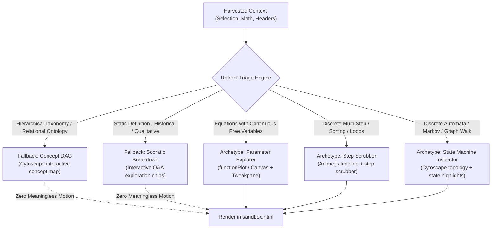

# Technical Specification: Archetype Triage & Fallback Modalities

**Status:** Approved & Living Specification  
**Domain:** Model Orchestration & Epistemic Archetype Triage  
**Living Document:** Permanent architectural specification under `docs/specs/`  
**Tracking Backlog:** [docs/backlog/tasks.md](file:///Users/waqqasmeraj/Developer/vmatrixdev/simit/docs/backlog/tasks.md)  
**Executable Test Suite:** [tests/archetype_triage.test.ts](file:///Users/waqqasmeraj/Developer/vmatrixdev/simit/tests/archetype_triage.test.ts)

---

## 1. Overview & Business Objectives

When users trigger **SimIt** on arbitrary paper or documentation text, not all snippets represent dynamic systems or parameter-driven equations. Generating arbitrary moving balls or generic charts for static concepts degrades user trust and violates epistemic software integrity.

The **Archetype Triage & Fallback Modalities** subsystem:
1. **Upfront Viability Classification**: Evaluates harvested context and classifies it into one of 5 canonical archetypes before code synthesis.
2. **"No Meaningless Motion" Invariant**: Strictly forbids decorative motion, arbitrary bouncing balls, or ungrounded animations for static text.
3. **Structured Non-Simulatable Fallbacks**: Automatically routes non-simulatable text into interactive **Cytoscape Concept DAGs** or **Socratic Question-and-Answer Breakdown Chips**.
4. **Equation Guidance & Context Expansion**: When text references mathematical variables without explicit formulas, guides the user to expand their selection to neighboring equations.

---

## 2. Taxonomy & Triage Decision Tree



---

## 3. Contracts & Data Models

TypeScript domain contracts are authored in [`src/types/archetype.ts`](file:///Users/waqqasmeraj/Developer/vmatrixdev/simit/src/types/archetype.ts):
- [`ArchetypeType`](file:///Users/waqqasmeraj/Developer/vmatrixdev/simit/src/types/archetype.ts): `'parameter_explorer' | 'step_scrubber' | 'state_machine' | 'concept_dag' | 'socratic_breakdown'`.
- [`ArchetypeClassification`](file:///Users/waqqasmeraj/Developer/vmatrixdev/simit/src/types/archetype.ts): Triage outcome containing archetype, confidence (0.0–1.0), rationale, simulatable boolean, and suggested variables.
- [`ConceptDagData`](file:///Users/waqqasmeraj/Developer/vmatrixdev/simit/src/types/archetype.ts): Directed acyclic graph specification with strongly typed nodes (`core`, `prerequisite`, `application`, `extension`) and edge relationships (`depends_on`, `generalizes`, `produces`, `contrasts_with`).
- [`SocraticBreakdownData`](file:///Users/waqqasmeraj/Developer/vmatrixdev/simit/src/types/archetype.ts): Question-and-answer exploration matrix containing core thesis, interactive inquiry chips, and LaTeX annotations.
- [`ArchetypeTriageResult`](file:///Users/waqqasmeraj/Developer/vmatrixdev/simit/src/types/archetype.ts): Unified payload dispatched to orchestrator and logged to ATIF trajectory telemetry.

### 3.1 Upfront Triage Prompt Contract

When triage runs, the orchestrator prompts the engine with the following JSON schema contract:

```json
{
  "name": "archetype_triage",
  "description": "Classify text snippet into simulation archetype or structured fallback",
  "parameters": {
    "type": "object",
    "properties": {
      "archetype": {
        "type": "string",
        "enum": ["parameter_explorer", "step_scrubber", "state_machine", "concept_dag", "socratic_breakdown"]
      },
      "confidence": { "type": "number", "minimum": 0.0, "maximum": 1.0 },
      "rationale": { "type": "string" },
      "isSimulatable": { "type": "boolean" },
      "suggestedVariables": { "type": "array", "items": { "type": "string" } }
    },
    "required": ["archetype", "confidence", "rationale", "isSimulatable"]
  }
}
```

---

## 4. Domain Invariants & Edge Cases

1. **"No Meaningless Motion" Rule**: If `isSimulatable` is `false`, the synthesizer MUST NOT output moving particles, bouncing balls, or arbitrary oscillating waves. It must output a `concept_dag` or `socratic_breakdown`.
2. **Missing Equation Fallback**: If text describes mathematical relationships (e.g. *"the attention weights are scaled by the square root of the key dimension"*) but lacks the formula $QK^T / \sqrt{d_k}$, triage flags `suggestedVariables: ["d_k", "Q", "K"]` and appends an expansion recommendation banner.
3. **Deterministic Archetype Mapping**:
   - Math equations with $\ge 1$ continuous parameter $\to$ `parameter_explorer`.
   - Sequential algorithms with explicit step counters $\to$ `step_scrubber`.
   - Finite states, transitions, or network topologies $\to$ `state_machine`.
   - Taxonomies, component hierarchies, or ontologies $\to$ `concept_dag`.
   - Biographical, historical, or philosophical text $\to$ `socratic_breakdown`.
4. **ATIF Telemetry Logging**: Every triage decision is recorded under the `archetype_triage` field in the session's ATIF trajectory log ([docs/specs/atif_specification.md](file:///Users/waqqasmeraj/Developer/vmatrixdev/simit/docs/specs/atif_specification.md)).

---

## 5. Behavioral Acceptance Matrix

| ID | Scenario | Given / State | When / Input | Expected Archetype | `isSimulatable` | Fallback Artifact | Test Target |
| :--- | :--- | :--- | :--- | :--- | :--- | :--- | :--- |
| **A1** | Softmax Temperature Equation | Math block: $P(i) = \frac{e^{z_i/\tau}}{\sum e^{z_j/\tau}}$ | Triage evaluation | `parameter_explorer` | `true` | None (Direct Sim) | `tests/archetype_triage.test.ts` |
| **A2** | QuickSort Partition Loop | Pseudo-code with `i`, `j`, pivot swap loop | Triage evaluation | `step_scrubber` | `true` | None (Direct Sim) | `tests/archetype_triage.test.ts` |
| **A3** | TCP Congestion States | Description of Slow Start $\to$ Congestion Avoidance | Triage evaluation | `state_machine` | `true` | None (Direct Sim) | `tests/archetype_triage.test.ts` |
| **A4** | Transformer Layer Hierarchy | Text: *"Transformer consists of Encoder and Decoder stacks..."* | Triage evaluation | `concept_dag` | `false` | Cytoscape DAG | `tests/archetype_triage.test.ts` |
| **A5** | Historical Intro to Perceptron | Text: *"In 1958, Frank Rosenblatt proposed the Perceptron..."* | Triage evaluation | `socratic_breakdown` | `false` | Socratic Q&A Chips | `tests/archetype_triage.test.ts` |
| **A6** | Ungrounded Motion Guard | Non-simulatable text passed to code generator | Synthesizer generates output | Rejects arbitrary canvas animations | Generates Concept DAG | `tests/archetype_triage.test.ts` |
