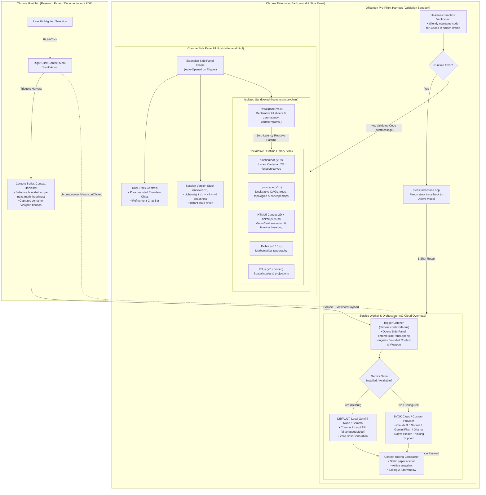
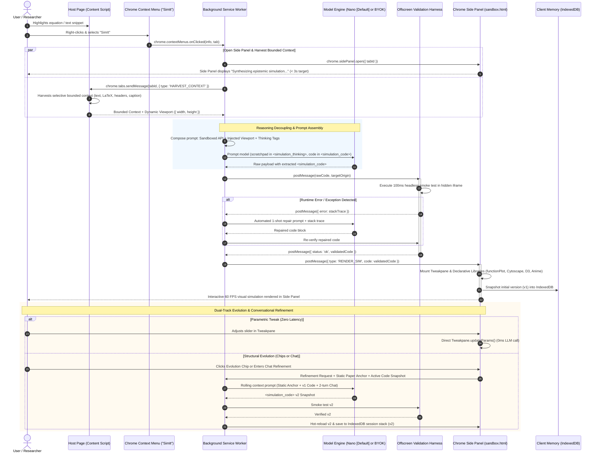

# System Architecture Specification

## 1. High-Level Architecture Overview

**SimIt** is the **"Lovable / v0 for interactive simulations and mental models."** Built as a Chrome Extension adhering strictly to **Manifest V3**, it acts as an autonomous compiler of static technical text, mathematical equations, and algorithms into **epistemic software**—playable state machines, phase transitions, and visual mathematical systems—rather than web apps or textual summaries.

The system targets a latency of **$< 3$ seconds to first frame** to preserve reading flow. The primary UX entry point allows users to highlight any text, equation, or algorithm:
1. The user right-clicks and selects **"SimIt"** from the browser context menu.
2. The action opens the native Chrome Side Panel and initiates the simulation pipeline.
3. The extension synthesizes declarative simulation modules using an on-device local engine (**Gemini Nano / local Gemma** via Chrome's Prompt API) by default with **$0 infrastructure cost**, validates code in an offscreen sandbox harness, and renders interactive visual simulations inside the Side Panel.
4. For high-fidelity generation, users can configure external frontier models via a **BYOK (Bring Your Own Key)** provider system (Claude 3.5 Sonnet, Gemini Flash, Ollama).

---

## 2. End-to-End Execution Flow

The sequence diagram below details the complete execution lifecycle from in-page trigger to side panel launch, reasoning decoupling, sandbox execution, and conversational refinement:

---

## 3. Architectural Subsystems

### 3.1 Selection Ingestion & Context Capture
* **Selective Bounded Scope (No Full Page Dumps)**: Ingests only the user's highlighted snippet, preceding section heading (`h1`–`h4`), neighboring caption/LaTeX elements (`\(...\)`, `\[...\]`, `<figcaption>`), and immediate adjacent paragraphs. Prevents context dilution and minimizes time-to-first-token.
* **Context Menu Activation**: Triggered cleanly via `chrome.contextMenus` for text and math selection contexts (`contexts: ["selection"]`), opening the Side Panel without injecting visual DOM elements into the host tab.
* **Dynamic Viewport Measurement & Injection**: The active Side Panel container pixel dimensions (`container.clientWidth`, `container.clientHeight`, adapting to user panel drag or browser viewport space) are queried dynamically at trigger time and injected directly into the system prompt to eliminate zero-dimension layout failures and optimize visual scaling.

### 3.2 UI Hosting: Side Panel vs. Inline DOM
* **Primary Container**: Native Chrome Side Panel (`chrome.sidePanel`) hosting an isolated `sandbox.html` via `postMessage`.
* **Architectural Rationale**: Side Panel provides complete CSS isolation, predictable aspect ratios, zero host-page style collisions, and universal compatibility across standard web pages, local documentation, and PDF.js / arXiv viewers.

### 3.3 Prompting Strategy & Reasoning Decoupling
* **No "Code Only" Directives**: Forcing raw code output suppresses chain-of-thought tokens and degrades spatial/mathematical generation quality.
* **Explicit Scratchpad Separation**:
  * Models write mathematical models, coordinate mappings, and step plans inside `<simulation_thinking>...</simulation_thinking>`.
  * Complete executable module code is returned inside `<simulation_code>...</simulation_code>`.
* **Native Hidden Thinking**: Leverages native reasoning APIs (Gemini Flash Thinking, Claude Extended Thinking) so server-side reasoning remains out-of-band while the payload returns verified code.

### 3.4 Declarative Sandboxed Runtime Stack (`sandbox.html`)
To achieve short, deterministic code with high first-run reliability, the runtime provides declarative libraries rather than letting LLMs invent DOM wiring:
* **Tweakpane (v4.x)**: Declarative parameter pane eliminating manual HTML sliders, labels, and event listeners; provides zero-latency `updateParams()`.
* **functionPlot (v1.x)**: Instant Cartesian coordinates and function curve evaluation without custom SVG scale math.
* **cytoscape (v3.x)**: Declarative DAGs, trees, and network layouts for discrete algorithms and concept graphs.
* **HTML5 Canvas 2D + anime.js (v3.x)**: Reliable vector/fluid canvas rendering and timeline tweening.
* **KaTeX (v0.16.x)**: High-speed LaTeX formula typesetting.
* **D3.js (v7.x pinned)**: Explicitly pinned to v7 to prevent deprecated v3/v4 syntax hallucinations.

### 3.5 Fallback Modes for Non-Simulatable Text
* **Upfront Archetype Triage**: Classifies input text into dynamic mathematical/state systems vs static conceptual text.
* **Graceful Alternate Modalities**: If text lacks dynamic math or state transitions (e.g., historical background, static definitions), renders an interactive concept map (Cytoscape DAG) or Socratic chip breakdown.
* **No Meaningless Motion**: Strictly avoids arbitrary bouncing balls or random charts to maintain epistemic truth.

### 3.6 Progressive Complexity & Conversational Iteration
* **Dual-Track Controls**: Pre-computed evolution chips (e.g., `[+ Add Temperature Scaling]`) alongside a natural language refinement chat bar.
* **Parametric Tweaks**: Minor parameter adjustments route directly to `Tweakpane.updateParams()` at 0ms latency without triggering LLM calls.
* **Context Rolling for Infinite Evolution**:
  * *System Prompt*: Core sandbox rules and library APIs.
  * *Original Paper Anchor*: Static ground truth excerpt to prevent semantic drift.
  * *Active Working Artifact*: Single latest working code snapshot passed inside `<simulation_code>`.
  * *Sliding Chat Window*: Retains only the last 2 user/assistant conversational turns.
* **Session Version Stack**: Client-side version stack (`v1 -> v2 -> v3`) stored in IndexedDB with 1-click state rollback.

### 3.7 $0 Infrastructure & Client-Side Agent Loop
* **Client-Orchestrated Loop**: The Chrome extension coordinates generation, pre-flight verification, and hot-reloading with zero cloud server requirements.
* **Local Headless Smoke Test**: 100ms evaluation inside a headless hidden iframe in the offscreen document.
* **Persistent Agent Memory**: Handled entirely in client-side IndexedDB.

---

## 4. Security & Sandbox Boundary

| Layer | Execution Context | Permissions & Capabilities | Security Boundary |
| :--- | :--- | :--- | :--- |
| **Context Menu & Content Script** | Host Tab DOM | Listens to selection, reads selected text and nearby math elements | Isolated world; no access to extension storage or API keys. Zero DOM injection. |
| **Service Worker** | Chrome Background | Handles triggers, opens Side Panel, manages BYOK storage, coordinates LLM calls & context rolling | Extension permissions (`contextMenus`, `sidePanel`, `storage`); no direct DOM access. |
| **Offscreen Document** | Headless Chrome Context | Executes 100ms code evaluation in hidden iframe | Isolated sandbox; cannot access host page DOM, cookies, or secrets. |
| **Sandbox Iframe** | `sandbox.html` (Side Panel) | Runs dynamic untrusted code, executes Tweakpane, functionPlot, Cytoscape, Canvas, D3 | Strict CSP (`sandbox allow-scripts`); zero network, zero cookies, zero host DOM access. |
| **Client Memory** | IndexedDB (`simit_sessions`) | Stores version snapshots (`v1`, `v2`, `v3`) and parameter states locally | Local to extension origin; encrypted at rest by the browser. |