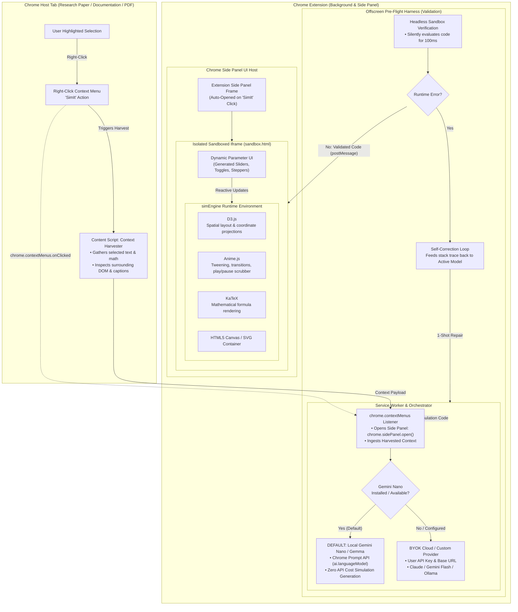
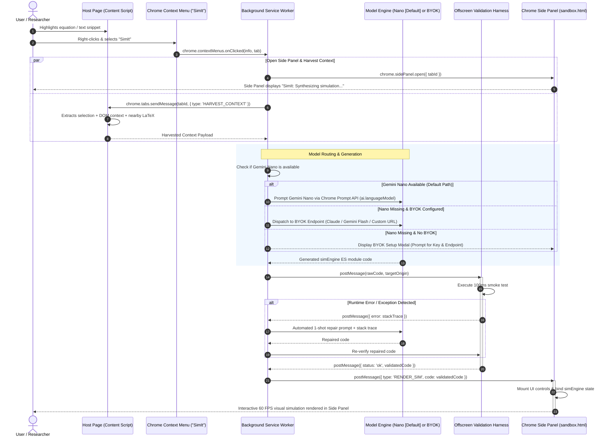

# System Architecture Specification

## 1. High-Level Architecture Overview

The **SimIt Interactive Visualizer Copilot** is built as a Chrome Extension adhering strictly to **Manifest V3**. The primary UX entry point allows users to highlight any text, equation, or algorithm, right-click, and select **"SimIt"** from the context menu. This action automatically opens the native Chrome Side Panel and initiates the simulation pipeline. 

The extension synthesizes executable simulation modules using an on-device **local AI engine (Gemini Nano / local Gemma)** by default with zero API costs during harness buildout, validates code in an offscreen sandbox harness, and renders interactive visual simulations inside the Side Panel. For high-fidelity generation, users can configure external frontier models via a **BYOK (Bring Your Own Key)** provider system.



---

## 2. End-to-End Execution Flow

The sequence diagram below details the user interaction flow—starting from right-clicking the highlighted text and selecting "SimIt" to automated side panel launching, code generation, and rendering:



---

## 3. Architectural Subsystems

### 3.1 Context Menu & Selection Ingestion
* **Context Menu Registration**: Configured in `background.js` using `chrome.contextMenus.create`:
  ```javascript
  chrome.contextMenus.create({
    id: "simit-selection",
    title: "SimIt",
    contexts: ["selection"]
  });
  ```
* **Side Panel Activation**: Upon clicking "SimIt", the service worker immediately calls `chrome.sidePanel.open({ tabId: tab.id })` to focus the user experience in the side panel without disrupting page layout.
* **Context Harvester (`content-script.js`)**:
  * Extracts selected text, surrounding math delimiters (`\(...\)`, `\[...\]`, `\begin{equation}`).
  * Inspects surrounding DOM nodes: nearest section headings (`h1`–`h4`), `<figcaption>` tags, and preceding definitions.
  * Packages and transmits the enriched payload to the service worker.

### 3.2 Orchestration & Model Provider Layer (`background.js`)
* **Default Local Generator (Gemini Nano / Gemma)**:
  * Invokes Chrome's built-in Prompt API (`window.ai` / `ai.languageModel`).
  * Generates zero-prompt simulation code on-device at **zero cost**, allowing rapid iteration while the execution harness is constructed.
  * Baseline / rough simulations are treated as expected and acceptable during initial testing as long as valid parameters and visuals execute.
* **BYOK (Bring Your Own Key) Provider Engine**:
  * Configurable client supporting Google Gemini (Flash / Pro), Anthropic Claude (Sonnet / Haiku), and custom OpenAI-compatible endpoints (Ollama, vLLM).
  * Manages user API keys, custom Base URLs, and model selection stored locally.
* **Setup Guard**: If Gemini Nano is unavailable and no BYOK key is stored, prompts the user to enter their key and endpoint directly inside the opened Side Panel.

### 3.3 Offscreen Pre-Flight Harness (`offscreen.html`)
* **Headless Sandbox**: Evaluates incoming generated code in an isolated offscreen document for a 100ms test cycle.
* **Fault Detection**: Intercepts `window.onerror`, unhandled promise rejections, and infinite loop timeouts.
* **Automated Self-Correction**: When an unhandled exception occurs, formats the error stack and passes it back to the active model engine (Nano or BYOK provider) for a single-pass automated repair before any UI exposure.

### 3.4 Execution Runtime (`sandbox.html`)
* **Manifest V3 Sandbox Isolation**: Runs within a restricted sandbox defined in `manifest.json`:
  ```json
  "sandbox": {
    "pages": ["sandbox.html"]
  }
  ```
* **Dynamic Parameter UI**: Renders parameter sliders, toggle switches, numeric steppers, and playback scrubbers dynamically generated from the model's schema.
* **`simEngine` Environment**: Bundles localized visualization libraries with zero external CDN dependencies:
  * **D3.js**: Spatial layout, coordinate scales, and data projections.
  * **Anime.js**: Timeline tweening, playback scrubber, and continuous animation loop.
  * **KaTeX**: Crisp math typography and equation annotations.
  * **HTML5 Canvas / SVG Container**: High-performance 60 FPS visual display.
* **Interactive Console Error Interceptor & Auto-Appearing Repair Icon**: Catches unhandled runtime exceptions (`window.onerror`, unhandled promise rejections) during slider or timeline interactions. Automatically signals the Side Panel host to reveal a floating **Repair Icon (🛠️)** for 1-click self-correction and hot-reload.

### 3.5 Agent Loop & Prompt Contract
For full specification of the prompt composition, sandbox environment declaration, and automated 1-shot self-repair loop, see [Agent Loop & System Prompt Specification](file:///Users/waqqasmeraj/Developer/vmatrixdev/simit/docs/specs/agent_loop.md).

### 3.6 Simulation Export & ATIF Trajectory Logger
* **Standalone Simulation Export**: Packages the generated simulation, parameter UI, and bundled libraries into a self-contained `.html` file that runs in any standard browser without extension dependencies.
* **ATIF (Agent Trajectory Interchange Format) Telemetry**: Automatically records structured agent trajectories (harvest context, prompts, raw outputs, pre-flight test results, repair iterations, latency) in standard ATIF JSON format (`.atif.json`) for cross-model benchmarking and regression testing. For full schema and workflow, see [ATIF & Simulation Export Specification](file:///Users/waqqasmeraj/Developer/vmatrixdev/simit/docs/specs/atif_specification.md).

---

## 4. Security & Sandbox Boundary

| Layer | Execution Context | Permissions & Capabilities | Security Boundary |
| :--- | :--- | :--- | :--- |
| **Context Menu & Content Script** | Host Tab DOM | Listens to selection, reads selected text and nearby math elements | Isolated world; no direct extension storage or secret API keys access. |
| **Service Worker** | Chrome Background | Handles `chrome.contextMenus.onClicked`, opens Side Panel, manages BYOK storage, coordinates LLM calls | Has extension permissions (`contextMenus`, `sidePanel`); no direct DOM access. |
| **Offscreen Document** | Headless Chrome Context | Executes initial code evaluation without UI rendering | Cannot access host page DOM, cookies, or extension credentials. |
| **Sandbox Iframe** | `sandbox.html` (Side Panel) | Runs dynamic untrusted code, executes canvas/SVG rendering | Strict CSP (`sandbox allow-scripts`); zero network, zero cookies, zero host DOM access. |