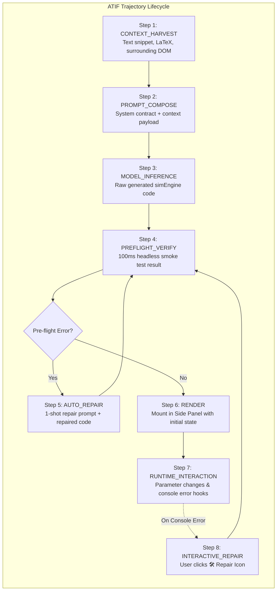

# Agent Trajectory Interchange Format (ATIF) & Simulation Export Specification

This document defines the schema and execution model for **ATIF (Agent Trajectory Interchange Format)** logging and **Standalone Simulation Export** in **SimIt**. These capabilities are integrated into **Phase 1** to enable immediate testing of the execution harness and rigorous benchmarking across different models (Gemini Nano, Local Gemma, Gemini 2.5 Flash, Claude 3.5 Sonnet, Ollama).

---

## 1. Why ATIF & Export Are Needed from Day 1

1. **Harness Verification & Cross-Model Benchmarking**: Allows testing the execution harness against both low-capacity local models (Gemini Nano) and frontier cloud models, measuring first-pass pass rates, repair success rates, and token/latency profiles.
2. **Reproducibility & Offline Evaluation**: Developers can export the full agent trajectory (`.atif.json`) to debug failed runs, evaluate prompt adjustments, and build automated regression test suites.
3. **Decoupled Simulation Testing**: The Standalone Simulation Exporter packages the generated simulation into a single, self-contained `.html` file that runs in any browser without requiring the Chrome extension runtime.

---

## 2. ATIF Trajectory Schema for SimIt

The ATIF log records the complete step-by-step trajectory of an agent run from context ingestion to final rendering and runtime error recovery.



### JSON Schema Definition (`session.atif.json`)

```json
{
  "$schema": "https://simit.dev/schemas/atif-v1.json",
  "version": "1.0.0",
  "session_id": "simit-traj-20261002-abc123xyz",
  "timestamp_start": "2026-10-02T19:30:00.000Z",
  "timestamp_end": "2026-10-02T19:30:04.250Z",
  "agent": {
    "name": "SimIt",
    "version": "0.1.0",
    "environment": {
      "platform": "chrome-extension-mv3",
      "browser": "Chrome 130.0",
      "os": "macOS"
    }
  },
  "model_config": {
    "provider": "chrome_prompt_api",
    "model_name": "gemini-nano",
    "is_local": true,
    "temperature": 0.2,
    "base_url": null
  },
  "harvested_context": {
    "source_url": "https://arxiv.org/abs/1706.03762",
    "source_title": "Attention Is All You Need",
    "selected_text": "Attention(Q, K, V) = softmax(QK^T / sqrt(d_k))V",
    "math_delimiters": ["\\[", "\\]"],
    "heading": "3.2.1 Scaled Dot-Product Attention",
    "caption": "Figure 2: (left) Scaled Dot-Product Attention."
  },
  "trajectory": [
    {
      "step_index": 1,
      "stage": "PROMPT_COMPOSE",
      "timestamp": "2026-10-02T19:30:00.120Z",
      "input": {
        "system_prompt_tokens_est": 850,
        "context_tokens_est": 120
      },
      "output": {
        "final_prompt_hash": "sha256:7f83b1..."
      }
    },
    {
      "step_index": 2,
      "stage": "MODEL_INFERENCE",
      "timestamp": "2026-10-02T19:30:02.400Z",
      "duration_ms": 2280,
      "input": {
        "prompt_length_chars": 3420
      },
      "output": {
        "raw_code": "export default { title: 'Scaled Dot-Product Attention', ... };",
        "output_chars": 1840
      }
    },
    {
      "step_index": 3,
      "stage": "PREFLIGHT_VERIFY",
      "timestamp": "2026-10-02T19:30:02.520Z",
      "duration_ms": 115,
      "test_type": "headless_smoke_test",
      "status": "PASS",
      "details": {
        "init_executed": true,
        "update_tested": true,
        "parameters_verified": ["tau", "dim_k"],
        "error": null
      }
    },
    {
      "step_index": 4,
      "stage": "RENDER",
      "timestamp": "2026-10-02T19:30:02.600Z",
      "status": "MOUNTED",
      "initial_params": {
        "tau": 1.0,
        "dim_k": 64
      }
    }
  ],
  "outcome": {
    "success": true,
    "first_pass_success": true,
    "repairs_needed": 0,
    "total_duration_ms": 2600,
    "final_code_hash": "sha256:4a8c9b..."
  }
}
```

---

## 3. Standalone Simulation Export

The Side Panel UI provides a 1-click **Export** menu offering two export formats:

### 3.1 Standalone Self-Contained HTML (`sim-export.html`)
Packages everything required to run the simulation offline into a single HTML file:
* **Inlined CSS**: Basic clean responsive layout.
* **Inlined Libraries**: Bundled minified D3.js, Anime.js, and KaTeX fonts/scripts (or lightweight local data URIs).
* **Inlined Dynamic UI**: Auto-generated slider and playback controls bound to the simulation.
* **Inlined Simulation Code**: The verified ES module code executed within an isolated local script scope.

Users can open `sim-export.html` directly in any web browser without internet access or extension dependencies.

### 3.2 Raw Simulation Module (`simulation.js` & `params.json`)
Exports the clean ES module file along with a JSON snapshot of the current parameter configuration for easy copy-pasting, version control, or unit test creation.

---

## 4. ATIF Trajectory Export in the UI

In the Side Panel header, developers and power users have access to:
1. **"Export Simulation (HTML)"**: Downloads standalone `.html` file.
2. **"Copy ATIF Trajectory"**: Copies the standardized JSON trajectory to the clipboard.
3. **"Download ATIF (.atif.json)"**: Saves trajectory for benchmark analysis and test suites.
4. **Auto-Logging Toggle**: When enabled during development, automatically logs all runs into indexed `chrome.storage.local` entries for batch benchmark export.
