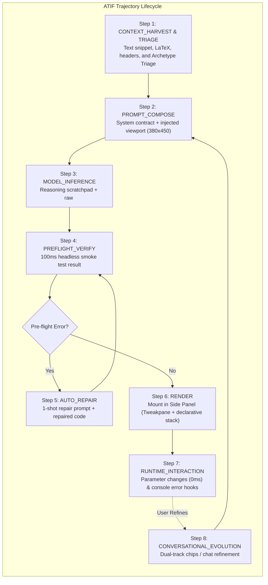

# Agent Trajectory Interchange Format (ATIF) & Simulation Export Specification

This document defines the schema and execution model for **ATIF (Agent Trajectory Interchange Format)** logging and **Standalone Simulation Export** in **SimIt**. These capabilities enable rigorous cross-model benchmarking (Gemini Nano vs Claude 3.5 Sonnet vs Gemini Flash vs Ollama), automated regression testing, and evaluation of prompt decoupling (`<simulation_thinking>` vs `<simulation_code>`).

---

## 1. Why ATIF & Export Are Essential

1. **Harness Verification & Cross-Model Benchmarking**: Measures first-pass compilation rates, pre-flight repair loops, thinking token budgets, and time-to-first-frame across on-device and cloud frontier models.
2. **Reproducibility & Reasoning Audit**: Preserves the complete model reasoning trace (`<simulation_thinking>`) alongside the extracted code (`<simulation_code>`) for qualitative and quantitative post-mortems.
3. **Decoupled Simulation Testing**: The Standalone Simulation Exporter packages the generated simulation into a single, self-contained `.html` file that runs in any browser with bundled declarative libraries (Tweakpane, functionPlot, Cytoscape, Anime, D3, KaTeX).

---

## 2. ATIF Trajectory Schema for SimIt

The ATIF log records the complete step-by-step trajectory of an agent run from context ingestion and archetype triage to final rendering and conversational iteration.



### JSON Schema Definition (`session.atif.json`)

```json
{
  "$schema": "https://simit.dev/schemas/atif-v1.json",
  "version": "1.1.0",
  "session_id": "simit-traj-20261002-abc123xyz",
  "timestamp_start": "2026-10-02T19:30:00.000Z",
  "timestamp_end": "2026-10-02T19:30:03.250Z",
  "agent": {
    "name": "SimIt",
    "version": "0.2.0",
    "environment": {
      "platform": "chrome-extension-mv3",
      "browser": "Chrome 130.0",
      "os": "macOS"
    }
  },
  "model_config": {
    "provider": "chrome_prompt_api",
    "model_name": "gemini-nano",
    "is_local": true,
    "temperature": 0.2,
    "native_thinking_enabled": false
  },
  "harvested_context": {
    "source_url": "https://arxiv.org/abs/1706.03762",
    "source_title": "Attention Is All You Need",
    "selected_text": "Attention(Q, K, V) = softmax(QK^T / sqrt(d_k))V",
    "math_delimiters": ["\\[", "\\]"],
    "heading": "3.2.1 Scaled Dot-Product Attention",
    "caption": "Figure 2: (left) Scaled Dot-Product Attention.",
    "archetype_triage": "dynamic_math",
    "viewport": {
      "width": 380,
      "height": 450
    }
  },
  "trajectory": [
    {
      "step_index": 1,
      "stage": "PROMPT_COMPOSE",
      "timestamp": "2026-10-02T19:30:00.120Z",
      "input": {
        "system_prompt_tokens_est": 850,
        "context_tokens_est": 120,
        "viewport": { "width": 380, "height": 450 }
      },
      "output": {
        "final_prompt_hash": "sha256:7f83b1..."
      }
    },
    {
      "step_index": 2,
      "stage": "MODEL_INFERENCE",
      "timestamp": "2026-10-02T19:30:02.100Z",
      "duration_ms": 1980,
      "output": {
        "thinking_trace": "1. Mathematical model: Softmax temperature scaling P_i = exp(z_i / tau)... 2. Bounds: tau in [0.1, 5.0]...",
        "raw_code": "export default { title: 'Scaled Dot-Product Attention', ... };",
        "output_chars": 1640
      }
    },
    {
      "step_index": 3,
      "stage": "PREFLIGHT_VERIFY",
      "timestamp": "2026-10-02T19:30:02.220Z",
      "duration_ms": 115,
      "test_type": "headless_smoke_test",
      "status": "PASS",
      "details": {
        "init_executed": true,
        "update_tested": true,
        "parameters_verified": ["tau", "dim_k"],
        "error": null
      }
    },
    {
      "step_index": 4,
      "stage": "RENDER",
      "timestamp": "2026-10-02T19:30:02.300Z",
      "status": "MOUNTED",
      "initial_params": {
        "tau": 1.0,
        "dim_k": 64
      }
    }
  ],
  "outcome": {
    "success": true,
    "first_pass_success": true,
    "repairs_needed": 0,
    "total_duration_ms": 2300,
    "final_code_hash": "sha256:4a8c9b..."
  }
}
```

---

## 3. Standalone Simulation Export

The Side Panel UI provides a 1-click **Export** menu offering two export formats:

### 3.1 Standalone Self-Contained HTML (`sim-export.html`)
Packages everything required to run the simulation offline into a single HTML file:
* **Inlined CSS**: Responsive layout with dark theme styling.
* **Inlined Declarative Libraries**: Bundled minified Tweakpane v4, functionPlot v1, Cytoscape v3, Anime.js v3, KaTeX v0.16, and D3 v7.
* **Inlined Dynamic UI**: Tweakpane controls pre-wired to the simulation module.
* **Inlined Simulation Code**: The verified ES module executed within an isolated script scope.

Users can open `sim-export.html` directly in any web browser without internet access or extension dependencies.

### 3.2 Raw Simulation Module (`simulation.js` & `params.json`)
Exports the clean ES module file along with a JSON snapshot of the current parameter configuration for version control or test fixture creation.

---

## 4. ATIF Trajectory Export in the UI

In the Side Panel header, developers and power users have access to:
1. **"Export Simulation (HTML)"**: Downloads standalone `.html` file.
2. **"Copy ATIF Trajectory"**: Copies the standardized JSON trajectory to the clipboard.
3. **"Download ATIF (.atif.json)"**: Saves trajectory for benchmark analysis and test suites.
4. **Auto-Logging Toggle**: When enabled during development, automatically logs all runs into indexed `chrome.storage.local` entries for batch benchmark export.

