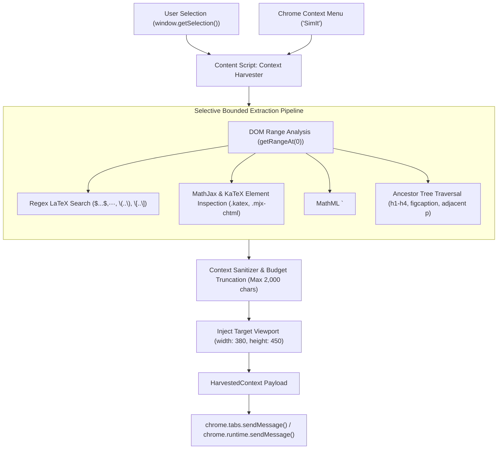

# Technical Specification: Context Harvester & Selection Ingestion

**Status:** Approved & Living Specification  
**Domain:** Content Script & Host Tab Ingestion  
**Living Document:** Permanent architectural specification under `docs/specs/`  
**Tracking Backlog:** [docs/backlog/tasks.md](file:///Users/waqqasmeraj/Developer/vmatrixdev/simit/docs/backlog/tasks.md)  

---

## 1. Overview & Business Objectives
The **Context Harvester** is a lightweight, non-intrusive Content Script executed within the host tab (research papers, documentation, arXiv, Wikipedia, PDF.js). When the user highlights an equation, algorithm, or technical passage and selects **"SimIt"** from the browser context menu:
1. **Clean Zero-Injection Activation**: Activated exclusively via the browser context menu (`chrome.contextMenus`). The content script injects zero DOM elements into the host document, ensuring zero layout shift and 100% compatibility across arXiv, Wikipedia, and PDF.js viewers.
2. **Selective Bounded Scope (No Full Page Dumps)**: Ingests strictly the highlighted snippet, preceding section heading (`h1`–`h4`), neighboring caption/LaTeX elements (`\(...\)`, `\[...\]`, `<figcaption>`), and immediate adjacent paragraphs. Full page dumps are prohibited to avoid context dilution and keep time-to-first-token $< 3$ seconds.
3. **Viewport Dimension Capture**: Ingests the target side panel dimensions (`viewportWidth: 380`, `viewportHeight: 450`) to ensure 100% responsive rendering without zero-dimension layout failures.

---

## 2. Domain Model & Architecture

---

## 3. Contracts & Data Models

### 3.1 TypeScript Domain Models
The domain contracts are authored in [`src/types/harvester.ts`](file:///Users/waqqasmeraj/Developer/vmatrixdev/simit/src/types/harvester.ts):
- [`HarvestedContext`](file:///Users/waqqasmeraj/Developer/vmatrixdev/simit/src/types/harvester.ts): Full canonical payload dispatched to background orchestrator.
- [`SelectionMetadata`](file:///Users/waqqasmeraj/Developer/vmatrixdev/simit/src/types/harvester.ts): Highlighted text, length, source URL, and document title.
- [`MathSnippet`](file:///Users/waqqasmeraj/Developer/vmatrixdev/simit/src/types/harvester.ts): Extracted mathematical notation and normalized LaTeX.
- [`SurroundingDOMContext`](file:///Users/waqqasmeraj/Developer/vmatrixdev/simit/src/types/harvester.ts): Nearest section heading, heading tag level, caption, and paragraph framing.
- `ViewportDimensions`: Target rendering bounds `{ width: number; height: number }` (default: `380x450`).

### 3.2 Math Extraction Delimiters & Selectors
| Engine / Format | Target DOM Element / Attribute | Extraction Strategy | Normalized Output |
| :--- | :--- | :--- | :--- |
| **KaTeX** | `.katex annotation[encoding="application/x-tex"]` | Read text content of annotation tag | `\frac{...}{...}` |
| **MathJax v3** | `mjx-container[jax="CHTML"]`, attribute `data-latex` | Read `data-latex` attribute or `<annotation>` | `\sum_{i=1}^n ...` |
| **Native MathML** | `math > semantics > annotation[encoding*="tex"]` | Read LaTeX annotation if available; fallback to `<math>` outerHTML | Clean LaTeX or MathML string |
| **Raw LaTeX** | Text nodes matching `\$[^\$]+\$`, `\$\$[^\$]+\$\$`, `\\\(.*?\\\)`, `\\\[.*?\\\]` | Regex extraction from selection & sibling nodes | Extracted inner math string |

---

## 4. Domain Invariants & Edge Cases

1. **Selective Bounded Scope Guarantee**: The harvested payload (`paragraphSnippet` + `selectedText`) must strictly never exceed **2,000 characters**. No full page dumps are permitted. If exceeded, the paragraph snippet is centered on the selection and truncated with `[...]`.
2. **Zero DOM Mutation**: The content script must NEVER alter, modify, or inject visual DOM elements into the host tab.
3. **Empty or Whitespace Selection**: If triggered with an empty selection, the harvester falls back to reading the DOM node currently in keyboard focus or right-click hit target.
4. **PDF Viewer Compatibility**: When invoked on Chrome's built-in PDF viewer (`chrome-extension://...` or `application/pdf`), if DOM traversal is restricted, the harvester falls back to extracting raw selected plain text with tab title and URL.

---

## 5. Behavioral Acceptance Matrix

| ID | Scenario | Given / DOM State | When / Input | Expected Output | IPC Target |
| :--- | :--- | :--- | :--- | :--- | :--- |
| **H1** | Standard LaTeX Selection | Text contains `\(E = mc^2\)` | User selects `E = mc^2` | `MathSnippet` with type `latex-inline`, latex `E = mc^2` | Service Worker |
| **H2** | KaTeX Rendered Formula | ArXiv page with `.katex` annotation | User highlights formula | Extracts raw TeX from `<annotation encoding="application/x-tex">` | Service Worker |
| **H3** | Heading Context Extraction | Selection inside `<h3>` sub-clause | User selects paragraph text | `nearestHeading` populated with `<h3>` text; `headingLevel: 'H3'` | Service Worker |
| **H4** | Figcaption Association | Selection adjacent to `<figure>` | User highlights caption text | `domContext.caption` populated with `<figcaption>` string | Service Worker |
| **H5** | Oversized Selection Guard | User selects 5,000-character section | User clicks "SimIt" | Truncates to 2,000 chars around selection center with `[...]` | Service Worker |
| **H6** | Zero DOM Mutation Guard | Content script executes harvest | Selection harvested | Host DOM undergoes 0 node additions or style modifications | Host Tab DOM |

