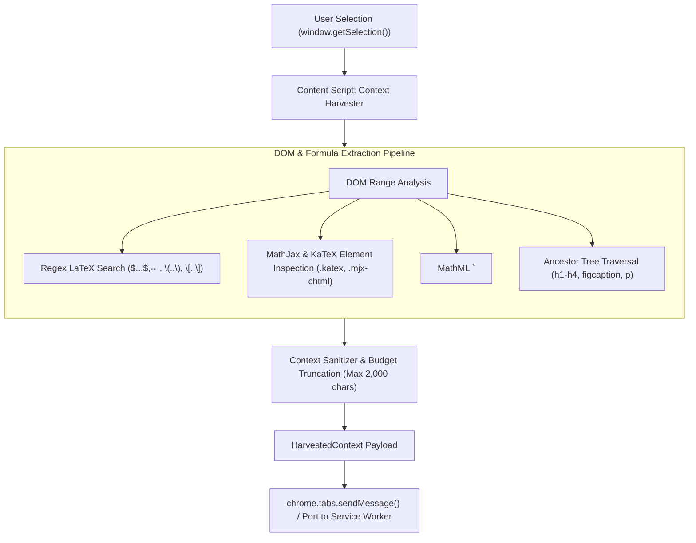

# Technical Specification: Context Harvester & Selection Ingestion

**Status:** Approved & Ready for Implementation  
**Domain:** Content Script & Host Tab Ingestion  
**Living Document:** Permanent architectural specification under `docs/specs/`  
**Tracking Backlog:** [docs/backlog/tasks.md](file:///Users/waqqasmeraj/Developer/vmatrixdev/simit/docs/backlog/tasks.md)  

---

## 1. Overview & Business Objectives
The **Context Harvester** is a lightweight, non-intrusive Content Script executed within the host tab (research papers, documentation, arXiv, Wikipedia, blog posts). When the user highlights an equation, algorithm, or concept and triggers "SimIt", the harvester extracts the highlighted text, searches the surrounding DOM for mathematical typography (KaTeX, MathJax, MathML, LaTeX delimiters), retrieves semantic document structure (nearest headings `h1`–`h4`, figure captions `<figcaption>`), and packages a deterministic payload for the background Service Worker.

---

## 2. Domain Model & Architecture

---

## 3. Contracts & Data Models

### 3.1 TypeScript Domain Models
The domain contracts are authored in [`src/types/harvester.ts`](file:///Users/waqqasmeraj/Developer/vmatrixdev/simit/src/types/harvester.ts):
- [`HarvestedContext`](file:///Users/waqqasmeraj/Developer/vmatrixdev/simit/src/types/harvester.ts): Full canonical payload dispatched to background orchestrator.
- [`SelectionMetadata`](file:///Users/waqqasmeraj/Developer/vmatrixdev/simit/src/types/harvester.ts): Highlighted text, length, source URL, and document title.
- [`MathSnippet`](file:///Users/waqqasmeraj/Developer/vmatrixdev/simit/src/types/harvester.ts): Extracted mathematical notation and normalized LaTeX.
- [`SurroundingDOMContext`](file:///Users/waqqasmeraj/Developer/vmatrixdev/simit/src/types/harvester.ts): Nearest section heading, heading tag level, caption, and paragraph framing.

### 3.2 Math Extraction Delimiters & Selectors
| Engine / Format | Target DOM Element / Attribute | Extraction Strategy | Normalized Output |
| :--- | :--- | :--- | :--- |
| **KaTeX** | `.katex annotation[encoding="application/x-tex"]` | Read text content of annotation tag | `\frac{...}{...}` |
| **MathJax v3** | `mjx-container[jax="CHTML"]`, attribute `data-latex` | Read `data-latex` attribute or `<annotation>` | `\sum_{i=1}^n ...` |
| **Native MathML** | `math > semantics > annotation[encoding*="tex"]` | Read LaTeX annotation if available; fallback to `<math>` outerHTML | Clean LaTeX or MathML string |
| **Raw LaTeX** | Text nodes matching `\$[^\$]+\$`, `\$\$[^\$]+\$\$`, `\\\(.*?\\\)`, `\\\[.*?\\\]` | Regex extraction from selection & sibling nodes | Extracted inner math string |

---

## 4. Domain Invariants & Edge Cases

1. **Character Budget Limit**: The harvested payload (`paragraphSnippet` + `selectedText`) must not exceed **2,000 characters** to preserve on-device Gemini Nano context limits (1,024–4,096 tokens). If exceeded, the paragraph snippet is centered on the selection and truncated with `[...]`.
2. **Zero DOM Mutation**: The content script must NEVER alter or inject visual DOM elements into the host tab.
3. **Empty or Whitespace Selection**: If triggered with an empty selection, the harvester falls back to reading the DOM node currently in keyboard focus or right-click hit target.
4. **PDF Viewer Compatibility**: When invoked on Chrome's built-in PDF viewer (`chrome-extension://...` or `application/pdf`), if DOM traversal is restricted, the harvester falls back to extracting raw selected plain text with tab title and URL.

---

## 5. Behavioral Acceptance Matrix

| ID | Scenario | Given / DOM State | When / Input | Expected Output | IPC Target |
| :--- | :--- | :--- | :--- | :--- | :--- |
| **H1** | Standard LaTeX Selection | Text contains `\(E = mc^2\)` | User selects `E = mc^2` | `MathSnippet` with type `latex-inline`, latex `E = mc^2` | Service Worker |
| **H2** | KaTeX Rendered Formula | ArXiv page with `.katex` annotation | User highlights formula | Extracts raw TeX from `<annotation encoding="application/x-tex">` | Service Worker |
| **H3** | Heading Context Extraction | Selection inside `<h3>` sub-clause | User selects paragraph text | `nearestHeading` populated with `<h3>` text; `headingLevel: 'H3'` | Service Worker |
| **H4** | Figcaption Association | Selection adjacent to `<figure>` | User highlights caption text | `domContext.caption` populated with `<figcaption>` string | Service Worker |
| **H5** | Oversized Selection Guard | User selects 5,000-character section | User clicks "SimIt" | Truncates to 2,000 chars around selection center with `[...]` | Service Worker |
