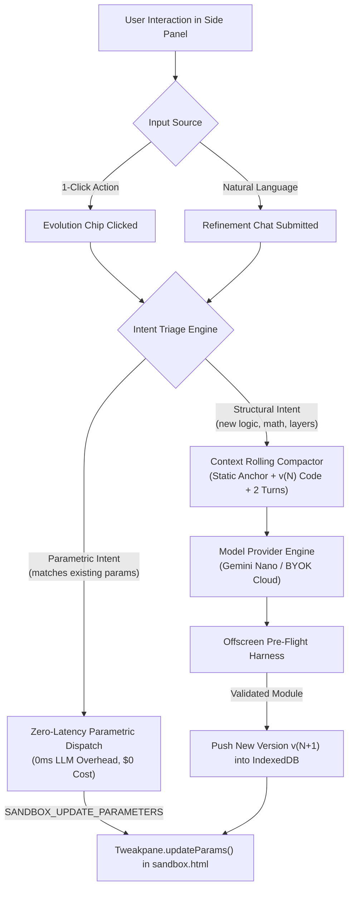

# Technical Specification: Conversational Evolution & Dual-Track Refinement

**Status:** Approved & Living Specification  
**Domain:** Conversational Simulation Evolution & Parametric Triage  
**Living Document:** Permanent architectural specification under `docs/specs/`  
**Tracking Backlog:** [docs/backlog/tasks.md](file:///Users/waqqasmeraj/Developer/vmatrixdev/simit/docs/backlog/tasks.md)  
**Executable Test Suite:** [tests/conversational_evolution.test.ts](file:///Users/waqqasmeraj/Developer/vmatrixdev/simit/tests/conversational_evolution.test.ts)

---

## 1. Overview & Business Objectives

Once an initial simulation renders in **SimIt**, users frequently want to explore counterfactuals, push mathematical parameters to edge cases, or adjust visual layers. Forcing every minor adjustment through an LLM synthesis loop introduces latency ($> 3\text{s}$), inflates token costs, and risks breaking previously working code.

The **Conversational Evolution & Dual-Track Refinement** subsystem delivers:
1. **Dual-Track Interaction UI**:
   - **Track 1: Pre-Computed Evolution Chips**: Contextual 1-click action buttons (e.g. `[+ Add Temperature Scaling]`, `[Show Phase Boundary]`, `[Toggle Stochastic Noise]`) synthesized alongside the simulation.
   - **Track 2: Refinement Chat Bar**: In-panel natural language conversational input allowing freeform steering without leaving the reading flow.
2. **Zero-Latency Parametric Triage (0ms LLM Overhead)**:
   - When a user interaction is purely parametric (e.g. *"Set temperature to 2.5"* or *"Double step speed"*), SimIt intercepts the intent and updates the sandbox `Tweakpane` bindings directly via IPC without calling an LLM.
3. **Structured Algorithmic Evolution**:
   - When modifications require structural code changes (e.g., adding differential equations, rendering new graph nodes), requests pass through the Context Rolling Compactor to synthesize new versions cleanly.

---

## 2. Dual-Track Interaction & Triage Architecture



---

## 3. Contracts & Data Models

TypeScript domain contracts are authored in [`src/types/evolution.ts`](file:///Users/waqqasmeraj/Developer/vmatrixdev/simit/src/types/evolution.ts):
- [`EvolutionChip`](file:///Users/waqqasmeraj/Developer/vmatrixdev/simit/src/types/evolution.ts): Actionable chip specification with action type (`'parameter_preset' | 'structural_refinement' | 'view_mode'`), target parameter bindings, and refinement prompts.
- [`RefinementAnalysis`](file:///Users/waqqasmeraj/Developer/vmatrixdev/simit/src/types/evolution.ts): Triage outcome categorizing intent into `'parametric_tweak'`, `'structural_evolution'`, or `'reset_state'`.
- [`ConversationalTurn`](file:///Users/waqqasmeraj/Developer/vmatrixdev/simit/src/types/evolution.ts): Chat turn model (`role`, `content`, `timestamp`, `chipId`).
- [`EvolutionRequestPayload`](file:///Users/waqqasmeraj/Developer/vmatrixdev/simit/src/types/evolution.ts): Pipeline request envelope dispatching active code, user intent, and session ID.
- [`EvolutionResponsePayload`](file:///Users/waqqasmeraj/Developer/vmatrixdev/simit/src/types/evolution.ts): Evolution response containing applied parameters or new validated code with refreshed chips.

### 3.1 Pre-Computed Evolution Chips Generation Schema

When the simulation module is synthesized, the model produces contextual chips within `<simulation_thinking>` or an exported metadata array:

```json
{
  "chips": [
    {
      "id": "chip-tau-high",
      "label": "🔥 High Temperature (τ=4.0)",
      "actionType": "parameter_preset",
      "targetParamId": "tau",
      "presetValue": 4.0,
      "rationale": "Demonstrates uniform probability distribution flattening"
    },
    {
      "id": "chip-add-entropy",
      "label": "📊 Plot Shannon Entropy",
      "actionType": "structural_refinement",
      "refinementPrompt": "Add a secondary line chart in functionPlot displaying Shannon entropy H(P) = -sum(P log P)",
      "rationale": "Shows entropy maximization as temperature approaches infinity"
    }
  ]
}
```

---

## 4. Domain Invariants & Guardrails

1. **Zero-Latency Parametric Guarantee**: If a chat message or chip targets an existing parameter (e.g. `tau = 3.0`), the triage engine MUST NOT dispatch prompt tokens to any model. It MUST update the sandbox via `SANDBOX_UPDATE_PARAMETERS` immediately.
2. **Ground-Truth Preservation**: Structural refinement prompts MUST retain the static paper anchor snippet so modifications cannot drift or hallucinate unrelated algorithms.
3. **Chip Lifecycle**: A maximum of 4 evolution chips are displayed simultaneously in the Side Panel header to maintain high readability and avoid visual clutter.
4. **Failure Containment**: If a structural refinement fails pre-flight verification, the active simulation remains running without disruption; the error triggers a 1-shot repair or reverts to the previous working version.

---

## 5. Behavioral Acceptance Matrix

| ID | Scenario | Given / State | When / Input | Expected Action | Latency Target | Test Target |
| :--- | :--- | :--- | :--- | :--- | :--- | :--- |
| **E1** | Parametric Chip Click | Slider `tau` exists in active sim | Clicks `[High Temp (τ=4.0)]` | Dispatches parameter update; no model call | $< 16\text{ms}$ | `tests/conversational_evolution.test.ts` |
| **E2** | Parametric Chat Input | Active sim has `speed` parameter | Types *"set speed to 2.5"* | Triage classifies `parametric_tweak`; updates slider | $< 50\text{ms}$ | `tests/conversational_evolution.test.ts` |
| **E3** | Structural Chat Input | Active Softmax sim | Types *"add entropy curve"* | Triage classifies `structural_evolution`; calls LLM | $< 3\text{s}$ | `tests/conversational_evolution.test.ts` |
| **E4** | Reset State Trigger | Mutated parameter state | Clicks `[Reset to Defaults]` | Resets all parameters to module defaults | $< 16\text{ms}$ | `tests/conversational_evolution.test.ts` |
| **E5** | Max 4 Chips Invariant | Model generates 7 chips | Side Panel renders chips | Clamps rendering to top 4 highest-confidence chips | Immediate | `tests/conversational_evolution.test.ts` |
