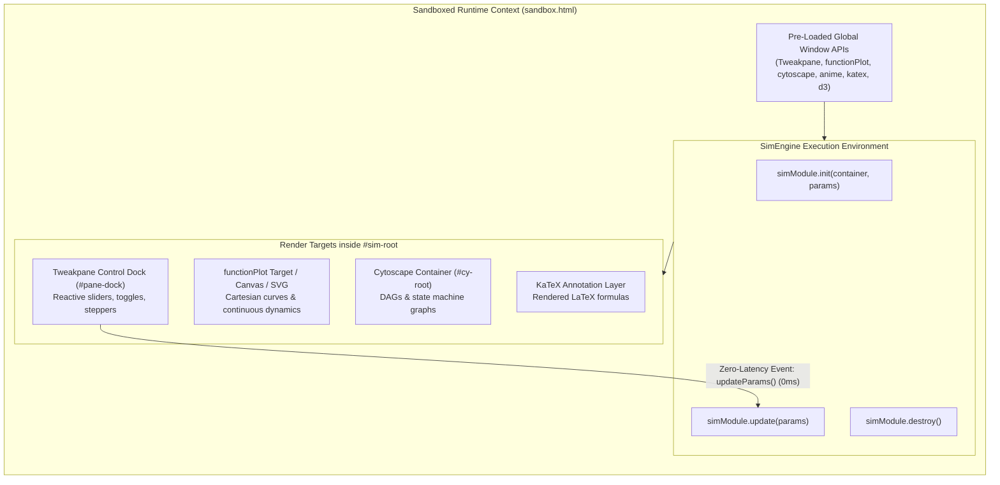

# Technical Specification: Declarative Runtime Stack & Parametric Engine

**Status:** Approved & Living Specification  
**Domain:** Sandboxed Runtime Environment & Declarative Libraries  
**Living Document:** Permanent architectural specification under `docs/specs/`  
**Tracking Backlog:** [docs/backlog/tasks.md](file:///Users/waqqasmeraj/Developer/vmatrixdev/simit/docs/backlog/tasks.md)  
**Executable Test Suite:** [tests/declarative_runtime.test.ts](file:///Users/waqqasmeraj/Developer/vmatrixdev/simit/tests/declarative_runtime.test.ts)

---

## 1. Overview & Business Objectives

Prompting language models to invent bespoke HTML sliders, input tags, coordinate calculations, and event handlers causes frequent runtime crashes, layout clipping, and degraded visual fidelity.

The **Declarative Runtime Stack** provides a standardized, pre-loaded suite of 10 declarative visualization, computation, and control libraries inside the sandboxed iframe (`sandbox.html`) and standalone exports:
1. **Tweakpane (v4.x)**: Parameter Controls & Scrubber UI. Automatically generates sleek, compact parameter control docks from declarative parameter definitions; routes slider adjustments with **0ms LLM latency**.
2. **math (Math.js v12.x)**: Linear Algebra & Symbolic Computing. High-performance matrix operations, dot products, vector projections, determinants, and inverses.
3. **jstat (v1.9.x)**: Probability & Statistical Distributions. Density functions (PDF), cumulative distribution functions (CDF), sampling, and statistical curves without hand-rolled polynomial approximations.
4. **functionPlot (v1.x)**: 2D Cartesian Function Curves. Provides instant coordinate systems, continuous mathematical curves, activations, and derivatives without manual SVG math.
5. **Cytoscape (v3.x)**: Topologies, Systems, & C4 Hierarchies. Renders declarative directed acyclic graphs (DAGs), state machines, compound container nodes, and network topologies with pan/zoom.
6. **D3.js (v7.x pinned)**: Math Scales & Spatial Projections ONLY. Coordinate scales (`scaleLinear`, `scaleLog`), interpolators (`interpolateViridis`), and geometric projections. Strict constraint: no DOM manipulation.
7. **HTML5 Canvas 2D + Anime.js (v3.x)**: Physical Motion & Step Transitions. Timeline tweening, state scrubbers, particle dynamics, and vector flow fields.
8. **KaTeX (v0.16.x)**: Dynamic Mathematical Notation & Label Typesetting. Sub-millisecond in-browser LaTeX formula rendering.
9. **Matter.js (v0.20.x)**: 2D Rigid-Body Physics & Collisions. Mechanical kinematics, collision envelopes, restitution, and gravity dynamics.
10. **gl-matrix (v3.4.x)**: High-Performance Vector & Matrix Projections. Fast coordinate translations, 2D/3D camera transformations, and spatial rotations.

---

## 2. Runtime Architecture & Library Topology

---

## 3. Contracts & Data Models

TypeScript domain contracts are authored in [`src/types/simulation.ts`](file:///Users/waqqasmeraj/Developer/vmatrixdev/simit/src/types/simulation.ts):
- [`SimModule`](file:///Users/waqqasmeraj/Developer/vmatrixdev/simit/src/types/simulation.ts): Core interface defining simulation lifecycle (`init`, `update`, `step`, `destroy`).
- [`ParameterDefinition`](file:///Users/waqqasmeraj/Developer/vmatrixdev/simit/src/types/simulation.ts): Strongly typed union of slider, toggle, stepper, and select definitions.
- [`TweakpaneBindingConfig`](file:///Users/waqqasmeraj/Developer/vmatrixdev/simit/src/types/simulation.ts): Configuration options for auto-generated parameter pane.
- [`FunctionPlotOptions`](file:///Users/waqqasmeraj/Developer/vmatrixdev/simit/src/types/simulation.ts): Coordinate domain, curve data, and grid bindings.
- [`CytoscapeLayoutOptions`](file:///Users/waqqasmeraj/Developer/vmatrixdev/simit/src/types/simulation.ts): Layout configuration (`dagre`, `cose`, `breadthfirst`).

### 3.1 Global Sandbox Window Contract

The sandbox environment guarantees the availability of global library namespaces on `window`:
- `window.Tweakpane.Pane` / `new Pane()`
- `window.math` (Math.js v12: linear algebra, matrix operations, dot products)
- `window.jstat` / `window.jStat` (jStat v1.9: probability distributions, sampling, CDF/PDF)
- `window.Matter` / `window.matter` (Matter.js v0.20: 2D physics engine, rigid bodies, restitution)
- `window.glMatrix` / `window.glmatrix` (gl-matrix v3.4: projections, transformations)
- `window.functionPlot({ target, width, height, data, xAxis, yAxis })`
- `window.cytoscape({ container, elements, style, layout })`
- `window.anime({ targets, ... })`
- `window.katex.render(latexString, htmlElement, { displayMode, throwOnError: false })`
- `window.d3` (D3 v7 API: scales, interpolators, axes)

---

## 4. Domain Invariants & Edge Cases

1. **Zero-Latency Reactive Tweaks**: Adjusting a parameter slider in Tweakpane triggers `simModule.update(params)` directly inside the sandbox frame. No background service worker messages, no network round-trips, and zero LLM calls occur.
2. **Deterministic Cleanup on Hot-Reload**: Before a new module or version is evaluated, the runtime executes `simModule.destroy()`, disposes active Tweakpane panes (`pane.dispose()`), cancels pending `requestAnimationFrame` IDs, stops active Matter engines (`Matter.Engine.clear()`), and clears `#sim-root`.
3. **Viewport Dimension Compliance**: Visual containers respect injected bounds (e.g. `width: 380px, height: 450px`). `functionPlot` and `cytoscape` instances scale to container dimensions without triggering window horizontal or vertical scrollbars.
4. **Defensive Math Guard**: Curves plotted via `functionPlot` handle domain singularities (e.g. division by zero, $\log(\le 0)$, $\sqrt{< 0}$) safely without unhandled JavaScript exceptions.
5. **No Hand-Rolled Loops or Approximations**: Linear algebra must leverage `math.*` functions; statistical densities must leverage `jstat.*`; 2D rigid-body kinematics must leverage `Matter.*`.

---

## 5. Behavioral Acceptance Matrix

| ID | Scenario | Given / State | When / Input | Expected Output | Latency Target | Test Target |
| :--- | :--- | :--- | :--- | :--- | :--- | :--- |
| **D1** | Tweakpane Auto-Docking | Module exports 2 sliders + 1 toggle | `init()` invoked | Mounts Tweakpane controls in dock | $< 50\text{ ms}$ | `tests/declarative_runtime.test.ts` |
| **D2** | Zero-Latency Parametric Update | User adjusts slider $\tau$ from 1.0 to 2.5 | Tweakpane `change` event fires | `update({ tau: 2.5 })` executes synchronously | $0\text{ ms}$ LLM overhead | `tests/declarative_runtime.test.ts` |
| **D3** | functionPlot Curve Rendering | Module specifies $f(x) = \frac{1}{1 + e^{-x}}$ | `functionPlot()` called | Canvas/SVG elements rendered in `#sim-root` | $< 60\text{ ms}$ | `tests/declarative_runtime.test.ts` |
| **D4** | Cytoscape Graph Topology | Module specifies DAG with 5 nodes and 4 edges | `cytoscape()` called with `dagre` layout | Graph rendered with interactive node taps | $< 80\text{ ms}$ | `tests/declarative_runtime.test.ts` |
| **D5** | KaTeX Mathematical Typesetting | Formula $\sigma(z) = \frac{1}{1 + e^{-z}}$ | `katex.render()` executed | Math rendered into DOM without error | $< 15\text{ ms}$ | `tests/declarative_runtime.test.ts` |
| **D6** | Module Teardown & Resource Disposal | Active simulation running with Tweakpane pane | Module destroy triggered | `pane.dispose()` called, canvas and timers cleared | $< 20\text{ ms}$ | `tests/declarative_runtime.test.ts` |
| **D7** | Math.js Linear Algebra | Matrix operations $Q \times K^T / \sqrt{d_k}$ | `math.multiply` & `math.divide` called | Correct scaled score matrix returned | $< 10\text{ ms}$ | `tests/declarative_runtime.test.ts` |
| **D8** | jstat Statistical Distributions | Probability density $\mathcal{N}(\mu, \sigma)$ | `jstat.normal.pdf(x, mean, std)` called | Accurate Gaussian PDF value returned | $< 5\text{ ms}$ | `tests/declarative_runtime.test.ts` |
| **D9** | Pre-Flight Smoke Test with Math Stack | Module using `math` and `jstat` globals | `runPreFlightSmokeTest()` executed | Module passes pre-flight with status `ok` | $< 50\text{ ms}$ | `tests/declarative_runtime.test.ts` |
| **D10** | Matter.js 2D Physics Mechanics | Rigid-body simulation with gravity and bounds | `Matter.Engine.create()` & `Matter.Composite.add()` | Bodies initialize with correct coordinates and mass | $< 20\text{ ms}$ | `tests/declarative_runtime.test.ts` |
| **D11** | gl-matrix Camera Projections | 3D perspective projection matrix calculation | `glMatrix.mat4.perspective()` executed | Valid 16-element Float32 perspective matrix created | $< 5\text{ ms}$ | `tests/declarative_runtime.test.ts` |
