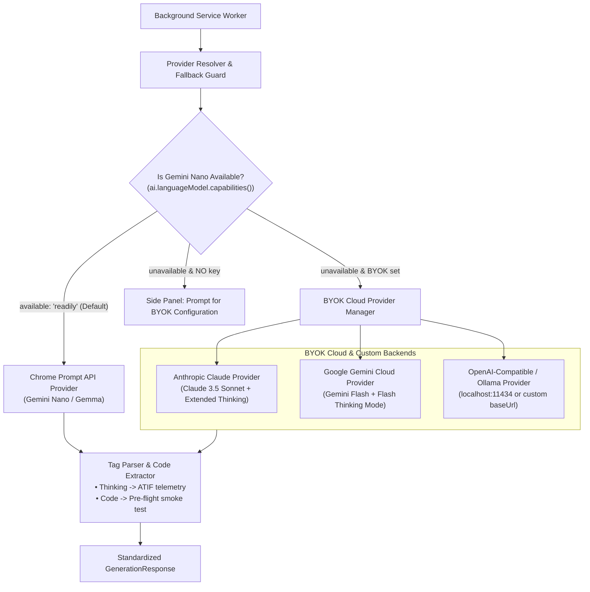

# Technical Specification: Model Providers & BYOK Engine

**Status:** Approved & Living Specification  
**Domain:** Background Service Worker & Model Orchestration  
**Living Document:** Permanent architectural specification under `docs/specs/`  
**Tracking Backlog:** [docs/backlog/tasks.md](file:///Users/waqqasmeraj/Developer/vmatrixdev/simit/docs/backlog/tasks.md)  

---

## 1. Overview & Business Objectives
The **Model Providers & BYOK Engine** manages simulation code generation. It adopts an on-device local-first philosophy with zero cloud lock-in:
1. **Default Local Engine (Gemini Nano / Local Gemma)**: Uses Chrome's built-in Prompt API (`ai.languageModel`) at **$0.00 zero cost** for rapid iteration and zero-prompt generation.
2. **BYOK (Bring Your Own Key) Engine**: For high-fidelity generation, users configure API keys for Anthropic Claude (Claude 3.5 Sonnet), Google Gemini Cloud (Gemini 2.5 Flash / Flash Thinking), or custom OpenAI-compatible endpoints (Ollama / vLLM).
3. **Native Hidden Thinking & Tag Decoupling**: For models supporting server-side reasoning, native thinking APIs keep reasoning out-of-band; for standard endpoints, explicit `<simulation_thinking>` and `<simulation_code>` tags are extracted cleanly.

---

## 2. Domain Model & Provider Architecture



---

## 3. Contracts & Data Models

### 3.1 TypeScript Domain Models
The domain contracts are authored in [`src/types/models.ts`](file:///Users/waqqasmeraj/Developer/vmatrixdev/simit/src/types/models.ts):
- [`IModelProvider`](file:///Users/waqqasmeraj/Developer/vmatrixdev/simit/src/types/models.ts): Core interface defining `isAvailable()`, `generateSimulation(payload)`, and `isThinkingSupported()`.
- [`ProviderType`](file:///Users/waqqasmeraj/Developer/vmatrixdev/simit/src/types/models.ts): `'chrome-prompt-api' | 'anthropic' | 'google-gemini' | 'openai-compatible'`.
- [`BYOKStorageSettings`](file:///Users/waqqasmeraj/Developer/vmatrixdev/simit/src/types/models.ts): Persistent settings schema stored in `chrome.storage.local`.
- [`GenerationPromptPayload`](file:///Users/waqqasmeraj/Developer/vmatrixdev/simit/src/types/models.ts): System prompt, technical context, viewport dimensions, and optional chat history.
- [`GenerationResponse`](file:///Users/waqqasmeraj/Developer/vmatrixdev/simit/src/types/models.ts): Extracted code, thinking trace, provider name, latency duration, and token usage.

### 3.2 Chrome Storage Schema (`simit_byok_settings`)
Stored in `chrome.storage.local` under key `simit_byok_settings`:
```json
{
  "activeProviderType": "chrome-prompt-api",
  "providers": {
    "chrome-prompt-api": {
      "modelName": "gemini-nano",
      "temperature": 0.2
    },
    "anthropic": {
      "apiKey": "sk-ant-...",
      "modelName": "claude-3-5-sonnet-20241022",
      "temperature": 0.2,
      "enableThinking": true,
      "thinkingBudgetTokens": 2048
    },
    "google-gemini": {
      "apiKey": "AIzaSy...",
      "modelName": "gemini-2.5-flash",
      "temperature": 0.2,
      "enableThinking": true
    },
    "openai-compatible": {
      "apiKey": "",
      "baseUrl": "http://localhost:11434/v1",
      "modelName": "deepseek-r1:8b",
      "temperature": 0.2
    }
  },
  "fallbackToBYOKOnNanoUnavailable": true
}
```

---

## 4. Domain Invariants & Edge Cases

1. **Tag Decoupling & Sanitization**:
   - The provider parses both `<simulation_thinking>...</simulation_thinking>` and `<simulation_code>...</simulation_code>`.
   - If tags are absent, the parser safely extracts code fences (```javascript ... ```).
   - The thinking trace is preserved in ATIF telemetry; the code is forwarded to offscreen pre-flight verification.
2. **Native Hidden Thinking Preservation**: For Anthropic and Gemini Thinking models, native thinking tokens are captured directly from API response blocks (e.g. `type: "thinking"` blocks in Claude or `thought: true` candidates in Gemini) without contaminating the module code payload.
3. **Security & Credential Storage**: API keys are stored strictly in `chrome.storage.local` (never synced via `chrome.storage.sync` or sent to external telemetry).
4. **Graceful Prompt API Detection**: When invoking `window.ai.languageModel` / `ai.languageModel`:
   - If `capabilities().available === 'no'`, automatically check if a BYOK key exists.
   - If no BYOK key exists, broadcast `SHOW_BYOK_SETUP` to Side Panel with a friendly setup card.

---

## 5. Behavioral Acceptance Matrix

| ID | Scenario | Given / State | When / Input | Expected Output | Provider Target |
| :--- | :--- | :--- | :--- | :--- | :--- |
| **M1** | Gemini Nano Available | Chrome has Prompt API enabled | Synthesis request dispatched | Calls `ai.languageModel.create()`, returns clean ES module | `chrome-prompt-api` |
| **M2** | Nano Missing, BYOK Configured | `available === 'no'`, Claude key set | Synthesis request dispatched | Calls Anthropic Messages API with user's key | `anthropic` |
| **M3** | Nano Missing, No BYOK Key | `available === 'no'`, zero keys | User clicks "SimIt" | Sends `SHOW_BYOK_SETUP` message to Side Panel | UI Setup Card |
| **M4** | Tag Extraction & Code Fence Stripping | Model returns `<simulation_thinking>...</simulation_thinking><simulation_code>export default {...}</simulation_code>` | Code generation completes | Thinking parsed to ATIF; returns clean `export default {...}` | TagParser |
| **M5** | Custom Ollama Base URL | Provider set to `openai-compatible`, `http://localhost:11434/v1` | Synthesis request dispatched | Dispatches to `/v1/chat/completions` with user parameters | `openai-compatible` |
| **M6** | Native Extended Thinking | Claude provider with `enableThinking: true` | Synthesis request dispatched | Dispatches with `thinking: { type: 'enabled', budget_tokens }` | `anthropic` |

