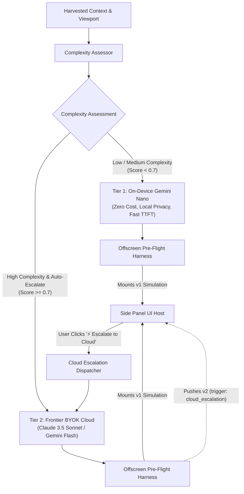

# Technical Specification: Hybrid Multi-Model Routing & Cloud Escalation

**Status:** Approved & Living Specification  
**Domain:** Model Orchestration & Hybrid Tier Routing  
**Living Document:** Permanent architectural specification under `docs/specs/`  
**Tracking Backlog:** [docs/backlog/tasks.md](file:///Users/waqqasmeraj/Developer/vmatrixdev/simit/docs/backlog/tasks.md)  
**Executable Test Suite:** [tests/model_routing.test.ts](file:///Users/waqqasmeraj/Developer/vmatrixdev/simit/tests/model_routing.test.ts)

---

## 1. Overview & Business Objectives

On-device models (such as **Gemini Nano** via the Chrome Prompt API) provide instant, zero-cost, private simulation generation, but their parameter capacity and token context are limited. Conversely, frontier cloud models (**Claude 3.5 Sonnet**, **Gemini 2.5 Flash**) excel at complex differential systems, advanced physics calculations, and multi-stage state machines, but incur monetary cost and API key setup.

The **Hybrid Multi-Model Routing & Cloud Escalation** subsystem establishes:
1. **Two-Tier Model Topology**:
   - **Tier 1 (On-Device Local)**: Gemini Nano / Gemma via Chrome Prompt API. Primary default for upfront archetype triage, parameter boundary extraction, basic Cartesian explorers, and concept DAGs.
   - **Tier 2 (Frontier Cloud / BYOK)**: Claude 3.5 Sonnet, Gemini 2.5 Flash, or OpenAI-compatible/Ollama. Used for high-complexity models requiring advanced math or multi-stage dynamics.
2. **Autonomous Complexity Assessment**: Evaluates mathematical density, equation order, and discrete state requirements to recommend the optimal execution tier.
3. **1-Click Cloud Escalation**: A prominent UI action in the Side Panel header (**"⚡ Escalate to Cloud"**) empowering users to seamlessly re-synthesize or enhance complex simulations with frontier models.

---

## 2. Two-Tier Routing & Escalation Architecture

---

## 3. Contracts & Data Models

TypeScript domain contracts are authored in [`src/types/routing.ts`](file:///Users/waqqasmeraj/Developer/vmatrixdev/simit/src/types/routing.ts):
- [`ComplexityAssessment`](file:///Users/waqqasmeraj/Developer/vmatrixdev/simit/src/types/routing.ts): Detailed complexity score (0.0 to 1.0), category level (`'low' | 'medium' | 'high'`), and mathematical indicators.
- [`RoutingDecision`](file:///Users/waqqasmeraj/Developer/vmatrixdev/simit/src/types/routing.ts): Decision payload indicating target tier, provider, model name, and escalation availability.
- [`CloudEscalationRequest`](file:///Users/waqqasmeraj/Developer/vmatrixdev/simit/src/types/routing.ts) & [`CloudEscalationResponse`](file:///Users/waqqasmeraj/Developer/vmatrixdev/simit/src/types/routing.ts): Escalation lifecycle contracts.

### 3.1 Complexity Scoring Heuristic

The complexity score is calculated deterministically from harvested signals:
$$\text{Score} = \min\left(1.0, \, 0.30 \cdot M_{\text{dense}} + 0.40 \cdot O_{\text{diff}} + 0.15 \cdot S_{\text{states}} + 0.15 \cdot L_{\text{length}}\right)$$
Where:
- $M_{\text{dense}}$: Density of mathematical operators ($\sum, \int, \frac{\partial}{\partial x}, \nabla, \prod$).
- $O_{\text{diff}}$: Presence of ODE/PDE systems or vector fields ($1.0$ if present, $0$ otherwise).
- $S_{\text{states}}$: State machine discrete state count ($> 4$ states maps to $1.0$).
- $L_{\text{length}}$: Harvested text character budget factor.

---

## 4. Domain Invariants & Guardrails

1. **Local-First Default**: Unless configured with explicit cloud auto-escalation, SimIt always runs Tier 1 first to guarantee zero cost and instant initial render.
2. **Transparent Cost Attribution**: When escalating to Tier 2, the UI clearly displays the active provider badge (e.g., *"Powered by Claude 3.5 Sonnet"*) so users are always aware of cloud token usage.
3. **Escalation Lineage**: Escalating a simulation from Tier 1 to Tier 2 creates a new version entry (`v2` or `v3`) with `trigger: 'cloud_escalation'`, preserving the local version for instant rollback.
4. **Resilient Fallback**: If Tier 2 cloud generation fails (e.g., invalid API key, network timeout), the UI catches the error cleanly, shows an actionable error banner, and leaves the active Tier 1 simulation untouched.

---

## 5. Behavioral Acceptance Matrix

| ID | Scenario | Given / State | When / Input | Expected Tier | Escalation Badge | Test Target |
| :--- | :--- | :--- | :--- | :--- | :--- | :--- |
| **R1** | Simple 1D Parameter Curve | Equation: $y = mx + b$ | Evaluated by Assessor | Tier 1 (Nano) | Disabled / Hidden | `tests/model_routing.test.ts` |
| **R2** | High-Order Differential System | Equation: Navier-Stokes $\nabla \cdot u = 0$ | Evaluated by Assessor | Tier 2 (if BYOK) | `"⚡ Escalate to Claude"` | `tests/model_routing.test.ts` |
| **R3** | 1-Click Cloud Escalation | Active sim running on Nano | User clicks "Escalate" | Dispatches to Tier 2; mounts new version | Active Tier: Tier 2 | `tests/model_routing.test.ts` |
| **R4** | Local Model Unavailable | Gemini Nano disabled | Selection triggered | Falls back to BYOK provider transparently | Active Tier: Tier 2 | `tests/model_routing.test.ts` |
| **R5** | Cloud API Failure Guard | Tier 2 request hits 401 | Cloud escalation fails | Catches error; retains Tier 1 active version | Error notification banner | `tests/model_routing.test.ts` |
