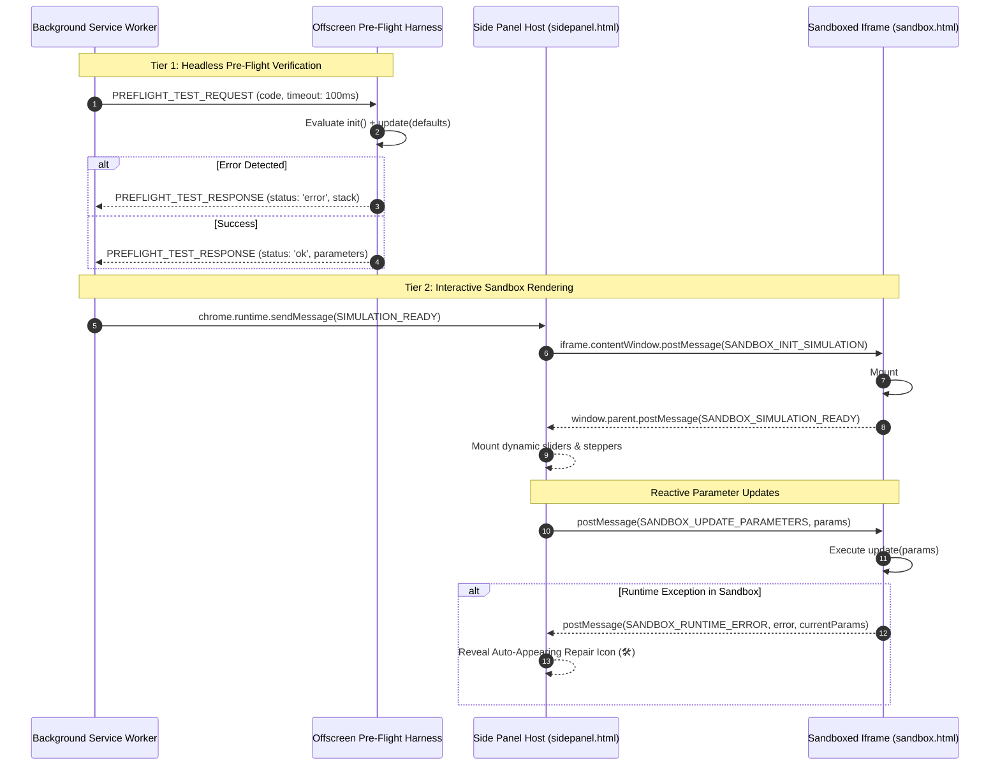

# Technical Specification: Sandboxed Runtime & IPC Protocol

**Status:** Approved & Ready for Implementation  
**Domain:** Sandboxed Iframe, Offscreen Document, & IPC Protocol  
**Living Document:** Permanent architectural specification under `docs/specs/`  
**Tracking Backlog:** [docs/backlog/tasks.md](file:///Users/waqqasmeraj/Developer/vmatrixdev/simit/docs/backlog/tasks.md)  

---

## 1. Overview & Business Objectives
Under Chrome Extension **Manifest V3**, executing dynamically generated code inside an extension page violates Chrome Content Security Policy (CSP). SimIt addresses this through a strict two-tier sandboxed execution architecture:
1. **Headless Offscreen Document (`offscreen.html`)**: Conducts automated pre-flight verification (100ms smoke test) before presenting code to the user.
2. **Interactive Sandboxed Iframe (`sandbox.html`)**: Hosted inside `sidepanel.html` under `"sandbox": { "pages": ["sandbox.html"] }` with `allow-scripts`, rendering 60 FPS simulations with KaTeX, D3, and Anime.js.

---

## 2. Domain Model & IPC Topology



---

## 3. Contracts & Data Models

### 3.1 TypeScript Domain Models
The domain contracts are authored in [`src/types/ipc.ts`](file:///Users/waqqasmeraj/Developer/vmatrixdev/simit/src/types/ipc.ts):
- [`PreFlightTestRequest`](file:///Users/waqqasmeraj/Developer/vmatrixdev/simit/src/types/ipc.ts): Payload dispatched to offscreen document.
- [`PreFlightTestResponse`](file:///Users/waqqasmeraj/Developer/vmatrixdev/simit/src/types/ipc.ts): Result payload (`'ok' | 'error'`) with error stack or verified parameters.
- [`HostToSandboxMessage`](file:///Users/waqqasmeraj/Developer/vmatrixdev/simit/src/types/ipc.ts): Messages sent into sandbox (`SANDBOX_INIT_SIMULATION`, `SANDBOX_UPDATE_PARAMETERS`, `SANDBOX_DESTROY`).
- [`SandboxToHostMessage`](file:///Users/waqqasmeraj/Developer/vmatrixdev/simit/src/types/ipc.ts): Messages emitted by sandbox (`SANDBOX_SIMULATION_READY`, `SANDBOX_RUNTIME_ERROR`).

### 3.2 Manifest V3 Sandbox Declaration
Configured in `manifest.json`:
```json
{
  "sandbox": {
    "pages": ["sandbox.html"]
  },
  "content_security_policy": {
    "sandbox": "sandbox allow-scripts; default-src 'none'; style-src 'unsafe-inline'; font-src 'self' data:; img-src 'self' data: blob:;"
  }
}
```

---

## 4. Domain Invariants & Edge Cases

1. **Origin Verification & PostMessage Guard**: `sidepanel.html` must verify event origin or source before processing incoming `postMessage` calls.
2. **Infinite Loop Protection**: Pre-flight test executes with a **100ms** hard timeout via `Promise.race([moduleExecution, timeoutPromise])`. If the timeout fires, the module is rejected with `TimeoutError: Execution exceeded 100ms limit`.
3. **Container Isolation**: The simulation writes only inside `<div id="sim-root"></div>`. Any attempt to access `window.top` or `document.cookie` is blocked by the iframe sandbox restrictions.
4. **State Preservation on Hot-Reload**: When a runtime error is repaired via the 🛠️ Repair Icon, `sidepanel.html` passes the active `currentParams` to `SANDBOX_INIT_SIMULATION` so the user does not lose their slider positions.

---

## 5. Behavioral Acceptance Matrix

| ID | Scenario | Given / State | When / Input | Expected Output | IPC Target |
| :--- | :--- | :--- | :--- | :--- | :--- |
| **I1** | Clean Pre-Flight Test | Valid simulation ES module | Offscreen receives `PREFLIGHT_TEST_REQUEST` | Returns `status: 'ok'` with extracted parameters list | Service Worker |
| **I2** | Pre-Flight Syntax Error | Code with invalid JS syntax | Offscreen attempts to evaluate | Returns `status: 'error'` with exact line and syntax message | Service Worker |
| **I3** | Infinite Loop Guard | Code contains `while(true){}` | Offscreen evaluates module | Times out after 100ms; returns `TimeoutError` | Service Worker |
| **I4** | Slider Update Dispatch | User drags parameter slider | Side Panel dispatches `SANDBOX_UPDATE_PARAMETERS` | Sandbox executes `update(params)` smoothly at 60 FPS | `sandbox.html` |
| **I5** | Runtime Error Intercept | Division by zero during update | Sandbox executes `update()` throwing error | Emits `SANDBOX_RUNTIME_ERROR` with stack and slider state | Side Panel Host |
