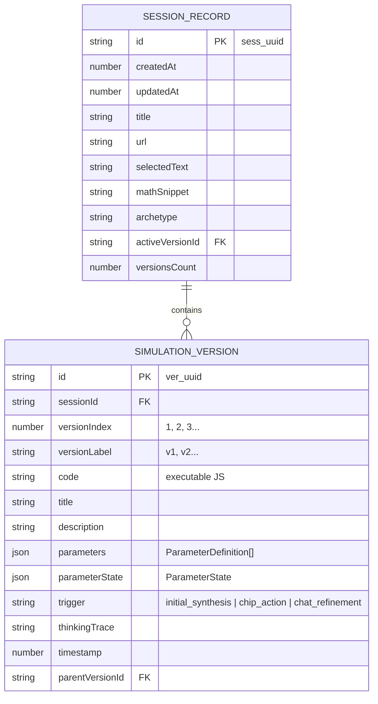
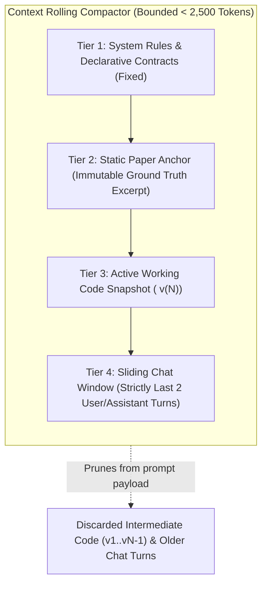

# Technical Specification: Session Memory, Version Stack & Context Rolling

**Status:** Approved & Living Specification  
**Domain:** Client-Side Storage, State Rollback & Context Compaction  
**Living Document:** Permanent architectural specification under `docs/specs/`  
**Tracking Backlog:** [docs/backlog/tasks.md](file:///Users/waqqasmeraj/Developer/vmatrixdev/simit/docs/backlog/tasks.md)  
**Executable Test Suite:** [tests/session_memory.test.ts](file:///Users/waqqasmeraj/Developer/vmatrixdev/simit/tests/session_memory.test.ts)

---

## 1. Overview & Business Objectives

Interactive exploration of scientific papers requires multi-turn refinement, experimentation with counterfactuals, and the freedom to branch or backtrack. Traditional chat apps suffer from two major flaws:
1. **Context Window Bloat**: Re-sending full conversational transcripts and previous code iterations explodes token counts, spikes latency, and exhausts context windows.
2. **Fragile State Recovery**: Modifying a simulation often breaks a working state, leaving the user with no easy way to revert.

The **Session Memory & Context Rolling** subsystem provides:
- **$0 Infrastructure Persistence**: Local IndexedDB database (`simit_db`) maintaining sessions, immutable simulation versions, and parameter states offline without cloud servers.
- **Immutable Version Stack (`v1 -> v2 -> v3`)**: 1-click instant time-travel rollback restoring exact code and slider parameters in $< 16\text{ms}$ with zero network or model calls.
- **Context Rolling Compactor**: Enforces a strict 4-tier token budget, retaining the static paper anchor, single active code snapshot, and sliding 2-turn conversational window.

---

## 2. Storage Topology & Context Rolling Architecture

---

## 3. Contracts & Storage Schemas

TypeScript domain contracts are authored in [`src/types/session.ts`](file:///Users/waqqasmeraj/Developer/vmatrixdev/simit/src/types/session.ts):
- [`SessionRecord`](file:///Users/waqqasmeraj/Developer/vmatrixdev/simit/src/types/session.ts): Root session metadata entity stored in IndexedDB `sessions` store.
- [`SimulationVersion`](file:///Users/waqqasmeraj/Developer/vmatrixdev/simit/src/types/session.ts): Immutable version snapshot stored in IndexedDB `versions` store.
- [`PaperAnchor`](file:///Users/waqqasmeraj/Developer/vmatrixdev/simit/src/types/session.ts): Unchanging paper excerpt, LaTeX math formula, and section header.
- [`ContextCompactorInput`](file:///Users/waqqasmeraj/Developer/vmatrixdev/simit/src/types/session.ts) & [`CompactedContextPayload`](file:///Users/waqqasmeraj/Developer/vmatrixdev/simit/src/types/session.ts): Rolling compactor input/output contracts.
- [`VersionRollbackRequest`](file:///Users/waqqasmeraj/Developer/vmatrixdev/simit/src/types/session.ts): Rollback request envelope.

### 3.1 IndexedDB Database Schema (`simit_db`)

| Store Name | Primary Key | Indexes | Stored Entity |
| :--- | :--- | :--- | :--- |
| `sessions` | `id` (string) | `updatedAt`, `url` | [`SessionRecord`](file:///Users/waqqasmeraj/Developer/vmatrixdev/simit/src/types/session.ts) |
| `versions` | `id` (string) | `sessionId`, `versionIndex`, `timestamp` | [`SimulationVersion`](file:///Users/waqqasmeraj/Developer/vmatrixdev/simit/src/types/session.ts) |

---

## 4. Domain Invariants & Guardrails

1. **Strict Context Budget (< 2,500 Tokens)**: Regardless of whether a user chats for 3 turns or 30 turns, the Context Rolling Compactor MUST prune prior code iterations and older chat turns. The prompt payload MUST NOT exceed 2,500 tokens.
2. **Ground-Truth Invariance**: The `PaperAnchor` (selected text and extracted math) is NEVER truncated or pruned during context rolling, ensuring the model never drifts from the paper's original formulation.
3. **Zero-Latency Time Travel**: Reverting to a prior version (e.g. clicking `v1` from `v3`) MUST execute strictly in-memory from IndexedDB in $< 16\text{ms}$ with zero network or LLM calls.
4. **Append-Only History**: New refinements made after a rollback do not delete historical versions; they append sequential versions (`v4`, `v5`...) with a `parentVersionId` pointer preserving the lineage graph.

---

## 5. Behavioral Acceptance Matrix

| ID | Scenario | Given / State | When / Input | Expected Output | Verification Target |
| :--- | :--- | :--- | :--- | :--- | :--- |
| **M1** | Initial Version Persistence | New simulation synthesized | Pre-flight passes | Creates session + `v1` snapshot in IndexedDB | `tests/session_memory.test.ts` |
| **M2** | Version Stack Push | Active `v1` simulation | Structural refinement succeeds | Pushes `v2` with `parentVersionId = v1.id` | `tests/session_memory.test.ts` |
| **M3** | 1-Click State Rollback | Session has `v1` and `v2` | User clicks `v1` badge | Restores `v1` code & slider params; 0 network calls | `tests/session_memory.test.ts` |
| **M4** | Context Compaction Bounds | Chat history contains 6 turns | Compactor runs for turn 7 | Retains paper anchor + `v6` code + turns 5 & 6 only | `tests/session_memory.test.ts` |
| **M5** | Paper Anchor Immutability | Compactor executes | Inspect output prompt | Paper snippet matches original harvest byte-for-byte | `tests/session_memory.test.ts` |
